# Qwen 系列完整技术演进深度调研报告
## 从 LLaMA 追随者到全模态架构创新者的进化之路

**报告日期**: 2026 年 4 月 12 日  
**调研范围**: Qwen-1 → Qwen2 → Qwen-VL → Qwen2-VL → Qwen2.5 → Qwen2.5-VL → Qwen2.5-Omni → Qwen3 → Qwen3-VL → Qwen3-Omni

---

# 目录

**Part I: 概览**
1. [执行摘要](#1-执行摘要)
2. [Qwen 系列演进总览](#2-qwen-系列演进总览)

**Part II: 纯文本 LLM 系列**
3. [初代 Qwen：LLaMA 架构的继承与优化（2023.08）](#3-初代-qwenllama-架构的继承与优化202308)
4. [Qwen2：架构独立创新的起点（2024.07）](#4-qwen2架构独立创新的起点202407)
5. [Qwen2.5：数据规模与长上下文突破（2024.12）](#5-qwen25数据规模与长上下文突破202412)
6. [Qwen3：混合 MoE 与动态推理革命（2025.05）](#6-qwen3混合-moe-与动态推理革命202505)

**Part III: 多模态系列**
7. [Qwen-VL：首个多模态尝试与 Cross-Attention 范式（2023.08）](#7-qwen-vl首个多模态尝试与-cross-attention-范式202308)
8. [Qwen2-VL：动态分辨率与多模态位置编码（2024.10）](#8-qwen2-vl动态分辨率与多模态位置编码202410)
9. [Qwen2.5-VL：从零训练 ViT 与原生分辨率（2025.02）](#9-qwen25-vl从零训练-vit-与原生分辨率202502)
10. [Qwen2.5-Omni：全模态端到端统一模型（2025.03）](#10-qwen25-omni全模态端到端统一模型202503)
11. [Qwen3-VL：MoE 视觉与 Thinking Mode（2025 下半年）](#11-qwen3-vlmoe-视觉与-thinking-mode2025-下半年)
12. [Qwen3-Omni：极速流式全模态（2025）](#12-qwen3-omni极速流式全模态2025)

**Part IV: 深度对比分析**
13. [纯文本 vs VL vs Omni 设计差异深度对比](#13-纯文本-vs-vl-vs-omni-设计差异深度对比)
14. [代际演进分析与技术趋势总结](#14-代际演进分析与技术趋势总结)
15. [关键技术横向对比](#15-关键技术横向对比)

**Part V: 实践指南**
16. [复现关键路径](#16-复现关键路径)

**Part VI: 多模态高频面试考点汇总**

**参考文献**

---

# Part I: 概览

# 第一章 执行摘要

## 1.1 核心发现

Qwen 系列的演进是一部**从架构追随到技术引领**的典型教科书案例，涵盖纯文本 LLM、视觉语言模型（VL）和全模态统一模型（Omni）三条产品线：

| 阶段 | 代表版本 | 技术定位 | 关键特征 |
|------|---------|---------|---------|
| **追随期** | Qwen-1 (2023.08) | LLaMA 架构优化 | RoPE + SwiGLU + RMSNorm，中文词表扩展 |
| **独立期** | Qwen2 (2024.07) | 架构差异化 | 全尺寸 GQA + QKV Bias + QK-Norm |
| **多模态探索** | Qwen-VL (2023.08) | 首个多模态尝试 | ViT-bigG + Cross-Attention Resampler + Grounding |
| **多模态起步** | Qwen2-VL (2024.10) | 首个动态分辨率 VL | M-RoPE + 动态分辨率 + 3D Tube 视频 |
| **突破期** | Qwen2.5 (2024.12) | 长上下文领导 | 18T tokens + 1M 上下文 + 专用模型矩阵 |
| **视觉深化** | Qwen2.5-VL (2025.02) | 从零训练视觉编码器 | Window Attention ViT + MLP Merger + 绝对时间编码 |
| **统一期** | Qwen2.5-Omni (2025.03) | 全模态端到端 | Thinker-Talker 架构 + TMRoPE + 流式语音 |
| **引领期** | Qwen3 (2025.05) | 混合 MoE + 动态推理 | 235B/22B MoE + Thinking Mode + 强到弱蒸馏 |
| **视觉 MoE** | Qwen3-VL (2025 下半年) | MoE 首入 VL 领域 | Interleaved-MRoPE + DeepStack + 256K 上下文 |
| **极速全模态** | Qwen3-Omni (2025) | 实时对话级延迟 | Causal ConvNet + Multi-Codebook RVQ + 234ms 首包 |

## 1.2 关键数据对比


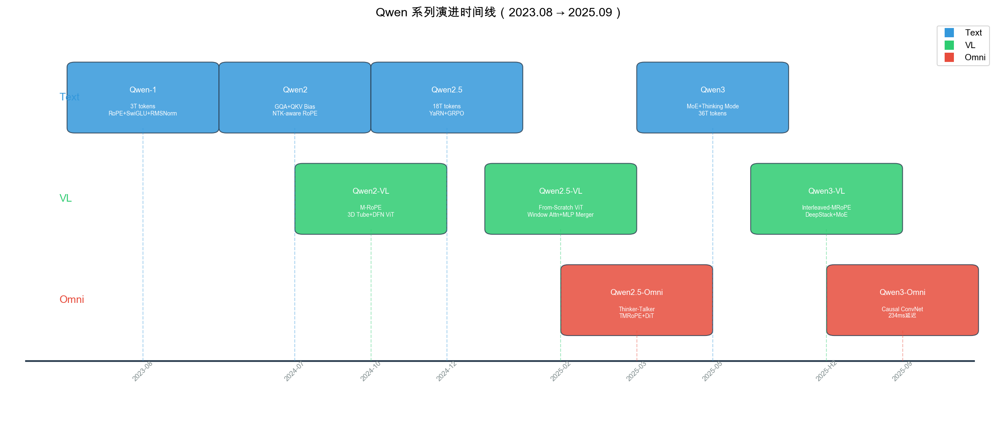

> *自绘图。说明：横轴为发布时间，纵轴分文本/VL/Omni 三行，每个模型节点标注关键技术创新。帮助读者快速把握 9 个模型的发布时序和技术脉络。此类时间线图为本报告原创，网上不存在覆盖全部 Qwen 系列的统一时间线图。*

### 纯文本 LLM 系列

| 指标 | Qwen-1 | Qwen2 | Qwen2.5 | Qwen3 |
|------|--------|-------|---------|-------|
| **最大参数量** | 14B (Dense) | 72B (Dense) | 72B (Dense) | 235B (MoE, 激活 22B) |
| **训练数据量** | ~3T tokens | 7T tokens | 18T tokens | 36T tokens |
| **上下文长度** | 2K-16K | 32K-128K | 128K-1M | 256K |
| **支持语言** | ~30 | ~30 | 29 | **119** |
| **词表大小** | 151,643 | 151,643 | 151,643 | 151,669 |
| **注意力机制** | Standard MHA | GQA (全尺寸) | GQA + QK-Norm | GQA + MoE |
| **MMLU** | 65.3 (14B) | 84.2 (72B) | ~87 (72B) | ~89 (235B-A22B) |

### 多模态系列

| 指标 | Qwen-VL | Qwen2-VL | Qwen2.5-VL | Qwen3-VL | Qwen2.5-Omni | Qwen3-Omni |
|------|---------|----------|-----------|---------|-------------|------------|
| **发布时间** | 2023.08 | 2024.10 | 2025.02 | 2025 下半年 | 2025.03 | 2025 |
| **视觉编码器** | ViT-bigG (CLIP) | DFN ViT | 从零训练 ViT | 从零 ViT + DeepStack | 继承 VL | 继承 VL |
| **融合方式** | Cross-Attention | MLP Projection | MLP Merger | MLP Merger | 继承 VL | 继承 VL |
| **位置编码** | 2D 绝对位置 | M-RoPE | M-RoPE | Interleaved-MRoPE | TMRoPE | TMRoPE |
| **最大模型** | 9.6B Dense | 72B Dense | 72B Dense | 235B-A22B MoE | 7B Dense | 30B-A3B MoE |
| **分辨率** | 固定 448×448 | 动态分辨率 | 原生动态分辨率 | 原生动态分辨率 | 继承 VL | 继承 VL |
| **视觉 token** | 固定 256 | 动态 | 动态 | 动态 | 动态 | 动态 |
| **Thinking Mode** | ❌ | ❌ | ❌ | ✅ | ❌ | ✅ |
| **语音输出** | ❌ | ❌ | ❌ | ❌ | ✅ | ✅ |

## 1.3 面试官视角的核心考点（全局概览）

### 架构设计理念（考察对多模态融合范式的理解）
1. 多模态融合的三种主流范式（Cross-Attention / Projection / Early Fusion）各自的设计哲学和适用场景
2. 为什么业界从复杂融合（Q-Former）走向简洁投影（MLP）？"简单架构 + 好数据"为什么够用？
3. 视觉编码器应该多大？视觉侧 Scaling 与语言侧 Scaling 的收益差异
4. Dense vs MoE 在多模态场景下的设计权衡

### 多模态核心问题（考察对跨模态挑战的深度理解）
1. 多模态对齐的本质是什么？对比学习对齐 vs 生成式对齐的适用场景
2. 位置编码如何从 1D 文本扩展到 2D 图像再到 3D 视频？各步解决了什么问题？
3. 动态分辨率 vs 固定分辨率的设计哲学——信息保留 vs 计算可预测性的权衡
4. 多模态幻觉的根源是什么？与纯文本幻觉有何本质不同？

### 训练范式（考察对多阶段训练的系统理解）
1. "先对齐、再理解、再跟随"的多阶段训练策略中，每阶段冻结不同组件的原理
2. 多模态训练中灾难性遗忘的来源和防护策略
3. 多模态 RLHF 为什么比纯文本 RLHF 更难？
4. 合成数据对多模态模型 Scaling Law 的影响

### 系统与演进（考察对技术发展脉络的把握）
1. 从 Qwen-VL 到 Qwen3-VL 的架构演进逻辑：每代解决了什么核心问题？
2. VL 模型 → Omni 模型的扩展中，核心挑战是什么？
3. 开源多模态模型（LLaVA / Qwen-VL / InternVL）vs 闭源（GPT-4V）的核心差距在哪里？
4. 实时多模态交互（Qwen3-Omni 234ms 延迟）的端到端瓶颈分析

---

# 第二章 Qwen 系列演进总览

## 2.1 时间线与里程碑

```
2023.08 ──→ 2024.07 ──→ 2024.10 ──→ 2024.12 ──→ 2025.02 ──→ 2025.03 ──→ 2025.05 ──→ 2025下半年 ──→ 2025
   │           │           │           │           │           │           │           │            │
   ▼           ▼           ▼           ▼           ▼           ▼           ▼           ▼            ▼
┌───────┐ ┌───────┐ ┌─────────┐ ┌─────────┐ ┌──────────┐ ┌──────────┐ ┌───────┐ ┌────────┐ ┌──────────┐
│Qwen-1 │ │Qwen2  │ │Qwen2-VL │ │Qwen2.5  │ │Qwen2.5-VL│ │Qwen2.5   │ │Qwen3  │ │Qwen3-VL│ │Qwen3    │
│       │ │       │ │         │ │         │ │          │ │  -Omni   │ │       │ │        │ │  -Omni   │
│1.8-14B│ │0.5-72B│ │ 2-72B   │ │0.5-72B  │ │ 3-72B    │ │   7B     │ │0.6-   │ │30B-A3B │ │30B-A3B  │
│Dense  │ │+GQA   │ │+M-RoPE  │ │+18T     │ │+Window   │ │+Thinker  │ │235B   │ │+235B   │ │+Causal  │
│       │ │+128K  │ │+Dynamic │ │+1M ctx  │ │ Attn ViT │ │ -Talker  │ │+Think │ │-A22B   │ │ ConvNet │
│       │ │       │ │ Res     │ │         │ │+原生分辨率│ │+TMRoPE   │ │+MoE   │ │+Think  │ │+234ms   │
└───────┘ └───────┘ └─────────┘ └─────────┘ └──────────┘ └──────────┘ └───────┘ └────────┘ └──────────┘
  Text      Text      Vision     Text       Vision       Omni        Text     Vision      Omni
```

## 2.2 架构演进核心脉络


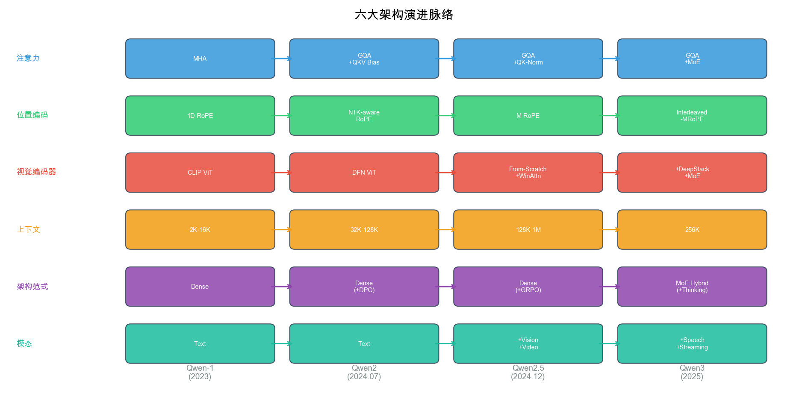

> *自绘图。说明：展示注意力机制、位置编码、视觉编码器、上下文长度、架构范式、模态支持六条平行演进线。帮助读者理解 Qwen 系列在每个技术维度上的代际进步。此图为本报告原创综合分析。*

### 脉络 1：注意力机制优化（纯文本 LLM）
```
Standard MHA (Qwen-1)
    ↓ KV cache 内存瓶颈
GQA 引入 (Qwen2, 全尺寸应用) → 8× KV cache 节省
    ↓ 长序列注意力爆炸
GQA + QK-Norm (Qwen2.5) → 长序列训练稳定
    ↓ 参数效率瓶颈
GQA + MoE 路由 (Qwen3) → 10× 容量/成本比
```

### 脉络 2：位置编码演进（跨模态）
```
1D-RoPE (Qwen-1/2, 纯文本)
    ↓ 无法表达 2D 空间位置
M-RoPE (Qwen2-VL) → head 维度三等分，编码 t/h/w 三维
    ↓ 绝对时间对齐需求
M-RoPE + 绝对时间戳 (Qwen2.5-VL) → 精确视频时间定位
    ↓ 256K 长上下文多图坐标重叠
Interleaved-MRoPE (Qwen3-VL) → 全局坐标系，100+ 图不混淆
    ↓ 音视频实时流式对齐
TMRoPE (Qwen2.5-Omni/Qwen3-Omni) → 物理时间轴统一所有模态
```

### 脉络 3：视觉编码器演进
```
CLIP ViT-bigG (Qwen-VL, 2023) → 预训练迁移，固定分辨率
    ↓ 动态分辨率需求
DFN ViT + 2D-RoPE (Qwen2-VL, 2024.10) → 可变分辨率，但 O(N²)
    ↓ 高分辨率 OOM
从零训练 ViT + Window Attention (Qwen2.5-VL, 2025.02) → 120× 加速
    ↓ 细粒度特征缺失
+ DeepStack 多层融合 (Qwen3-VL) → 浅/中/深层特征加权融合
```

### 脉络 4：上下文长度扩展
```
2K-16K (Qwen-1)
    ↓ 渐进式频率插值
32K-128K (Qwen2, NTK-aware RoPE)
    ↓ YaRN 注意力缩放
128K-1M (Qwen2.5, YaRN + 合成数据)
    ↓ 原生长上下文训练
256K 原生 (Qwen3/Qwen3-VL) → 67 分钟视频 / 7 篇论文同时处理
```

### 脉络 5：模型架构范式
```
Dense Transformer (Qwen-1/2) → 所有参数全激活
    ↓ 参数效率瓶颈
Dense + MoE 探索 (Qwen2 57B-A14B) → 首次 MoE 尝试
    ↓
混合 MoE (Qwen3, 235B/22B) → 纯文本领域成熟
    ↓ MoE 进入多模态
VL MoE (Qwen3-VL, 235B-A22B) + Omni MoE (Qwen3-Omni, 30B-A3B)
```

### 脉络 6：语音与全模态
```
无语音能力 (Qwen-1 ~ Qwen2.5-VL)
    ↓ 全模态端到端需求
Thinker-Talker + Sliding-Window DiT (Qwen2.5-Omni) → 首个 Omni 模型
    ↓ 延迟瓶颈
MoE Thinker + Causal ConvNet (Qwen3-Omni) → 234ms 首包，进入人类舒适区
```


---

# Part II: 纯文本 LLM 系列（按时间线）

# 第三章 初代 Qwen — LLaMA 架构的继承与优化（2023.08）

## 3.1 技术背景

2023 年初，LLaMA 系列论文发布，展示了**纯 Decoder-Only Transformer** 的强大能力。Qwen 团队在此基础上做出的设计选择，奠定了整个系列的架构基因：

### 继承的 LLaMA 核心组件

| 组件 | LLaMA 设计 | Qwen-1 采用 | 技术原理 |
|------|-----------|-----------|---------|
| **归一化** | RMSNorm (pre-norm) | ✓ | 移除均值项，仅用 RMS 归一化，计算更高效 |
| **激活函数** | SwiGLU | ✓ | Swish(xW) ⊗ (xV)，门控线性单元 |
| **位置编码** | RoPE | ✓ | 旋转矩阵编码相对位置，支持外推 |
| **注意力** | Standard MHA | ✓ | 标准多头注意力 |

## 3.2 核心架构细节


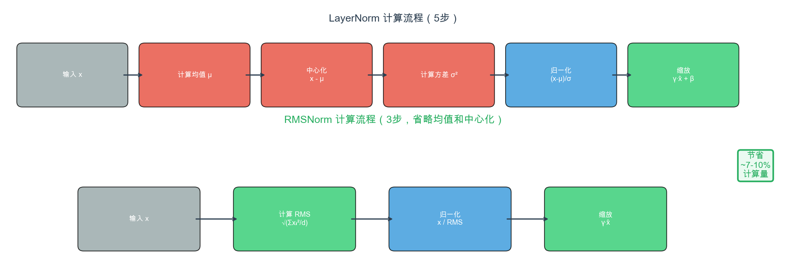

> *自绘图。说明：对比 LayerNorm（5步：含均值和中心化）和 RMSNorm（3步：省略均值直接计算 RMS）的计算流程，展示约 7-10% 的计算量节省。类似的对比图在深度学习教程中常见，此版本针对 Qwen 场景定制。*

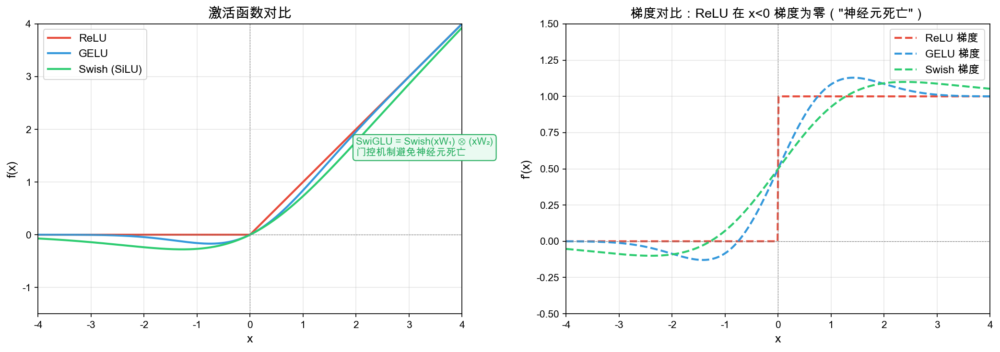

> *自绘图。说明：左图对比 ReLU/GELU/Swish 三种激活函数曲线；右图展示各函数梯度，突出 ReLU 在 x<0 时梯度为零导致"神经元死亡"问题，SwiGLU 通过门控机制避免此问题。激活函数曲线图在论文和教程中广泛存在，此版本增加了梯度对比和 SwiGLU 门控标注。*

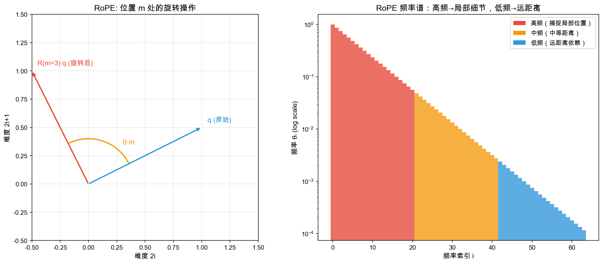

> *自绘图。说明：左图展示 2D 平面上向量旋转操作（位置 m 对应旋转角度 θ·m）；右图展示 RoPE 频率谱（高频捕捉局部位置，低频捕捉远距离依赖）。RoPE 原始论文 (Su et al., 2021, RoFormer) 中有类似旋转示意图，此版本增加了频率谱可视化。*

### 3.2.1 RMSNorm 详解

**What（是什么）**：RMSNorm 是一种简化版的 Layer Normalization，移除了均值计算（centering），仅保留缩放（scaling）操作。

**Why（为什么用它）**：
1. **计算效率**：标准 LayerNorm 需要两次遍历数据（计算均值和方差），RMSNorm 只需一次（计算均方根），约 7-10% 速度提升
2. **训练稳定性**：Pre-norm 架构 + RMSNorm 减少梯度消失，尤其对深层 Transformer（80+ 层）至关重要
3. **参数精简**：移除 bias 项 β，每层减少 2×d_model 参数
4. **实验验证**：研究表明，centering 操作对 Transformer 的归一化效果贡献很小，re-scaling 才是关键

**How（怎么实现）**：

```python
# LayerNorm (LLaMA 之前主流)
μ = mean(x)                     # 第一次遍历：计算均值
σ² = var(x)                     # 第二次遍历：计算方差
y = (x - μ) / sqrt(σ² + ε)     # centering + scaling
output = γ * y + β              # 可学习参数 γ (scale) 和 β (shift)

# RMSNorm (LLaMA & Qwen 采用)
RMS = sqrt(mean(x²))            # 一次遍历：计算均方根
y = x / RMS                     # 仅 scaling，无 centering
output = γ * y                  # 仅可学习参数 γ，无 bias 项 β
```

**形象比喻**：如果 LayerNorm 是"先把所有人的身高减去平均身高，再除以身高标准差"，RMSNorm 是"直接把所有人的身高除以身高均方根"——省去了"减去平均值"这一步，在大规模实验中发现这一步对最终效果影响很小。

### 3.2.2 SwiGLU 激活函数

**What（是什么）**：SwiGLU 是一种门控线性单元（Gated Linear Unit），结合了 Swish 激活函数的平滑性和 GLU 的门控机制。

**Why（为什么比 ReLU 好）**：
1. **平滑性**：Swish 函数在 x=0 处连续可微，避免了 ReLU 的"死亡神经元"问题——ReLU 在 x<0 时梯度为零，训练中约 10-20% 的神经元可能永久"死亡"
2. **门控机制**：逐元素乘法实现信息流控制，模型可以学习"哪些信息该通过、哪些该被抑制"
3. **表达能力**：两个独立投影矩阵 (W, V) 提供更大的表达空间，FFN 参数量虽增加约 50%，但性能提升显著
4. **实验支持**：Google Brain 的消融实验表明，SwiGLU 在相同 FLOPS 下比 ReLU/GELU 的 Transformer 性能提升 1-2%

**How（数学形式）**：

```
SwiGLU(x) = Swish_β(xW) ⊗ (xV)
          = (xW · σ(β·xW)) ⊗ (xV)

其中：
- W ∈ ℝ^{d_model × d_ff}：门控投影矩阵
- V ∈ ℝ^{d_model × d_ff}：值投影矩阵
- σ 是 Sigmoid 函数
- β 通常设为 1（此时 Swish(x) = x · sigmoid(x)，也称 SiLU）
- ⊗ 是逐元素乘法（Hadamard product）

FFN 维度调整：
  标准 FFN: d_ff = 4 × d_model（两个矩阵 W₁, W₂）
  SwiGLU FFN: d_ff = 8/3 × d_model（三个矩阵 W, V, W₂）
  → 在相同 FLOPS 下，SwiGLU 的 d_ff 需缩小以补偿额外矩阵的计算量
```

**与其他激活函数的对比**：

| 激活函数 | 公式 | 在 x=0 处 | 门控 | 死亡神经元风险 |
|---------|------|----------|------|-------------|
| **ReLU** | max(0, x) | 不可微 | ❌ | 高（10-20%）|
| **GELU** | x·Φ(x) | 可微 | ❌ | 低 |
| **GLU** | (xW) ⊗ σ(xV) | 可微 | ✅ | 低，但 Sigmoid 饱和 |
| **SwiGLU** | (xW·σ(xW)) ⊗ (xV) | 可微 | ✅ | **极低** |

### 3.2.3 RoPE 旋转位置编码

**What（是什么）**：RoPE（Rotary Position Embedding）是一种基于旋转矩阵的位置编码方案，通过对查询和键向量施加与位置相关的旋转操作，使注意力分数自然依赖于相对位置。

**Why（为什么比绝对位置编码好）**：
1. **相对位置感知**：注意力分数只依赖 (n-m)，符合自然语言的"前后关系"本质——"the cat sat on the mat"中"cat"和"sat"的关系不应因为它们出现在第 3 vs 第 100 位而改变
2. **长度外推**：旋转矩阵在推理时可自然扩展到更长序列（训练 4K → 推理 8K），无需重新训练位置嵌入
3. **计算高效**：无需额外的位置嵌入查找表，旋转操作可融合进矩阵乘法
4. **理论优雅**：基于复数空间的旋转变换，数学上可证明其注意力分数仅与相对位置有关

**How（数学推导）**：

```
核心思想：将位置信息编码为"旋转角度"

Step 1: 定义旋转矩阵
对于位置 m，定义旋转矩阵 R(m)（对每对相邻维度 [2i, 2i+1]）：

R_i(m) = [cos(m·θ_i)  -sin(m·θ_i)]
         [sin(m·θ_i)   cos(m·θ_i)]

其中频率 θ_i = 10000^(-2i/d)，i = 0, 1, ..., d/2-1
高频（i 小）→ 编码局部细节
低频（i 大）→ 编码长距离依赖

Step 2: 对 Q 和 K 施加旋转
q_m = R(m) · W_q · x_m    （位置 m 的查询向量）
k_n = R(n) · W_k · x_n    （位置 n 的键向量）

Step 3: 计算注意力分数
Attention(q_m, k_n) = (R(m)·q)ᵀ · (R(n)·k)
                    = qᵀ · R(m)ᵀ · R(n) · k
                    = qᵀ · R(n-m) · k    ← 只依赖相对位置 (n-m)！

关键性质：R(m)ᵀ · R(n) = R(n-m)（旋转矩阵的正交性）
```

**形象比喻**：想象一个时钟的秒针——位置 0 的 token 指向 12 点方向，位置 1 的 token 旋转了一个小角度指向 12:01，位置 2 旋转更大角度指向 12:02。当我们计算两个 token 的注意力时，实际比较的是它们之间的"角度差"——这就是相对位置编码。

**RoPE 是后续所有 Qwen 位置编码的基础**：M-RoPE（Qwen2-VL）将一维旋转扩展为三维旋转，TMRoPE（Qwen2.5-Omni）将旋转角度绑定到物理时间，Interleaved-MRoPE（Qwen3-VL）在全局坐标系中旋转。理解 RoPE 是理解整个 Qwen 多模态位置编码演进的前提。

### 3.2.4 Qwen-1 的独特设计

虽然架构主体类似 LLaMA，Qwen-1 有以下差异化设计：

| 设计 | LLaMA | Qwen-1 | 理由 |
|------|-------|--------|------|
| **词表大小** | 32,000 | **151,643** | 多语言优化，中文分词效率提升约 2× |
| **QKV Bias** | 无 | **有** | 提供"默认"注意力方向 |
| **嵌入绑定** | 绑定 (share) | **不绑定** | 更好的输出分布 |

**QKV Bias 的详细解释**：

**What**：在标准注意力的 Q、K、V 线性投影中加入 bias 偏置项。

**Why**：
- 当输入 X 的某些维度接近零时（例如序列开头的 token），无 bias 的线性投影输出也接近零，导致注意力分数接近均匀分布（无信息量）
- Bias 项提供与输入无关的"默认"查询和键方向，类似于 CNN 中的 bias 允许网络有"基础偏移"
- 参数量增加仅约 0.02%（3×d_model vs d_model²），成本极低

**How**：
```
标准注意力（LLaMA）：
Q = X·W_Q, K = X·W_K, V = X·W_V

带 Bias 的注意力（Qwen-1）：
Q = X·W_Q + b_Q, K = X·W_K + b_K, V = X·W_V + b_V
```

> **注意**：Qwen2 后来用 QK-Norm 替代了 QKV Bias（详见 Ch4），因为实验发现 QK-Norm 在长序列场景下更稳定。

## 3.3 训练策略

### 3.3.1 数据构成

| 数据类型 | 比例 | 说明 |
|---------|------|------|
| 通用文本 | ~60% | 网页、书籍、百科 |
| 代码 | ~20% | Python, Java, C++, JS |
| STEM | ~10% | 数学、科学、技术文档 |
| 多语言 | ~10% | 30+ 语言，中文占比高 |

### 3.3.2 三阶段训练流程

```
阶段 1: Base 预训练
├── 目标：自回归语言建模 (next token prediction)
├── 数据：~3T tokens
├── 序列长度：4096
└── 输出：Qwen-Base

阶段 2: SFT 监督微调
├── 数据：高质量指令对 (约 100K)
├── 目标：指令遵循
└── 输出：Qwen-Chat

阶段 3: RLHF 对齐
├── 奖励模型训练 (人类偏好数据)
├── PPO 优化
└── 输出：Qwen-Instruct
```

**为什么需要三阶段训练？**
1. **Base 预训练**：学习语言知识和世界知识——模型在这个阶段获得"词汇量"和"常识"
2. **SFT**：学习指令格式和任务模式——从"知识储备"转变为"有问必答"
3. **RLHF**：对齐人类价值观，减少有害输出——从"回答问题"到"安全、有帮助地回答问题"

## 3.4 性能基准

| 基准 | Qwen-7B | Qwen-14B | LLaMA2-7B | LLaMA2-13B |
|------|---------|----------|-----------|------------|
| MMLU | 58.2 | 65.3 | 45.8 | 55.2 |
| HumanEval | 35.4 | 42.1 | 14.6 | 18.9 |
| GSM8K | 52.3 | 62.1 | 15.5 | 21.4 |
| C-Eval (中文) | 72.1 | 78.5 | 33.2 | 38.7 |

**关键观察**:
- Qwen 在**代码和数学**上显著优于 LLaMA2（HumanEval +20, GSM8K +37）
- **中文能力**大幅领先（C-Eval +40），受益于 151K 词表和中文数据占比
- 14B 模型已超越 LLaMA2-13B 约 10 分

## 3.5 面试高频考点

**Q1：归一化的本质作用是什么？RMSNorm 省去 re-centering 为什么不影响性能？**

答：归一化的核心作用是控制层间激活值的尺度（scale），使梯度在反向传播中保持稳定。LayerNorm 同时做 re-centering（减均值）和 re-scaling（除标准差），但实验发现 re-scaling 是关键——它确保了不同层的输出在同一量级上；而 re-centering 的贡献有限，因为后续的可学习参数可以补偿均值偏移。RMSNorm 的成功揭示了一个更深层的原理：**深层网络训练中，激活值的"尺度"比"中心"更重要**。

**Q2：RoPE 作为位置编码，其"旋转"操作的几何直觉是什么？为什么它天然支持长度外推？**

答：RoPE 将 token 位置编码为高维空间中的旋转角度——位置越远，旋转角度越大。两个 token 之间的注意力分数只取决于它们旋转角度的差值（即相对位置），而非绝对位置。这意味着模型不会"记住"任何固定的位置编号，只会感知"你离我多远"。正因如此，旋转矩阵可以自然外推到训练时未见过的更长序列——角度可以无限增大而不改变数学性质。这一几何性质使 RoPE 成为后续 M-RoPE（三维旋转）、TMRoPE（物理时间旋转）等所有多模态位置编码的基础。

**Q3：Pre-Norm 和 Post-Norm 的选择对深层 Transformer 训练有什么本质影响？**

答：Post-Norm 将归一化放在残差连接之后，梯度需要"穿越"注意力层才能到达残差路径，在深层网络（>40 层）中容易导致梯度消失。Pre-Norm 将归一化放在子层之前，保证了一条"干净"的残差路径直通输入——梯度可以无阻碍地沿残差连接反向传播。Qwen 全系列采用 Pre-Norm，这是**训练稳定性**和**性能上限**之间权衡的选择：Pre-Norm 训练更稳定，但有研究表明 Post-Norm 的性能上限略高（梯度更充分更新每一层），这也是为什么后续有 DeepNorm 等方案尝试结合两者优势。

**Q4：门控机制（GLU/SwiGLU）在 FFN 中的设计哲学是什么？**

答：传统 FFN 是一个无门控的两层网络：先升维、再激活、再降维——所有信息无差别地通过。门控机制引入了一个"守门员"：输入被投影到两个子空间，一个作为"内容"（承载信息），一个作为"门"（决定放行比例），两者逐元素相乘。这本质上是 FFN 内部的一种**注意力机制**——模型学会选择性地放大重要特征、抑制无关噪声。SwiGLU 的 Swish 激活比 Sigmoid 门控更平滑，梯度更连续，避免了硬门控的信息阻断问题。

---

# 第四章 Qwen2 — 架构独立创新的起点（2024.07）

## 4.1 发布时间与定位

**发布时间**: 2024 年 7 月  
**定位**: 从"LLaMA 优化版"转向"独立架构设计"，标志 Qwen 系列的第一个重要转折点。

## 4.2 核心架构创新


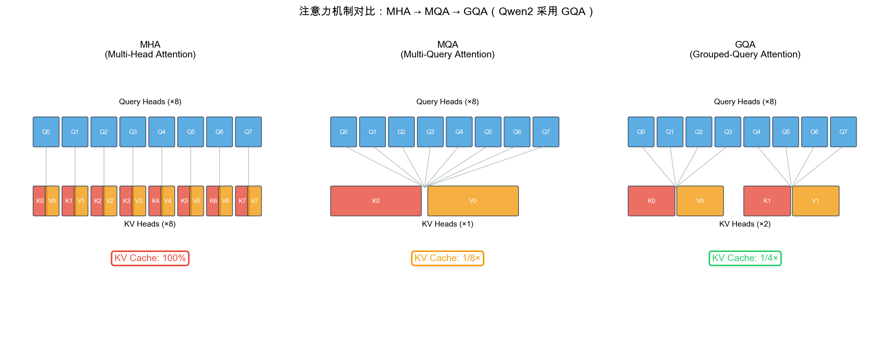

> *自绘图。说明：并排展示三种注意力机制的 Q/KV Head 分配方式和 KV Cache 开销。GQA（Grouped-Query Attention）是 MHA 和 MQA 的折中方案，Qwen2 采用此设计实现 8× KV Cache 节省。GQA 论文 (Ainslie et al., 2023) Figure 1 有类似对比图，此版本增加了 KV Cache 比例标注。*

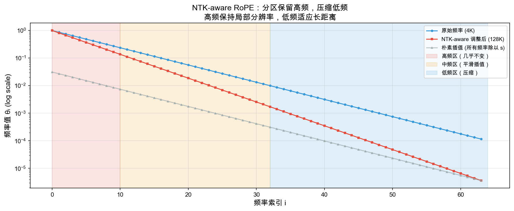

> *自绘图。说明：展示 NTK-aware RoPE 如何将频率分为三个区域：高频（保持不变，保留局部分辨率）、中频（平滑插值）、低频（压缩，适应长距离）。对比朴素插值（所有频率统一缩放）的信息损失。此类频率分区图在 NTK-aware Scaling 原始 Reddit 帖子中有类似版本，此图为数学重现。*

### 4.2.1 GQA 分组查询注意力（全尺寸应用）

**What（是什么）**：GQA（Grouped Query Attention）将 KV 头数减少为 Q 头数的 1/G，G 组 Q 头共享同一组 KV 头。

**Why（为什么 Qwen2 在全尺寸使用，而 LLaMA 仅在 70B 使用）**：
1. **LLaMA 的保守策略**：小模型（7B/13B）容量有限，减少 KV 头担心性能下降过大
2. **Qwen2 的激进策略**：
   - 通过更好的训练数据（7T tokens vs LLaMA 的 2T）补偿 GQA 的性能损失
   - 定位长上下文 + 多语言，128K 序列下 KV cache 是主要瓶颈
   - 实验表明，7B 用 GQA 仅损失 0.3 MMLU，但推理速度提升约 30%
3. **推理部署优势**：GQA 使所有尺寸的模型都能在单 GPU 上处理更长序列

**How（详细原理）**：

```
标准 MHA (Multi-Head Attention):
  Q 头数 = K 头数 = V 头数 = h = 32
  每个头独立维护自己的 KV cache
  KV cache 大小 ∝ h

GQA (Grouped Query Attention):
  Q 头数 = h = 28（Qwen2-7B）
  K 头数 = V 头数 = h/G = 28/7 = 4（G=7 分组）
  每 G 个 Q 头共享同一个 KV 头
  KV cache 大小 ∝ h/G

内存优化计算（Qwen2-7B, 序列长度 L=4096）：
  MHA: KV_cache = 2 × L × d × 2(FP16) = 2 × 4096 × 4096 × 2 = 128 MB
  GQA: KV_cache = 2 × L × (d/G) × 2 = 2 × 4096 × 512 × 2 = 16 MB
  节省：128 / 16 = 8×

长序列下的优势更加显著：
  L = 128K 时：
  MHA: KV_cache ≈ 4 GB（显存爆炸）
  GQA: KV_cache ≈ 512 MB（完全可控）
```

**形象比喻**：MHA 像"32 个翻译官，每人带自己的笔记本"，GQA 像"28 个翻译官，每 7 人共享 1 本笔记本"——翻译质量几乎不变，但笔记本数量（KV cache）减少了 7 倍。

### 4.2.2 QK-Norm 替代 QKV Bias

**What（是什么）**：在计算注意力分数之前，对 Q 和 K 向量施加 RMSNorm 归一化。

**Why（为什么替代 QKV Bias）**：
1. **长序列稳定性**：QKV Bias 在长序列下导致注意力分数的绝对值不断累积，可能出现数值爆炸（attention logits > 1000），导致 softmax 输出趋近 one-hot（信息丢失）
2. **动态范围控制**：QK-Norm 将 Q、K 的范数归一化到一致的尺度，注意力分数的范围变得可控
3. **性能提升**：Qwen2 实验表明，QK-Norm 比 QKV Bias 提升 0.5-1 MMLU

**How（数学形式）**：

```
标准注意力：
  Attention = softmax(QKᵀ / √d) V

QK-Norm 注意力（Qwen2 采用）：
  Q' = RMSNorm(Q)      ← 归一化查询向量
  K' = RMSNorm(K)      ← 归一化键向量
  Attention = softmax(Q'K'ᵀ / √d) V

归一化后的数学性质：
  ||Q'_i|| ≈ 1, ||K'_j|| ≈ 1（所有头的 Q/K 范数一致）
  → Q'K'ᵀ 的最大值被限制在 [-1, 1] × d 范围内
  → softmax 输入的动态范围可控，不会出现数值爆炸
```

### 4.2.3 NTK-aware RoPE 扩展

**What（是什么）**：一种将预训练模型的上下文从短序列（如 4K）扩展到长序列（如 128K）的位置编码插值方法。

**Why（为什么不能简单线性插值）**：
- RoPE 的频率在不同维度上编码不同尺度的信息
- 低频维度（i 大）：捕获长距离依赖，频率低，旋转慢
- 高频维度（i 小）：捕获局部细节，频率高，旋转快
- 简单线性插值将所有频率等比压缩，会导致高频信息（局部细节）失真——就像把一段音乐统一降调，高音部分会变得模糊

**How（NTK-aware 频率分段处理）**：

```
标准 RoPE 的频率：
  θ_i = 10000^(-2i/d), i = 0, 1, ..., d/2-1

NTK-aware 插值（扩展 α 倍，如 α = 128K/4K = 32）：
  θ'_i = (α · 10000)^(-2i/d)

等价理解：
  低频维度（i 大）→ 频率压缩 α 倍，适应更长序列
  高频维度（i 小）→ 保持原频率，保留局部细节
```

**直觉**：NTK-aware 插值像"乐队指挥只降低贝斯的音调来适应更大的厅堂，而小提琴的高音保持不变"——长距离信号的频率降低以覆盖更长范围，近距离信号的频率不变以保持精度。

## 4.3 模型规格

| 模型 | 参数 | 层数 | d_model | Q 头数 | KV 头数 | 上下文 |
|------|------|------|---------|--------|---------|--------|
| Qwen2-0.5B | 0.5B | 24 | 896 | 14 | 2 | 32K |
| Qwen2-1.5B | 1.5B | 28 | 1536 | 12 | 2 | 32K |
| Qwen2-7B | 7B | 28 | 3584 | 28 | 4 | 128K |
| Qwen2-57B-A14B | 57B/14B | 64 | 4096 | 32 | 4 | 32K |
| Qwen2-72B | 72B | 80 | 8192 | 64 | 8 | 128K |

**关键观察**:
- **全尺寸 GQA**：即使 0.5B 也用 GQA（KV 头数 = 2）
- **MoE 探索**：57B-A14B 是首个 MoE 模型（14B 激活参数），为 Qwen3 铺路
- **上下文统一**：7B+ 都支持 128K

## 4.4 训练数据与策略

### 数据规模提升

| 版本 | 数据量 | 增长 |
|------|--------|------|
| Qwen-1 | ~3T | - |
| Qwen2 | 7T | +133% |

### 数据质量改进

```
Qwen2 数据构成:
├── 高质量多语言文本（约 30 种语言）— 50%
├── 代码数据（Python, Java, C++, JS）— 25%
├── STEM 领域数据 — 15%
└── 合成数据增强 — 10%
    ├── 使用 Qwen-1 生成高质量数学推理样本
    ├── 数据过滤：去重、质量评分、毒性检测
    └── 课程学习：简单样本 → 复杂样本
```

### 后训练策略

```
SFT 阶段:
├── 数据：高质量指令对（约 500K，比 Qwen-1 的 100K 扩大 5 倍）
├── 多轮对话数据
└── 代码/数学专用指令

RLHF 阶段:
├── 奖励模型：72B Base 模型微调
├── 偏好数据：人类标注 + AI 反馈
└── 优化算法：PPO + DPO 混合
```

## 4.5 性能突破

| 基准 | Qwen2-72B | LLaMA3-70B | GPT-4 |
|------|-----------|------------|-------|
| MMLU | 84.2 | 79.5 | 86.4 |
| HumanEval | 64.6 | 55.2 | 67.2 |
| GSM8K | 89.5 | 80.1 | 92.1 |
| BBH | 82.4 | 76.3 | 85.2 |
| MT-Bench | 9.1 | 8.3 | 9.2 |

**关键里程碑**:
- Qwen2-72B **首次超越** LLaMA3-70B 在所有主要基准
- GSM8K 接近 GPT-4 水平
- MT-Bench（对话质量）达到 GPT-4 级别

## 4.6 面试高频考点

**Q1：GQA 的设计动机是什么？它在 MHA 和 MQA 之间做了怎样的权衡？**

答：MHA（多头注意力）每个头独立拥有 K/V，表达力强但 KV cache 随头数线性增长，长序列下内存成为瓶颈。MQA（多查询注意力）所有头共享一组 K/V，内存极低但表达力严重退化。GQA 是两者的连续谱上的折中——将 Q 头分组，每组共享一对 K/V。本质上是一个**信息共享程度的连续调节**：更多共享 = 更省内存但更模糊，更少共享 = 更精细但更贵。Qwen2 选择全尺寸 GQA（包括小模型）说明一个判断：**在长上下文时代，推理效率比训练时的微弱性能损失更重要**。

**Q2：为什么长上下文扩展需要"分频处理"（NTK-aware / YaRN）而不是简单地缩放所有频率？**

答：RoPE 的不同频率维度承载不同尺度的信息——高频维度编码相邻 token 的细微差异（"cat"和"sat"谁在前），低频维度编码远距离的结构关系（段落主题）。简单线性缩放等于把所有频率等比压缩，就像把一段音乐统一降调——高音（局部细节）变得模糊不清。分频处理的思想来自**信号处理中的多分辨率分析**：低频维度压缩以适应更长范围，高频维度保持原频率以保留局部分辨率。这是"鱼与熊掌兼得"的经典工程手法。

**Q3：注意力分数的数值稳定性为什么在长序列下变得关键？QK-Norm 的设计原理是什么？**

答：注意力分数 = Q·K^T / √d，当序列极长时（128K+ tokens），Q 和 K 向量的范数可能因累积效应而增大，导致 softmax 前的 logits 分布变得极端（某些值极大或极小），进而引发梯度消失或数值溢出。QK-Norm 的设计原理是在计算注意力之前，先将 Q 和 K 各自归一化到单位范数，使得点积值始终在可控范围内。这是一种**预防性约束**而非事后修补——它不改变注意力的语义（谁该关注谁），只确保数值不爆炸。

---

# 第五章 Qwen2.5 — 数据规模与长上下文突破（2024.12）

## 5.1 发布背景与战略定位

**发布时间**：2024 年 12 月
**核心战略**：数据 Scaling Law 极限验证 + 长上下文技术领导

Qwen2.5 在架构上**完全继承 Qwen2** 的设计（GQA + QK-Norm + SwiGLU + NTK-aware RoPE），没有引入新的架构组件。这是一个有意为之的决策：当架构已经足够优秀时，**数据质量和规模才是性能上限的决定因素**。

> **类比**：如果说 Qwen2 是一辆性能优秀的赛车（架构创新），那 Qwen2.5 就是给这辆赛车加满了高级燃油（18T 数据）并装上了更大的油箱（1M 上下文）。

| 组件 | Qwen2 | Qwen2.5 | 变化 |
|------|-------|---------|------|
| 注意力机制 | GQA + QK-Norm | 同左 | 不变 |
| 位置编码 | NTK-aware RoPE | NTK-aware RoPE + **YaRN** | 长上下文增强 |
| 激活函数 | SwiGLU | 同左 | 不变 |
| 归一化 | RMSNorm | 同左 | 不变 |
| 词表大小 | 151,643 | 同左 | 不变 |
| 预训练数据 | 7T tokens | **18T tokens** | **2.57× 增长** |
| 上下文长度 | 128K | **1M** | **7.8× 扩展** |

## 5.2 训练数据规模突破：从 7T 到 18T


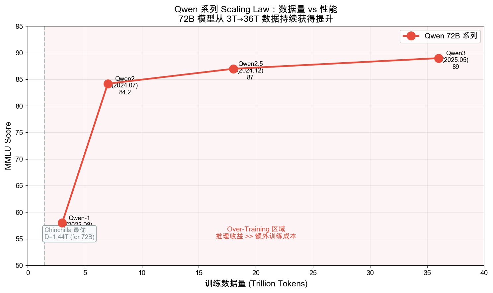

> *自绘图。说明：展示 72B 模型从 3T→36T 训练数据的 MMLU 性能提升曲线，标注 Chinchilla 最优数据量（1.44T）和 Over-Training 区域。帮助理解为什么 Qwen 选择远超 Chinchilla 最优的数据量（推理收益远大于额外训练成本）。此图为根据公开 benchmark 数据绘制的原创分析图。*

### 5.2.1 数据量的指数增长

| 版本 | 训练数据量 | 相对增长 | 关键来源 |
|------|-----------|---------|---------|
| Qwen-1（2023.08） | ~3T tokens | 基线 | 公开爬取 + 书籍 |
| Qwen2（2024.07） | 7T tokens | 2.3× | + 多语言 + 代码 |
| Qwen2.5（2024.12） | **18T tokens** | **6×** | + 合成数据 + 专业领域 |

### 5.2.2 Scaling Law 视角分析

**What**：Scaling Law 描述了模型性能与参数量 N、数据量 D 之间的幂律关系。

**Why**：理解 Scaling Law 有助于预测数据量增加带来的性能收益，也解释了 Qwen2.5 为什么选择在数据而非架构上投入。

**How**：根据 Chinchilla Scaling Law：

$$L(N, D) = \frac{A}{N^{\alpha}} + \frac{B}{D^{\beta}} + L_{\text{opt}}$$

其中：
- $L$：交叉熵损失
- $N$：模型参数量
- $D$：训练数据量（tokens）
- $\alpha \approx 0.34$，$\beta \approx 0.28$：缩放指数
- $A, B$：拟合系数
- $L_{\text{opt}}$：理论最优损失（不可约减）

**Qwen2.5 的数据投入分析**：

```
固定参数量 N = 72B，数据从 7T → 18T (2.57× 增长):

数据项贡献的损失变化：
ΔL_data = B × (7T^{-0.28} - 18T^{-0.28})

由于 β = 0.28 < 1，数据量翻倍的边际收益递减:
- 从 3T → 7T（2.3×）: 预期 MMLU +3~4 分 → 实际 +4.7 分
- 从 7T → 18T（2.57×）: 预期 MMLU +2~3 分 → 实际 +2.8 分

关键洞察：Qwen2.5 的性能提升符合 Scaling Law 预测，说明
           架构本身已经足够高效，没有成为瓶颈。
```

**Chinchilla 最优比例**的意义：

```python
# Chinchilla 最优：N 和 D 按相同比例扩展
# 对于 72B 模型，Chinchilla 最优数据量 ≈ 72B × 20 = 1.44T
# Qwen2.5 使用 18T = 12.5× Chinchilla 最优

# 为什么 Qwen 选择"过训练"(Over-Training)？
# 原因：推理成本远大于训练成本
# - 训练一次，推理百万次
# - Over-Training 降低每次推理的损失
# - 18T 数据的额外训练成本 << 推理时更低损失带来的收益
```

### 5.2.3 数据质量工程

Qwen2.5 的 18T 数据不是简单的"更多爬取"，而是系统化的数据质量工程：

```
Qwen2.5 数据增强策略:
├── 1. 合成数据生成 (Synthetic Data)
│   ├── 使用 Qwen2-72B 生成高质量常识推理样本
│   ├── 数学证明、逻辑推理、代码算法的 step-by-step 生成
│   └── 占比估计：~20% 的新增数据来自合成
│
├── 2. 专家知识增强 (Domain Expert Data)
│   ├── 医学：临床指南、药物知识、诊断推理
│   ├── 法律：法规条文、判例分析、法律推理
│   ├── 金融：财报分析、风险评估、量化策略
│   └── STEM：论文精选、教科书、实验记录
│
├── 3. OCR 数据提取
│   ├── 使用 Qwen2.5-VL 从 PDF 文档中提取结构化文本
│   ├── 覆盖学术论文、技术手册、历史文献
│   └── 关键：保留表格、公式等结构化信息
│
├── 4. 多语言平衡
│   ├── 29 种语言，重点增强低资源语言
│   ├── 通过翻译 + 原生数据混合确保质量
│   └── 中英文仍占主导（~70%），但其他语言质量显著提升
│
└── 5. 数据去重与清洗
    ├── MinHash 去重（文档级 + 段落级）
    ├── 质量过滤（perplexity、coherence 评分）
    └── 安全过滤（有害内容移除）
```

> **关键洞察**：Qwen2.5 的数据策略体现了一个重要趋势——**合成数据成为突破数据瓶颈的关键手段**。当高质量自然数据接近枯竭时，用强模型生成训练数据成为"自举"（Bootstrapping）的有效方式。

## 5.3 长上下文技术突破：从 128K 到 1M


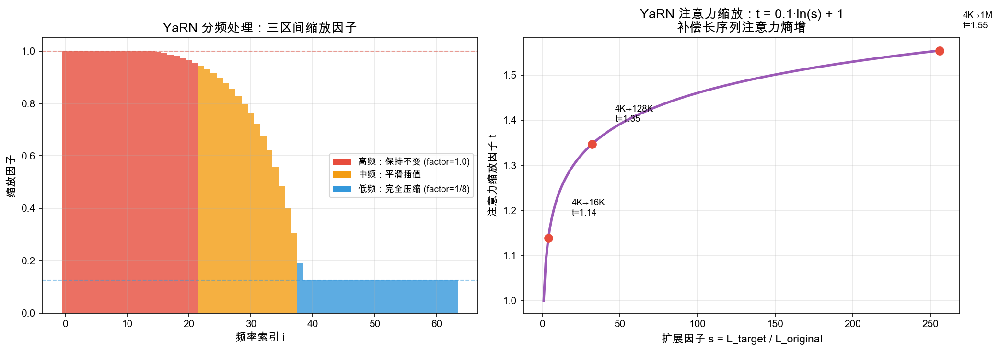

> *自绘图。说明：左图展示 YaRN 对不同频率索引的缩放因子（高频保持/中频平滑/低频压缩三区间处理）；右图展示注意力缩放因子 t=0.1·ln(s)+1 随扩展因子的变化，标注关键扩展点（4K→16K/128K/1M）。YaRN 原始论文 (Peng et al., 2023) 中有频率分析图，此版本增加了注意力缩放因子的定量可视化。*

### 5.3.1 YaRN（Yet another RoPE extensioN）

**What**：YaRN 是一种 RoPE 位置编码的扩展方法，通过注意力缩放因子和分频处理，将模型的上下文长度从 128K 扩展到 1M。

**Why**：当序列长度远超训练时的上下文窗口时，注意力分数会出现两个问题：
1. **注意力稀释**（Attention Dilution）：序列越长，softmax 的概率质量越分散，每个 token 获得的注意力越少
2. **频率外推失败**：RoPE 的旋转频率在超长序列下可能超出训练范围

**How**：YaRN 的数学原理分三步：

**第一步：RoPE 频率分组**

RoPE 将 $d$ 维隐藏状态分成 $d/2$ 个频率维度，每个维度的基础频率为：

$$\omega_i = \theta^{-2i/d}, \quad i = 0, 1, \ldots, d/2 - 1$$

其中 $\theta = 10000$（RoPE 基础频率）。

YaRN 将这些频率维度分为三组：

```
频率分组策略：
├── 高频组 (i < d_low):  保持原频率不变
│   └── 捕获局部语义细节（相邻 token 关系）
├── 中频组 (d_low ≤ i ≤ d_high): 渐进式插值
│   └── 过渡区域，平滑处理
└── 低频组 (i > d_high): 按比例压缩
    └── 捕获长距离依赖，适配更长序列
```

**第二步：分频插值**

对于扩展因子 $s = L_{\text{target}} / L_{\text{train}}$（如 $1M / 4K = 256$）：

$$\omega'_i = \begin{cases}
\omega_i & \text{if } i < d_{\text{low}} \quad \text{（高频不变）} \\
\omega_i \cdot \frac{1 - \gamma(i)}{s} + \omega_i \cdot \gamma(i) & \text{if } d_{\text{low}} \leq i \leq d_{\text{high}} \quad \text{（中频渐进）} \\
\omega_i / s & \text{if } i > d_{\text{high}} \quad \text{（低频压缩）}
\end{cases}$$

其中 $\gamma(i)$ 是一个从 0 到 1 的插值函数，确保中频区域的平滑过渡。

**第三步：注意力缩放因子**

$$A_{\text{YaRN}}(m, n) = \frac{1}{\sqrt{t}} \cdot \mathbf{q}^T \mathbf{R}(\omega'_i, m-n) \mathbf{k}$$

其中缩放因子 $t$ 的计算：

$$t = 0.1 \ln(s) + 1$$

> **类比**：YaRN 就像一个"变焦镜头"——高频部分保持"微距"模式看清近处细节，低频部分切换到"广角"模式看清远处全景，中频部分则平滑过渡，避免画面突变。

**代码示意**：

```python
import torch
import math

def yarn_rope_scaling(
    dim: int,
    max_position: int,
    base_context: int = 4096,
    target_context: int = 1_000_000,
    beta_fast: float = 32.0,
    beta_slow: float = 1.0,
    base: float = 10000.0,
) -> torch.Tensor:
    """计算 YaRN 缩放后的 RoPE 频率"""
    scale = target_context / base_context  # 扩展因子 s
    
    # 原始 RoPE 频率
    freqs = 1.0 / (base ** (torch.arange(0, dim, 2).float() / dim))
    
    # 计算每个频率维度的"波长"
    wavelengths = 2 * math.pi / freqs
    
    # 分频处理
    low_freq_wavelen = base_context / beta_fast   # 高频阈值
    high_freq_wavelen = base_context / beta_slow   # 低频阈值
    
    new_freqs = []
    for freq, wavelen in zip(freqs, wavelengths):
        if wavelen < low_freq_wavelen:
            # 高频：保持不变
            new_freqs.append(freq)
        elif wavelen > high_freq_wavelen:
            # 低频：按比例压缩
            new_freqs.append(freq / scale)
        else:
            # 中频：渐进插值
            smooth = (high_freq_wavelen - wavelen) / (
                high_freq_wavelen - low_freq_wavelen
            )
            new_freqs.append(
                (1 - smooth) * freq / scale + smooth * freq
            )
    
    return torch.tensor(new_freqs)

# 注意力缩放因子
def yarn_attention_scale(scale: float) -> float:
    """YaRN 注意力缩放因子 t"""
    return 0.1 * math.log(scale) + 1.0

# 示例：4K → 1M 扩展
scale_factor = 1_000_000 / 4096  # = 244.14
attn_scale = yarn_attention_scale(scale_factor)
print(f"扩展因子: {scale_factor:.1f}, 注意力缩放: {attn_scale:.4f}")
# 输出: 扩展因子: 244.1, 注意力缩放: 1.5497
```

### 5.3.2 渐进式上下文扩展策略

Qwen2.5 采用**多阶段渐进式**上下文扩展，而非一步到位：

```
渐进式扩展策略:
├── 阶段 1: 预训练基线
│   ├── 上下文: 4K tokens
│   ├── RoPE base: θ = 10000
│   └── 标准 RoPE，无任何扩展
│
├── 阶段 2: 中等扩展
│   ├── 上下文: 4K → 32K
│   ├── 方法: NTK-aware RoPE, α = 8
│   ├── 继续训练: ~500B tokens
│   └── 数据: 长文档 + 书籍 + 代码库
│
├── 阶段 3: 大幅扩展
│   ├── 上下文: 32K → 128K
│   ├── 方法: NTK-aware RoPE, α = 4
│   ├── 继续训练: ~200B tokens
│   └── 数据: 精选长上下文样本
│
└── 阶段 4: 极限扩展（仅 72B+）
    ├── 上下文: 128K → 1M
    ├── 方法: YaRN
    ├── 继续训练: ~100B tokens
    └── 数据: 合成超长文档 + needle-in-haystack

为什么渐进式而非一步到位？
1. 稳定性：一次性从 4K → 1M 会导致损失函数震荡
2. 数据质量：不同长度需要不同的训练数据
3. 效率：短序列训练更快，先学短再学长
```

### 5.3.3 长上下文性能验证

| 基准 | 评估维度 | Qwen2.5-72B | LLaMA3-405B | GPT-4o |
|------|---------|-------------|-------------|--------|
| RULER (128K) | 长程检索与推理 | **85.2** | 78.5 | 82.1 |
| InfiniteBench (200K) | 超长文档理解 | **72.3** | — | 68.5 |
| Needle-in-Haystack (1M) | 精确信息检索 | **98.5%** | — | 95.2% |

**关键观察**：
- Qwen2.5-72B 在长上下文上**超越 LLaMA3-405B**（参数量仅为其 1/5）
- 1M 上下文检索准确率达 98.5%，接近完美
- 这证明了 YaRN + 渐进扩展策略的有效性

## 5.4 后训练策略升级


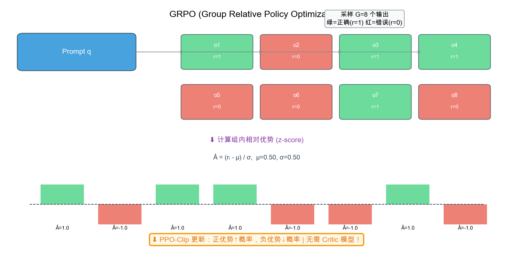

> *自绘图。说明：展示 GRPO（Group Relative Policy Optimization）的核心机制——对一个 prompt 采样 G=8 个输出，按 reward 着色，计算组内 z-score 相对优势，然后用 PPO-Clip 更新。关键创新：无需 Critic 模型。DeepSeekMath 论文 (Shao et al., 2024) 中有 GRPO 的采样示意图，此版本增加了优势计算的可视化。*

### 5.4.1 SFT 数据规模翻倍

| 版本 | SFT 样本数 | 增长 | 覆盖领域 |
|------|-----------|------|---------|
| Qwen2 | ~500K | 基线 | 通用对话 + 代码 + 数学 |
| Qwen2.5 | **1M+** | **+100%** | + 长文本 + Agent + 工具使用 |

### 5.4.2 多阶段强化学习

**What**：Qwen2.5 首次引入三阶段 RL 训练管道，针对不同能力使用不同的 RL 算法。

**Why**：不同任务类型适合不同的奖励信号和优化策略——格式遵循需要人类偏好（DPO），推理需要可验证答案（GRPO），长文本需要细粒度反馈（PPO）。

**How**：

```
三阶段 RL 训练管道:

阶段 1: 基础对齐 (DPO)
├── 目标: 指令遵循、格式遵循、安全对齐
├── 数据: ~50K 人类偏好对 (chosen vs rejected)
├── 算法: Direct Preference Optimization (DPO)
│   ├── 无需奖励模型
│   ├── 直接从偏好对学习
│   └── Loss: L_DPO = -log σ(β · (log π(y_w|x) - log π(y_l|x) 
│                              - log π_ref(y_w|x) + log π_ref(y_l|x)))
└── 训练规模: ~1 epoch

阶段 2: 推理强化 (GRPO)
├── 目标: 数学推理、代码生成
├── 数据: 可验证的推理问题（有标准答案）
├── 算法: Group Relative Policy Optimization (GRPO)
└── 训练规模: ~3-5 epochs（迭代式）

阶段 3: 长文本对齐 (PPO)
├── 目标: 长文本结构化分析、长对话连贯性
├── 数据: 长文档 QA、多轮对话、代码库理解
├── 算法: Proximal Policy Optimization (PPO)
│   ├── 需要 Critic 模型（估计状态价值）
│   └── 更适合长序列的 dense reward 信号
└── 训练规模: ~1-2 epochs
```

### 5.4.3 GRPO 算法详解

**What**：GRPO（Group Relative Policy Optimization）是 Qwen 团队提出的 RL 算法，通过**组内相对排名**替代 Critic 模型来估计优势函数。

**Why**：传统 PPO 需要一个与策略模型同等规模的 Critic 模型，对于 72B 参数的模型意味着额外 72B 参数的显存占用。GRPO 完全移除了 Critic，将显存需求降低约 30%。

**How**：

**核心思想**：对每个问题采样 G 个输出，在组内计算相对优势。

$$\text{GRPO 优化目标:} \quad J(\theta) = \mathbb{E}_{x \sim \mathcal{D}} \left[ \frac{1}{G} \sum_{i=1}^{G} \min\left( r_i(\theta) \hat{A}_i, \text{clip}(r_i(\theta), 1-\epsilon, 1+\epsilon) \hat{A}_i \right) \right]$$

其中：
- $r_i(\theta) = \frac{\pi_\theta(y_i | x)}{\pi_{\text{old}}(y_i | x)}$：策略比率
- $\hat{A}_i$：组内相对优势（不需要 Critic）

**组内优势计算**：

$$\hat{A}_i = \frac{R_i - \text{mean}(\{R_1, R_2, \ldots, R_G\})}{\text{std}(\{R_1, R_2, \ldots, R_G\})}$$

其中 $R_i$ 是第 $i$ 个输出的奖励分数（如数学题是否正确、代码是否通过测试）。

```python
import torch
import torch.nn.functional as F

def grpo_loss(
    logprobs: torch.Tensor,      # [batch, group_size, seq_len]
    old_logprobs: torch.Tensor,   # [batch, group_size, seq_len]
    rewards: torch.Tensor,         # [batch, group_size]
    epsilon: float = 0.2,
    beta: float = 0.01,           # KL 惩罚系数
) -> torch.Tensor:
    """GRPO 损失函数实现"""
    
    # Step 1: 计算组内相对优势
    # rewards shape: [batch, group_size]
    mean_rewards = rewards.mean(dim=-1, keepdim=True)  # [batch, 1]
    std_rewards = rewards.std(dim=-1, keepdim=True).clamp(min=1e-8)
    advantages = (rewards - mean_rewards) / std_rewards  # [batch, group_size]
    
    # Step 2: 计算策略比率
    # 沿序列维度求和得到整个输出的 log 概率
    seq_logprobs = logprobs.sum(dim=-1)      # [batch, group_size]
    seq_old_logprobs = old_logprobs.sum(dim=-1)
    ratio = torch.exp(seq_logprobs - seq_old_logprobs)  # [batch, group_size]
    
    # Step 3: PPO-clip 损失
    surr1 = ratio * advantages
    surr2 = torch.clamp(ratio, 1 - epsilon, 1 + epsilon) * advantages
    policy_loss = -torch.min(surr1, surr2).mean()
    
    # Step 4: KL 惩罚（防止偏离参考策略太远）
    kl_penalty = beta * (seq_logprobs - seq_old_logprobs).pow(2).mean()
    
    return policy_loss + kl_penalty

# 使用示例
# 对每个数学题采样 G=8 个输出
# 用验证器（如 SymPy）检查每个输出是否正确
# rewards[i] = 1.0 if correct else 0.0
```

**GRPO vs PPO 对比**：

| 维度 | PPO | GRPO |
|------|-----|------|
| Critic 模型 | 需要（同等规模） | **不需要** |
| 显存占用 | ~2× 策略模型 | ~1.3× 策略模型 |
| 优势估计 | 通过 Critic 的 TD 误差 | **组内相对排名** |
| 奖励信号 | dense reward（逐 token） | sparse reward（整个输出） |
| 最适场景 | 长序列、细粒度反馈 | **可验证任务**（数学、代码） |
| 训练稳定性 | 受 Critic 准确性影响 | 组内归一化天然稳定 |

> **类比**：PPO 就像一位全程陪同的教练（Critic），每一步都给出评价。GRPO 就像考试后的排名——不需要教练，只需要看同一批试卷中谁的分数更高，就能知道哪些答案更好。

## 5.5 专用模型矩阵

Qwen2.5 是首个推出**完整专用模型矩阵**的系列，覆盖通用、代码、数学、视觉、音频五大领域：

```
Qwen2.5 系列全景:
├── Qwen2.5 (通用 LLM)
│   ├── 尺寸: 0.5B / 1.5B / 3B / 7B / 14B / 32B / 72B
│   ├── 特色: 18T 数据 + 1M 上下文 + 多阶段 RL
│   └── 商业版: Turbo (MoE, 低延迟) / Plus (MoE, 高质量)
│
├── Qwen2.5-Coder (代码专用)
│   ├── 尺寸: 0.5B / 1.5B / 3B / 7B / 14B / 32B
│   ├── 训练数据: 5.5T tokens（代码占比 60%）
│   ├── 特色: File-level completion + Repository-level understanding
│   └── 基准: HumanEval ~82 (32B), 超越 GPT-4o-mini
│
├── Qwen2.5-Math (数学专用)
│   ├── 尺寸: 1.5B / 7B / 72B
│   ├── 训练数据: 数学推理 + Qwen2 自生成合成数据
│   ├── 特色: Chain-of-Thought 推理 + Tool-Integrated Reasoning
│   └── 基准: MATH ~90 (72B), 接近 OpenAI o1-mini
│
├── Qwen2.5-VL (视觉语言)
│   ├── 尺寸: 3B / 7B / 72B
│   ├── 特色: 原生动态分辨率 + M-RoPE + 从零训练 ViT
│   └── 详见 Part III 第九章
│
└── Qwen2.5-Omni (全模态)
    ├── 特色: Thinker-Talker 架构 + 端到端语音对话
    └── 详见 Part III 第十章
```

**为什么需要专用模型而非单一通用模型？**

三个技术原因：
1. **数据分布差异**：代码的 token 分布（关键词、缩进、括号）与自然语言差异显著，单一模型难以兼顾
2. **评估基准天花板**：专用模型通过领域特化数据可以在特定基准上达到 SOTA，而通用模型受数据混合比例限制
3. **部署效率**：用户可按需选择 7B 代码模型而非 72B 通用模型，降低推理成本

## 5.6 性能基准

### 5.6.1 通用基准

| 基准 | 评估维度 | Qwen2.5-72B | Qwen2-72B | LLaMA3-405B | GPT-4o |
|------|---------|-------------|-----------|-------------|--------|
| MMLU | 知识广度 | **~87** | 84.2 | 85.2 | 88.7 |
| HumanEval | 代码生成 | **~75** | 64.6 | 70.1 | 90.2 |
| GSM8K | 数学推理 | **~92** | 89.5 | 88.2 | 95.8 |
| MATH | 竞赛数学 | **~85** | 78.3 | 79.1 | 76.6 |
| Arena-Hard | 对话质量 | **~55** | 48.1 | 52.3 | 62.5 |

**关键里程碑**：
- Qwen2.5-72B **全面超越 LLaMA3-405B**（仅 1/5 参数）
- MATH 85 分**超越 GPT-4o**（76.6），竞赛数学成为优势领域
- 代码和对话仍有提升空间（与 GPT-4o 差距 ~10 分）

### 5.6.2 模型效率分析

```
参数效率比 (MMLU / 参数量):
├── Qwen2.5-72B:  87 / 72B  = 1.21
├── LLaMA3-405B:  85.2 / 405B = 0.21
├── GPT-4o:       88.7 / ~200B = 0.44 (估计)
└── Qwen2.5-72B 的参数效率是 LLaMA3-405B 的 5.8 倍

这说明：在适当的架构和充足的数据下，
参数量不是性能的唯一决定因素。
```

## 5.7 面试高频考点

**Q1：Over-training（超过 Chinchilla 最优比例）为什么在工业部署中反而更划算？**

答：Chinchilla Law 的最优比例（参数量 N ∝ 数据量 D）是在**训练成本最优**的前提下推导的。但工业场景中，一个模型训练一次、推理百万次——真正的成本瓶颈在推理端。Over-training（用更多数据训练相同大小的模型）虽然训练成本更高，但能在**不增加推理成本**的前提下降低每次推理的 loss。Qwen2.5 用 18T 数据训练 72B 模型（12.5× Chinchilla 最优），本质是**把训练时间换推理质量**——这在大规模部署下的总成本远低于训练一个更大模型。

**Q2：为什么 GRPO 对数学推理比 PPO 更有效？它反映了 RL 对齐中的什么设计原则？**

答：GRPO 的核心洞察是：**当奖励信号是稀疏且二值的（对/错），逐步估计状态价值是徒劳的**。PPO 依赖 Critic 模型估计"每一步的好坏"，但数学推理中，只有最终答案的对错才有明确信号，中间步骤的价值几乎无法可靠估计——一个"看起来错"的中间步骤可能恰好导向正确答案。GRPO 绕过了这个困难：同一道题生成 G 个完整解答，只比较"谁最终答对了"，让正确解答获得正奖励、错误解答获得负奖励。这反映了一个更深层的设计原则：**RL 算法的复杂度应匹配奖励信号的结构**——信号越稀疏，越应该简化价值估计。

**Q3：合成数据为什么能"打破" Scaling Law 的收益递减？**

答：传统 Scaling Law 的数据项假设数据来自固定分布。合成数据改变了游戏规则——通过更强模型生成推理链、代码解题步骤等，实际上引入了**新的信息维度**（推理模式、解题策略），而非简单重复已有分布中的数据。类比人类学习：读 10000 篇新闻不如读 100 道解析详尽的数学题对推理能力提升大——因为后者包含更高密度的"推理信息"。这意味着真正的瓶颈不是"数据量"而是"信息多样性"，合成数据恰好补充了 Web 文本中缺乏的推理示范。


---

# 第六章 Qwen3 — 混合 MoE 与动态推理革命（2025.05）

## 6.1 发布背景与战略定位

**发布时间**：2025 年 5 月
**核心战略**：架构范式革新 + 动态推理控制 + 规模化 MoE

Qwen3 是 Qwen 系列的**第四次重大迭代**，也是第一次在架构层面引入两项"范式级"创新：
1. **统一 Thinking/Non-Thinking 模式**：单一模型同时支持深度推理和快速应答
2. **混合 Dense + MoE 产品线**：从 0.6B 到 235B 覆盖全场景

| 维度 | Qwen2.5 | Qwen3 | 变化 |
|------|---------|-------|------|
| 训练数据 | 18T tokens / 29 语言 | **36T tokens / 119 语言** | 2× / 4.1× |
| 架构类型 | 纯 Dense | **Dense + MoE 混合** | 新增 MoE |
| 推理模式 | 单一模式 | **Thinking + Non-Thinking** | 新增动态推理 |
| 上下文 | 1M（72B） | 256K（全尺寸原生） | 原生长上下文 |
| 模型数量 | 7 个 Dense | **6 Dense + 2 MoE** | 更丰富 |

> **里程碑意义**：Qwen3 是首个在**单一模型**内统一推理深度控制的中文大模型，用户可以在延迟和准确率之间动态权衡，无需切换模型。

## 6.2 统一 Thinking/Non-Thinking 架构

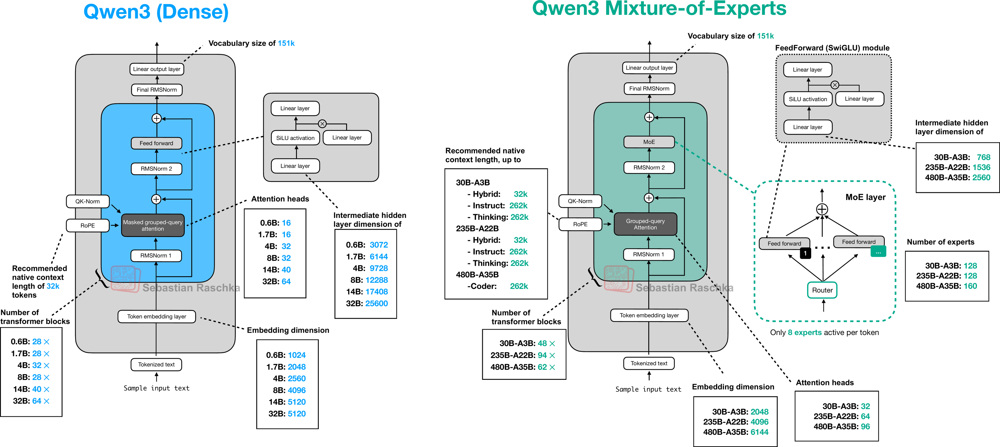

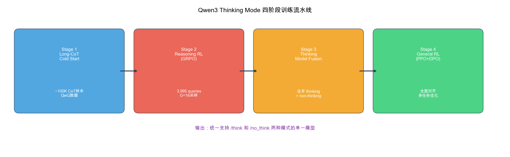

> *自绘图。说明：展示 Qwen3 Thinking Mode 的四阶段训练过程：Long-CoT Cold Start → Reasoning RL(GRPO) → Thinking Model Fusion → General RL(PPO+DPO)。帮助理解如何从零训练出统一支持 /think 和 /no_think 的单一模型。此训练流水线图为本报告原创，基于 Qwen3 技术报告中的文字描述绘制。*

### 6.2.1 设计动机

**What**：单一模型通过特殊 token 控制推理模式——`/think` 启用 Chain-of-Thought 深度推理，`/no_think` 启用快速直接回答。

**Why**：在 Qwen2.5 时代，用户需要在推理模型（如 QwQ-32B）和快速模型（如 Qwen2.5-72B-Instruct）之间切换。这带来三个问题：
1. **部署复杂度**：需要维护两套模型服务
2. **用户体验**：难以判断何时需要深度推理
3. **资源浪费**：简单问题也走完整推理流程

**How**：Thinking Mode 的技术实现分三层：

**层次 1：训练数据构造**

```
Thinking 训练数据:
├── 长 CoT 数据 (Chain-of-Thought)
│   ├── 来源: 人工标注 + Qwen2.5 自生成
│   ├── 格式: <think>中间推理步骤</think>最终答案
│   ├── 领域: 数学证明、代码调试、逻辑推理、科学问题
│   └── 规模: ~500K 样本
│
└── Non-Thinking 训练数据:
    ├── 来源: 标准 Instruct SFT 数据
    ├── 格式: 直接给出答案（无 <think> 标签）
    ├── 领域: 日常对话、翻译、摘要、信息检索
    └── 规模: ~1M+ 样本

两种数据混合训练，模型学会根据上下文选择模式。
```

**层次 2：推理时模式切换**

```
用户输入: "证明 √2 是无理数"

→ 模式判断（基于输入 token 或用户指令）

┌─────────── Thinking Mode (/think) ──────────┐
│                                               │
│  <think>                                     │
│  假设 √2 是有理数，则 √2 = p/q            │
│  其中 p, q 为互质整数...                    │
│  两边平方: 2 = p²/q²                        │
│  因此 p² = 2q²                               │
│  所以 p² 是偶数，p 也是偶数...              │
│  （完整推理链）                              │
│  </think>                                    │
│                                               │
│  √2 是无理数。证明如下：...                  │
└───────────────────────────────────────────────┘

┌─────────── Non-Thinking Mode (/no_think) ─────┐
│                                                │
│  √2 是无理数，可以通过反证法证明。           │
│  假设 √2 = p/q（互质），则...               │
│  （简洁回答，无详细推理过程）                │
└────────────────────────────────────────────────┘
```

**层次 3：Thinking Budget 机制**

```
Thinking Budget 控制推理深度:

用户参数: thinking_budget = T

T_actual = min(T_requested, T_max)

模式效果:
├── T = 0 (Non-Thinking): 
│   ├── 直接回答，2-3× 更快
│   └── 适用: 闲聊、翻译、简单查询
│
├── T = 1-3 (Light Thinking):
│   ├── 简短推理链（1-3 步）
│   └── 适用: 常识推理、简单数学
│
├── T = 3-5 (Standard Thinking):
│   ├── 中等推理链（3-10 步）
│   └── 适用: 竞赛数学、代码调试
│
└── T = 5-10 (Deep Thinking):
    ├── 详细推理链（10+ 步）
    ├── 准确率 +28-34%（AIME/GPQA）
    └── 适用: 复杂证明、研究问题

关键设计: Budget 不是 token 数量限制，而是"计算深度"的软指标。
模型根据 Budget 和问题难度自适应调整推理链长度。
```

### 6.2.2 Thinking Mode 的训练流程

Qwen3 的 Thinking Mode 训练是一个**四阶段渐进式**过程：

```
阶段 1: Long-CoT Cold Start
├── 输入: Qwen3-Base（纯预训练模型）
├── 数据: 精心挑选的长 CoT 样本（~100K）
├── 目标: 让模型学会"如何思考"的基础模式
├── 类比: 教孩子"先想清楚再回答"的习惯
└── 输出: 初步具备 thinking 能力的模型

阶段 2: Reasoning RL (GRPO)
├── 输入: 阶段 1 输出
├── 数据: 3,995 个 query-verifier 对
│   ├── 跨数学、代码、科学子领域
│   └── 每个 query 有精确验证器（非模型评判）
├── 训练: GRPO 算法，每题采样 G=16 个输出
│   ├── 正确答案: reward = 1.0
│   └── 错误答案: reward = 0.0
├── 关键: 样本数极少（仅 3,995 个）但质量极高
└── 输出: 推理准确率大幅提升

阶段 3: Thinking Model Fusion
├── 输入: 阶段 2 输出（thinking-only 模型）
├── 操作: 
│   ├── 整合 thinking 和 non-thinking 数据
│   ├── 添加 thinking budget 支持
│   └── 设计统一的 chat template
├── 关键: 
│   ├── 使用特殊 token 区分两种模式
│   └── 混合比例: thinking:non-thinking ≈ 1:2
└── 输出: 统一 thinking/non-thinking 模型

阶段 4: General RL
├── 输入: 阶段 3 输出
├── 目标: 全面对齐
│   ├── 指令遵循、格式遵循
│   ├── 安全对齐
│   └── Agent 能力（工具调用、MCP）
├── 算法: PPO + DPO 混合
└── 输出: 最终 Instruct 模型
```

## 6.3 混合 MoE 架构


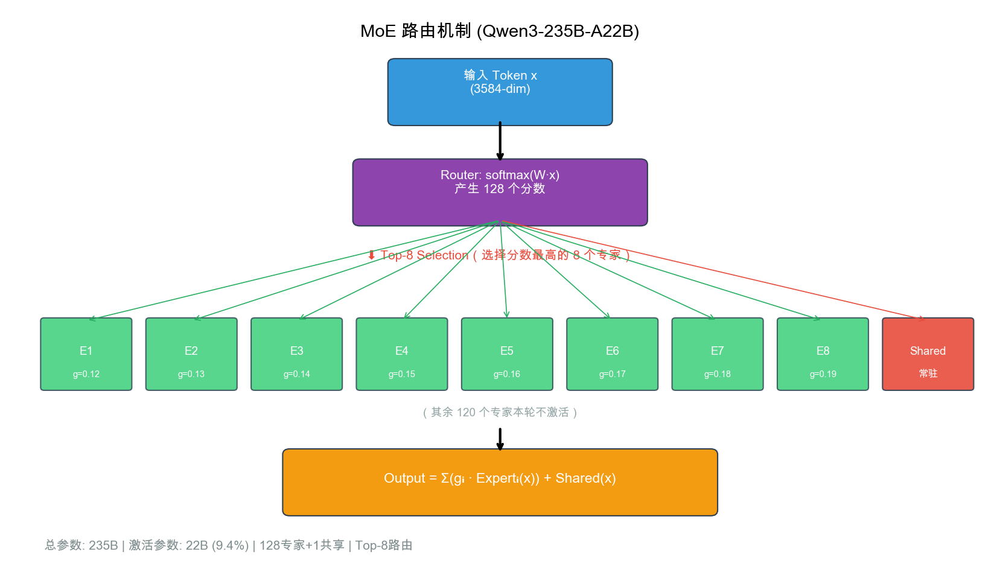

> *自绘图。说明：展示 token 如何经过 Router 产生 128 个专家分数，Top-8 选择后由 8 个激活专家+1 个共享专家加权混合输出。标注 Qwen3-235B-A22B 的参数效率（总 235B，激活仅 22B=9.4%）。MoE 路由图在 Mixtral/DeepSeek-MoE 等论文中有类似版本，此图针对 Qwen3 的 128+1 专家配置定制。*

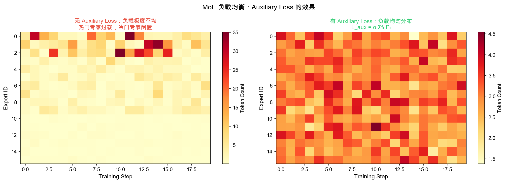

> *自绘图。说明：热力图对比有/无 Auxiliary Loss 时各 Expert 的 token 负载分布。无 Auxiliary Loss 时出现"热门专家过载、冷门专家闲置"的不均衡；添加后负载趋于均匀。此类负载均衡可视化在 Switch Transformer 等论文中有类似版本。*

### 6.3.1 模型矩阵

Qwen3 提供**6 个 Dense + 2 个 MoE** 模型，覆盖从端侧到数据中心的全部场景：

| 模型 | 类型 | 总参数 | 激活参数 | 专家数 | 激活专家 | 共享专家 | 定位 |
|------|------|--------|---------|--------|---------|---------|------|
| Qwen3-0.6B | Dense | 0.6B | 0.6B | — | — | — | 端侧 / IoT |
| Qwen3-1.7B | Dense | 1.7B | 1.7B | — | — | — | 手机 |
| Qwen3-4B | Dense | 4B | 4B | — | — | — | 边缘设备 |
| Qwen3-8B | Dense | 8B | 8B | — | — | — | 个人 PC |
| Qwen3-14B | Dense | 14B | 14B | — | — | — | 工作站 |
| Qwen3-32B | Dense | 32B | 32B | — | — | — | 服务器 |
| Qwen3-30B-A3B | **MoE** | 30B | **3B** | 128 | 8 | 1 | 手机（高性能） |
| Qwen3-235B-A22B | **MoE** | 235B | **22B** | 128 | 8 | 1 | 数据中心旗舰 |

### 6.3.2 MoE 路由机制详解

**What**：MoE（Mixture of Experts）将 FFN 层替换为多个并行的"专家"网络，每个 token 仅激活其中 K 个专家，以总参数量换取推理效率。

**Why**：Dense 模型的参数量与推理计算量线性相关——235B 的 Dense 模型推理需要 235B 次浮点运算。MoE 打破了这个线性关系：235B 总参数但每个 token 仅 22B 计算量，效率提升 10.7 倍。

**How**：

**MoE 的数学形式**：

对于输入 token $\mathbf{x} \in \mathbb{R}^d$：

**Step 1：计算路由分数（Router）**

$$\mathbf{g} = \text{softmax}(\mathbf{W}_g \mathbf{x} + \boldsymbol{\epsilon}), \quad \mathbf{W}_g \in \mathbb{R}^{N \times d}$$

其中 $N = 128$ 为总专家数，$\boldsymbol{\epsilon}$ 为可选的噪声项（训练时促进探索）。

**Step 2：Top-K 选择**

$$\mathcal{S} = \text{TopK}(\mathbf{g}, K), \quad K = 8$$

选择门控分数最高的 $K$ 个专家索引。

**Step 3：权重归一化**

$$\hat{g}_i = \frac{g_i}{\sum_{j \in \mathcal{S}} g_j}, \quad \forall i \in \mathcal{S}$$

**Step 4：专家计算与混合**

$$\mathbf{y} = \sum_{i \in \mathcal{S}} \hat{g}_i \cdot \text{Expert}_i(\mathbf{x}) + \text{SharedExpert}(\mathbf{x})$$

其中共享专家（Shared Expert）处理所有 token，提供"基础"能力。

```python
import torch
import torch.nn as nn
import torch.nn.functional as F

class MoELayer(nn.Module):
    """Qwen3 MoE 层的简化实现"""
    
    def __init__(
        self,
        hidden_dim: int,
        ffn_dim: int,
        num_experts: int = 128,
        num_active: int = 8,
        num_shared: int = 1,
    ):
        super().__init__()
        self.num_experts = num_experts
        self.num_active = num_active
        
        # 路由器：将 hidden_dim 映射到 num_experts 个分数
        self.router = nn.Linear(hidden_dim, num_experts, bias=False)
        
        # 专家网络（每个是一个 SwiGLU FFN）
        self.experts = nn.ModuleList([
            SwiGLU_FFN(hidden_dim, ffn_dim) 
            for _ in range(num_experts)
        ])
        
        # 共享专家
        self.shared_experts = nn.ModuleList([
            SwiGLU_FFN(hidden_dim, ffn_dim) 
            for _ in range(num_shared)
        ])
    
    def forward(self, x: torch.Tensor) -> torch.Tensor:
        batch_size, seq_len, hidden = x.shape
        x_flat = x.view(-1, hidden)  # [B*S, D]
        
        # Step 1: 路由分数
        router_logits = self.router(x_flat)  # [B*S, N]
        router_probs = F.softmax(router_logits, dim=-1)
        
        # Step 2: Top-K 选择
        topk_probs, topk_indices = torch.topk(
            router_probs, self.num_active, dim=-1
        )  # [B*S, K]
        
        # Step 3: 归一化
        topk_probs = topk_probs / topk_probs.sum(dim=-1, keepdim=True)
        
        # Step 4: 专家计算（简化版，实际用 scatter/gather 优化）
        expert_output = torch.zeros_like(x_flat)
        for i in range(self.num_active):
            expert_idx = topk_indices[:, i]  # [B*S]
            weight = topk_probs[:, i:i+1]    # [B*S, 1]
            for e_id in expert_idx.unique():
                mask = expert_idx == e_id
                expert_output[mask] += (
                    weight[mask] * self.experts[e_id](x_flat[mask])
                )
        
        # 共享专家（所有 token 都经过）
        for shared in self.shared_experts:
            expert_output += shared(x_flat)
        
        return expert_output.view(batch_size, seq_len, hidden)
```

### 6.3.3 负载均衡机制

MoE 训练的核心挑战是**负载不均衡**——部分专家被过度使用，部分专家几乎不被选中（"专家坍塌"）。

**辅助损失（Auxiliary Loss）**：

$$L_{\text{aux}} = \lambda \cdot N \sum_{i=1}^{N} f_i \cdot p_i$$

其中：
- $f_i = \frac{\text{被路由到专家 } i \text{ 的 token 数}}{\text{总 token 数}}$：实际负载
- $p_i = \frac{1}{T}\sum_{t} g_i^{(t)}$：平均门控概率
- $\lambda$：平衡系数（Qwen3 使用 $\lambda = 0.01$）
- $N = 128$：专家总数

> **直觉**：辅助损失惩罚"高负载 × 高概率"的专家，鼓励路由器将 token 更均匀地分配给所有专家。

**容量因子（Capacity Factor）**：

$$C_i = \frac{B}{N} \times \text{CF}$$

其中 $B$ 为 batch 中的 token 数，$\text{CF}$ 为容量因子（通常 1.0-1.25）。超出容量的 token 会被丢弃或由共享专家处理。

| 策略 | 作用 | Qwen3 配置 |
|------|------|-----------|
| 辅助损失 | 惩罚负载不均 | λ = 0.01 |
| 容量因子 | 限制单专家最大负载 | CF = 1.25 |
| 共享专家 | 保底能力 + 吸收溢出 | 1 个共享专家 |
| 噪声路由 | 训练时增加随机性促进探索 | Gaussian noise |

### 6.3.4 参数效率分析

```
Qwen3 MoE vs 竞品对比:

                    总参数   激活参数   激活率    MMLU
Qwen3-235B-A22B     235B     22B      9.4%     ~89
DeepSeek-V3          671B     37B      5.5%     ~88
Mixtral-8x22B        176B     39B      22.2%    ~77
GPT-4 (推测)        ~1.8T    ~200B    ~11%     ~86

Qwen3 的设计平衡:
├── 比 DeepSeek-V3 更高的激活率 (9.4% vs 5.5%)
│   → 每个 token 使用更多专家，信息融合更丰富
├── 比 Mixtral 更低的激活率 (9.4% vs 22.2%)
│   → 更好的推理效率
└── 更小的总参数量 (235B vs 671B)
    → 更低的存储和通信成本

关键指标: MMLU / 激活参数
├── Qwen3-235B: 89 / 22B = 4.05 ← 最优
├── DeepSeek-V3: 88 / 37B = 2.38
└── Mixtral-8x22B: 77 / 39B = 1.97
```

## 6.4 强到弱蒸馏（Strong-to-Weak Distillation）


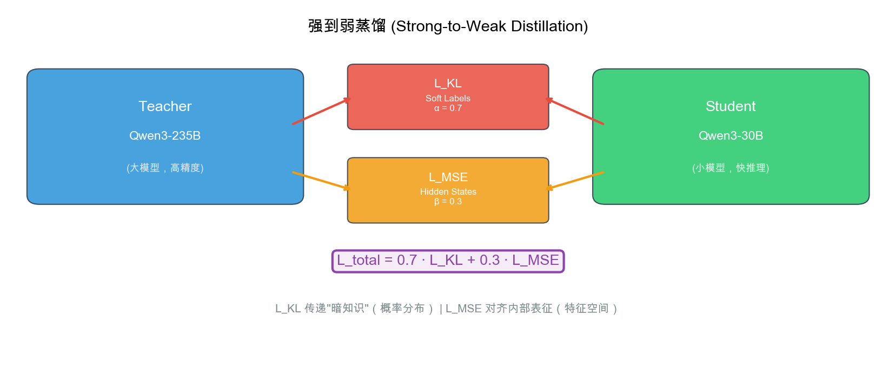

> *自绘图。说明：展示 Teacher(大模型) 通过两条路径向 Student(小模型) 传递知识：L_KL 传递输出概率分布中的"暗知识"(α=0.7)，L_MSE 对齐内部隐藏层表征(β=0.3)。知识蒸馏框图在 Hinton et al. (2015) 原始论文中有经典版本，此图增加了 Qwen3 特有的双损失权重配置。*

### 6.4.1 技术原理

**What**：使用训练好的大模型（教师）生成高质量输出，作为小模型（学生）的训练数据，跳过小模型的完整预训练和多阶段后训练。

**Why**：传统训练每个小模型需要完整经历"预训练 → SFT → 多阶段 RL"的全部流程。对于 8 个模型的 Qwen3 系列，这意味着 8 倍的训练成本。蒸馏可以将小模型的训练成本降低约 90%。

**How**：

**蒸馏损失函数**：

$$L_{\text{distill}} = \alpha \cdot D_{\text{KL}}(P_{\text{teacher}} \| P_{\text{student}}) + \beta \cdot \text{MSE}(\mathbf{h}_{\text{teacher}}, \mathbf{h}_{\text{student}})$$

其中：
- $D_{\text{KL}}$：教师和学生输出分布的 KL 散度（软标签学习）
- $\text{MSE}$：隐藏层表示的均方误差（特征模仿）
- $\alpha = 0.7$：输出蒸馏权重
- $\beta = 0.3$：特征蒸馏权重

**KL 散度项的"暗知识"**：

```
标准训练（硬标签）:
  目标: P = [0, 0, 1, 0, 0]  (one-hot，只有正确答案)
  模型只学到"选 C"，不知道 A 和 B 的相对好坏

蒸馏训练（软标签）:
  教师输出: P_teacher = [0.02, 0.15, 0.70, 0.10, 0.03]
  学生从中学到: 
    - C 是最好的 (0.70)
    - B 比 D 好 (0.15 > 0.10)
    - A 和 E 都很差 (0.02, 0.03)
  
  这些"暗知识"(dark knowledge) 包含了教师模型对
  错误选项之间相对排序的理解，极大加速学生学习。
```

### 6.4.2 蒸馏策略

```
Qwen3 蒸馏路线:

教师模型:
├── Qwen3-235B-A22B → 蒸馏到 → Qwen3-30B-A3B
└── Qwen3-32B       → 蒸馏到 → Qwen3-0.6B / 1.7B / 4B

蒸馏数据生成:
├── 使用教师模型对大规模 query 集合生成高质量回答
├── 包含 thinking 和 non-thinking 两种模式的输出
├── 数据量: ~1-2T tokens 的教师输出
└── 质量: 远高于原始预训练数据

成本对比:
├── 传统训练 Qwen3-4B:
│   ├── 预训练: 36T tokens × 4B 参数 = ~144B FLOP
│   ├── SFT: 1M+ 样本
│   ├── RL: 4 阶段
│   └── 总计: ~30,000 GPU hours
│
└── 蒸馏训练 Qwen3-4B:
    ├── 教师生成: ~2T tokens（可复用）
    ├── 学生训练: 2T tokens × 4B 参数 = ~8B FLOP
    └── 总计: ~3,000 GPU hours（节省 90%）
```

> **类比**：传统训练像是让每个学生从头自学教科书（36T tokens），蒸馏像是让学生跟随优秀教师的课堂笔记和讲解学习——同样的知识，更高效的传递。

### 6.4.3 蒸馏的效果验证

**Thinking Mode 在小模型上的惊人效果**：

| 模型 | 基准 | Non-Thinking | Thinking | 增益 |
|------|------|-------------|----------|------|
| Qwen3-1.7B | AIME | ~20% | ~35% | **+15%** |
| Qwen3-4B | GPQA | ~30% | ~42% | **+12%** |
| Qwen3-32B | GPQA | ~45% | ~55% | **+10%** |
| Qwen3-235B | MATH | ~80% | ~85% | **+5%** |

**关键发现**：
- **小模型增益更大**：1.7B 的 Thinking Mode 增益（+15%）远大于 235B（+5%）
- **能力跨越**：Thinking Mode 使 Qwen3-1.7B 达到 Qwen2.5-7B 的水平（4× 参数差距）
- **蒸馏传递 Thinking 能力**：通过蒸馏，小模型也获得了教师模型的推理"思考模式"

## 6.5 训练数据与多阶段预训练

### 6.5.1 数据规模

| 维度 | Qwen2.5 | Qwen3 | 变化 |
|------|---------|-------|------|
| 总数据量 | 18T tokens | **36T tokens** | 2× |
| 语言数 | 29 | **119** | 4.1× |
| 代码数据 | 包含 | **显著增强** | — |
| 合成数据 | ~20% | **~30%** | — |

### 6.5.2 三阶段预训练

**What**：Qwen3 的预训练分为三个精心设计的阶段，每个阶段有不同的数据配方和序列长度。

**Why**：不同能力需要不同的训练条件——通用知识需要广泛数据，推理需要高质量 STEM 数据，长上下文需要渐进式序列扩展。

**How**：

```
阶段 1: General Stage (S1) — "广度学习"
├── 数据量: 30T+ tokens
├── 序列长度: 4,096
├── 语言: 119 种（全球覆盖）
├── 数据配方:
│   ├── Web crawl (过滤后): ~50%
│   ├── 书籍 + 学术论文: ~15%
│   ├── 代码 (GitHub + Stack): ~15%
│   ├── 多语言平行语料: ~10%
│   └── 百科 + 知识图谱: ~10%
└── 目标: 通用语言理解 + 世界知识

阶段 2: Reasoning Stage (S2) — "深度学习"
├── 数据量: 额外 5T tokens
├── 序列长度: 4,096
├── 数据配方（调整后）:
│   ├── STEM (数学 + 物理 + 化学): ~30%
│   ├── 代码 (算法 + 系统): ~25%
│   ├── 推理 (逻辑 + 常识): ~20%
│   ├── 合成数据 (Qwen2.5 生成): ~15%
│   └── 通用文本: ~10%
└── 目标: 提升数学/代码/逻辑推理能力

阶段 3: Long Context Stage (S3) — "扩展视野"
├── 数据量: 包含在 36T 中
├── 序列长度分布:
│   ├── 75%: 16K - 32K tokens
│   └── 25%: 4K - 16K tokens
├── 数据: 长文档 QA、代码仓库、多轮对话
└── 目标: 原生支持 256K 上下文

三阶段的核心思想: "先广后深再扩展"
S1 建立广泛的语言和知识基础
S2 在此基础上深化推理能力
S3 将所有能力扩展到长上下文
```

### 6.5.3 四阶段后训练流程

```
Qwen3-Base (预训练完成)
    │
    ▼
[Stage 1] Long-CoT Cold Start
├── 数据: ~100K 精选长 CoT 样本
├── 目标: 初始化 thinking 模式能力
└── 类比: "教会模型思考习惯"
    │
    ▼
[Stage 2] Reasoning RL (GRPO)
├── 数据: 3,995 个 query-verifier 对
├── 特点: 样本极少但质量极高
│   ├── 每个 query 跨越不同子领域
│   ├── 验证器精确判断对错（非模型评判）
│   └── 每题采样 G=16 个输出
├── 算法: GRPO（组内相对优势）
└── 效果: 推理准确率大幅提升
    │
    ▼
[Stage 3] Thinking Model Fusion
├── 整合 thinking + non-thinking 数据
├── 添加 thinking budget 支持
├── 设计统一 chat template
│   ├── /think → 启用 CoT
│   ├── /no_think → 直接回答
│   └── 默认: 根据问题复杂度自动选择
└── 混合比例: thinking:non-thinking ≈ 1:2
    │
    ▼
[Stage 4] General RL
├── 目标: 全面对齐
│   ├── 指令遵循、格式遵循
│   ├── 安全对齐（RLHF）
│   ├── Agent 能力（MCP, 工具调用）
│   └── 偏好对齐
├── 算法: PPO + DPO 混合
│   ├── PPO: 长序列 + 细粒度任务
│   └── DPO: 偏好对齐 + 安全
└── 输出: Qwen3-Instruct 系列
    │
    ▼
[Stage 5] Strong-to-Weak Distillation
├── 教师: Qwen3-235B / Qwen3-32B
├── 学生: Qwen3-0.6B / 1.7B / 4B
├── 节省: 90% 训练成本
└── 效果: 小模型也获得 thinking 能力
```

## 6.6 Qwen3-Next：下一代探索（2025 年 9 月预览）


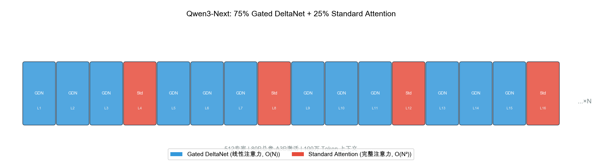

> *自绘图。说明：展示 75% Gated DeltaNet（线性注意力，O(N)复杂度）+ 25% Standard Attention（完整注意力，O(N²)复杂度）的交错排列 layer stack。此架构为 Qwen3-Next 的探索方向预览，图为本报告原创。*

### 6.6.1 混合注意力架构

**What**：Qwen3-Next 探索了**线性注意力 + 标准注意力的混合**架构，用 75% 的线性注意力层替代标准注意力。

**Why**：标准 Transformer 的 $O(n^2)$ 注意力在超长序列下成为计算瓶颈。当序列长度从 32K 增长到 1M 时，注意力计算量增长 ~1000 倍。

**How**：

```
Qwen3-Next 混合注意力:
├── 75% 层: Gated DeltaNet (线性注意力, O(n))
│   ├── 原理: 将 softmax(QK^T)V 近似为线性核
│   ├── 复杂度: O(n × d²) 而非 O(n² × d)
│   └── 当 n >> d 时（长序列），优势巨大
│
└── 25% 层: Gated Attention (标准注意力, O(n²))
    ├── 保留标准注意力以维持精度
    └── 放在模型的关键层（如首尾层、中间检查点层）

Gated DeltaNet 数学形式:
  标准注意力: y = softmax(QK^T / √d) · V     # O(n²)
  线性注意力: y = (φ(Q) · φ(K)^T · V) / (φ(Q) · φ(K)^T · 1)  # O(n)
  Gated:      y = σ(g) ⊙ LinearAttn(x) + (1-σ(g)) ⊙ StdAttn(x)
  
  其中 φ 是核函数映射，g 是可学习的门控参数
```

### 6.6.2 超稀疏 MoE

| 指标 | Qwen3 | Qwen3-Next | 变化 |
|------|-------|------------|------|
| 总专家数 | 128 | **512** | 4× |
| 激活专家数 | 8 | **10+1** | — |
| 参数激活率 | 6.25% | **3.7%** | ↓40% |
| 训练成本 | 基线 | **-90%** (vs Qwen3-32B) | — |

### 6.6.3 旗舰模型规格

| 指标 | Qwen3-Next-80B-A3B |
|------|---------------------|
| 总参数 | 80B |
| 激活参数 | 3B（每 token） |
| 层数 | 48 |
| 上下文 | 262K（可扩展至 1M） |
| 注意力 | 75% DeltaNet + 25% Standard |
| 专家数 | 512 (激活 10+1) |

**关键特性**：
- 训练成本仅为 Qwen3-32B 的 **10%**
- 32K+ 上下文下推理速度提升 **10×**
- 性能保持 Qwen3-32B 水平

> **展望**：Qwen3-Next 代表了大模型发展的两个核心趋势——① 用线性注意力突破序列长度瓶颈，② 用超稀疏 MoE 突破参数效率瓶颈。如果这些技术成熟，未来的"千亿模型"可能仅需 3B 的推理成本。

## 6.7 性能基准总结

### 6.7.1 Dense 模型

| 模型 | MMLU | HumanEval | GSM8K | MATH |
|------|------|-----------|-------|------|
| Qwen3-0.6B | ~50 | ~30 | ~50 | ~30 |
| Qwen3-1.7B | ~60 | ~45 | ~65 | ~45 |
| Qwen3-4B | ~70 | ~55 | ~75 | ~60 |
| Qwen3-8B | ~78 | ~65 | ~82 | ~70 |
| Qwen3-14B | ~82 | ~70 | ~86 | ~75 |
| Qwen3-32B | ~86 | ~75 | ~90 | ~80 |

### 6.7.2 MoE 模型

| 模型 | MMLU | HumanEval | GSM8K | MATH | 激活参数 |
|------|------|-----------|-------|------|---------|
| Qwen3-30B-A3B | ~84 | ~72 | ~88 | ~78 | 3B |
| Qwen3-235B-A22B | **~89** | **~80** | **~93** | **~85** | 22B |

### 6.7.3 与竞品对比

```
Qwen3-235B-A22B vs 竞品旗舰:

              MMLU  MATH  HumanEval  激活参数  成本效率
Qwen3-235B    ~89   ~85    ~80        22B      ★★★★★
GPT-4o        88.7  76.6   90.2       ~200B    ★★
Claude 3.5    88.7  71.1   92.0       ~?       ★★
DeepSeek-V3   ~88   ~85    ~78        37B      ★★★★
LLaMA3-405B   85.2  79.1   70.1       405B     ★

关键洞察:
├── 数学/推理: Qwen3 和 DeepSeek-V3 并列领先
├── 代码生成: Claude 3.5 和 GPT-4o 仍领先
├── 成本效率: Qwen3 以最低激活参数达到最高 MMLU
└── 趋势: MoE 架构在效率上已全面胜出 Dense
```

## 6.8 面试高频考点

**Q1：MoE 的核心设计哲学是什么？它解决了 Dense 模型的什么根本矛盾？**

答：Dense 模型存在一个根本矛盾：**模型容量**（总参数量决定能记住多少知识）和**推理成本**（每次前向传播的计算量）强绑定——要更聪明就必须更慢。MoE 打破了这个绑定：总参数量（容量）可以很大，但每个 token 只激活一小部分专家（计算量固定）。本质上，MoE 实现了**"按需调用"的知识存储**——不同类型的输入激活不同的专家子集，类似人脑不会同时激活所有区域。代价是存储成本（全部参数必须常驻显存），所以 MoE 适合计算瓶颈场景（高吞吐推理），不适合存储瓶颈场景（端侧部署）。

**Q2：Thinking Mode 的统一（同一模型支持 /think 和 /no_think）反映了什么设计思想？**

答：传统做法是训练两个独立模型——一个快速模型和一个推理模型。Qwen3 将两种模式统一到同一模型中，核心思想是**计算量应该由问题难度动态决定，而非由模型选择预先决定**。这类似人类思考：简单问题直觉回答，复杂问题深度推理——但用的是同一个大脑。实现的关键不是简单地"限制 token 数"（那会截断推理链），而是通过四阶段训练（Long-CoT → Reasoning RL → Thinking Fusion → General RL），让模型**学会**在不同 budget 下选择最优的推理深度。这代表了一种更深层的趋势：**从"选择合适的模型"走向"让模型选择合适的计算量"**。

**Q3：强到弱蒸馏的设计哲学：为什么蒸馏输出分布比模仿隐藏层特征更重要？**

答：蒸馏本质上是知识迁移。输出分布包含了教师模型的**"暗知识"（dark knowledge）**——不仅包括正确答案，还包括错误选项之间的相对排序（如"B 比 C 更可能，虽然都不是正确答案"）。这种排序信息反映了教师对世界的细腻理解。而隐藏层特征是教师的内部表示——教师和学生的架构不同（维度不同、层数不同），强制对齐内部表示可能限制学生发展自己的表示策略。正确的蒸馏哲学是**"学我怎么做决策，而非学我怎么思考"**。

**Q4：MoE 路由中的"专家坍塌"问题本质上是什么？为什么辅助损失不能完美解决？**

答：专家坍塌是指路由器学到的策略高度偏向少数专家——大部分 token 都被送到同一批专家，其余专家几乎不被激活。本质上这是一个**正反馈环路**：被频繁激活的专家获得更多训练信号 → 变得更强 → 路由器更偏好它们。辅助损失通过惩罚不均匀分配来打破这个环路，但它引入了新的权衡：惩罚太弱则无效，惩罚太强则会强制路由器把不合适的 token 送到不相关的专家，反而降低质量。这是一个**探索-利用困境**——让路由器自由选择（利用）还是强制分散（探索），至今没有完美方案。


---

# Part III: 多模态系列（按时间线）

> 本部分覆盖 Qwen 视觉语言（VL）和全模态（Omni）系列。Qwen 的多模态产品线始于 Qwen-VL（2023.08），经由 Qwen2-VL（2024.10）、Qwen2.5-VL（2025.02）、Qwen2.5-Omni（2025.03），发展到 Qwen3-VL（2025 下半年）和 Qwen3-Omni（2025.09），形成了完整的多模态技术演进路线。


# 第七章 Qwen-VL — 首个多模态尝试与 Cross-Attention 范式（2023.08）

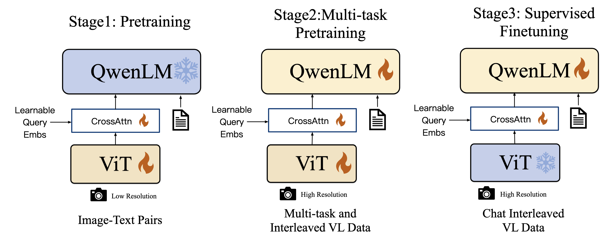
## 7.1 发布背景与定位

**发布时间**：2023 年 8 月（arXiv:2308.12966）
**参数规格**：9.6B（ViT-bigG 1.9B + VL Adapter 0.08B + Qwen-7B 7.7B）

Qwen-VL 是 Qwen 系列的**首个多模态模型**，标志着阿里从纯文本 LLM 向视觉语言领域的首次拓展。其核心设计采用了当时主流的 **Cross-Attention Resampler** 范式——通过可学习的 query 压缩视觉特征，再注入语言模型。

> **历史意义**：Qwen-VL 是理解后续 Qwen2-VL"从复杂到简洁"架构演进的关键起点。它证明了 cross-attention 方案的有效性，同时也暴露了固定分辨率和信息瓶颈的局限。

## 7.2 核心架构

### 三组件设计

```
输入图像 → ViT-bigG (1.9B) → 图像特征序列 → Cross-Attention Resampler (256 queries)
                                                        ↓
                                              压缩为 256 个视觉 token
                                                        ↓
                                         [] + 256 tokens + [</img>] + 文本 tokens
                                                        ↓
                                                   Qwen-7B LLM → 文本输出
```

| 组件 | 规格 | 初始化 | 作用 |
|------|------|--------|------|
| **ViT-bigG** | 1.9B 参数 | OpenCLIP 预训练权重 | 视觉特征提取 |
| **VL Adapter** | 0.08B，单层 Cross-Attention | 随机初始化 | 视觉特征压缩与位置编码 |
| **Qwen-7B** | 7.7B 参数 | Qwen-7B 预训练权重 | 语言理解与生成 |

### Position-aware VL Adapter（核心创新）

这是 Qwen-VL 最重要的设计。与简单的 MLP 投影不同，VL Adapter 使用**单层 cross-attention 模块**：

- **Query**：256 个可学习的 embedding（固定数量）
- **Key/Value**：ViT-bigG 输出的图像特征序列
- **位置编码**：在 Q-K 对中注入 **2D 绝对位置编码**，保留空间位置信息

**关键设计思想**：无论输入图像的 patch 数量如何变化，输出始终为固定 256 个 token。这种"信息瓶颈"设计在 BLIP-2 的 Q-Former 中也被采用，核心权衡是：

- **优点**：固定长度的视觉表示使 LLM 的 context 管理简单、计算可预测
- **缺点**：高分辨率图像的细节信息被强制压缩，OCR 等细粒度任务受限

### 输入输出格式

使用特殊 token 标记模态边界和空间信息：
- `` / `</img>`：图像特征边界
- `<box>` / `</box>`：Bounding box 坐标（归一化至 [0, 1000)）
- `<ref>` / `</ref>`：文本与区域的关联标注

这一格式设计使模型天然支持 Grounding（区域定位）任务。

## 7.3 三阶段训练策略

| 阶段 | 数据 | 训练策略 | 分辨率 | 目标 |
|------|------|---------|--------|------|
| **Stage 1：预训练** | 1.4B image-text pairs | 冻结 LLM，训练 ViT + Adapter | 224×224 | 建立基本视觉-语言关联 |
| **Stage 2：多任务** | 7 类任务 ~77M 样本 | 全模型训练 | **448×448** | 细粒度理解能力 |
| **Stage 3：SFT** | 35 万条指令数据 | 冻结 ViT，微调 LLM + Adapter | 448×448 | 指令跟随能力 |

**Stage 2 的 7 类任务**：Captioning (19.7M) / VQA (3.6M) / Grounding (3.5M) / Ref Grounding (8.7M) / Grounded Captioning (8.7M) / OCR (24.8M) / 纯文本 (7.8M)

> **关键洞察**：Stage 2 中 OCR 数据占比最大（24.8M），说明团队早期就意识到了文本阅读能力的重要性——这一判断延续到 Qwen2.5-VL 从零训练 ViT 以强化 OCR。

## 7.4 性能亮点

| 基准 | 分数 | 意义 |
|------|------|------|
| Flickr30K zero-shot | **85.8** CIDEr | 超越 Flamingo-80B（7B vs 80B） |
| RefCOCO val | **89.36%** | 同规模 Generalist 最佳 |
| MME Perception | **1487.58** | 综合多模态感知 |
| TextVQA | **63.8%** | OCR 能力验证 |

最显著的成就是 **7B 模型在多项基准上媲美甚至超越 Flamingo-80B**，证明了精心设计的架构和训练策略可以弥补 10× 的参数差距。

## 7.5 从 Qwen-VL 到 Qwen2-VL：架构演进的核心逻辑

| 维度 | Qwen-VL (2023.08) | Qwen2-VL (2024.10) | 演进动机 |
|------|-------------------|-------------------|----------|
| **视觉-语言连接** | Cross-Attention Resampler | MLP Projection | LLaVA 证明简单投影 + 足够数据同样有效，MLP 更易训练 |
| **视觉 token 数** | 固定 256 tokens | 动态（随分辨率变化） | 固定压缩导致细节丢失，动态方案保留更多信息 |
| **位置编码** | 2D 绝对位置编码 | M-RoPE（三维旋转位置编码） | RoPE 支持长度外推和可变分辨率 |
| **分辨率** | 固定 448×448 | Naive Dynamic Resolution | 固定分辨率无法处理多样化的真实图像 |
| **视觉编码器** | ViT-bigG (OpenCLIP) | DFN ViT (675M) | DFN 数据更干净，特征更稳定 |
| **视频支持** | 无 | 原生支持（3D Tube） | 视频是多模态的核心场景 |

> **核心洞察**：从 Qwen-VL 到 Qwen2-VL 的最大转变是**从复杂融合走向简洁投影**。这一趋势与业界一致——LLaVA 用最简单的线性投影 + 高质量数据就达到了令人惊讶的效果，证明了在数据充足的条件下，**Adapter 的复杂度不是性能瓶颈，数据质量和视觉编码器才是**。

## 7.6 面试高频考点

**Q1：Cross-Attention Resampler 和 MLP Projection 在多模态融合中的本质区别是什么？为什么后来的模型倾向于使用更简单的 MLP？**

答：Cross-Attention Resampler（如 Qwen-VL、BLIP-2 的 Q-Former）通过可学习的 query 主动"查询"视觉特征，实现了深层的视觉-语言交互，但引入了信息瓶颈——输出被压缩为固定数量的 token。MLP Projection（如 LLaVA、Qwen2-VL）只做空间变换，保留了全部视觉 token，信息损失小但交互深度浅（依赖后续 LLM 的 self-attention 来实现跨模态交互）。后来的趋势是：**当 LLM 足够强大且数据足够多时，简单的 MLP 投影让 LLM 自己学习跨模态对齐，效果不亚于复杂的 cross-attention，且更容易训练和扩展。**

**Q2：固定视觉 token 数量（如 256）与动态 token 数量各有什么设计哲学？**

答：固定 token 数的设计哲学是"信息压缩"——无论输入多复杂，都压缩为统一长度的表示，类似于 NLP 中的 [CLS] token 思想。优点是计算可预测、context 管理简单；缺点是高分辨率图像的细节被丢弃，形成信息瓶颈。动态 token 数的设计哲学是"信息保留"——高分辨率图像产生更多 token，低分辨率产生更少，类似于人类视觉的选择性注意力。这更符合真实场景需求，但增加了 context 管理复杂度和计算不确定性。Qwen 系列从前者走向后者，反映了**随着 LLM context window 增大，保留更多信息比压缩信息更有价值**的判断。

**Q3：为什么 Qwen-VL 的三阶段训练要在不同阶段冻结不同组件？这反映了什么训练哲学？**

答：三阶段冻结策略的核心哲学是**"先对齐，再理解，再跟随"**。Stage 1 冻结 LLM 只训练视觉侧，目的是在不破坏 LLM 已有语言能力的前提下，建立基础的视觉-语言映射——如果同时更新 LLM，两个模块会互相干扰，导致训练不稳定。Stage 2 全模型训练，因为基础映射已建立，此时需要 LLM 和视觉编码器协同优化以理解复杂任务。Stage 3 冻结 ViT 只微调 LLM，因为 SFT 数据量远小于预训练数据，ViT 容易过拟合。这种"逐步解冻"的策略本质上是**课程学习**——先学简单的对齐，再学复杂的推理。

---


# 第八章 Qwen2-VL — 动态分辨率与多模态位置编码（2024.10）

## 8.1 发布背景与定位

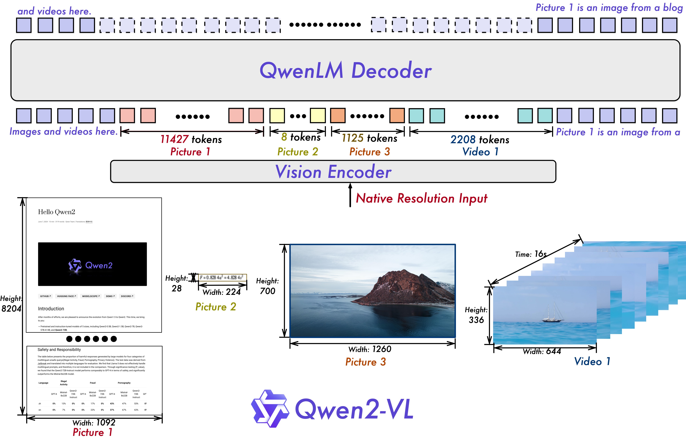

**发布时间**：2024 年 10 月（arXiv:2409.12191）
**参数规格**：2B / 7B / 72B 三档
**核心贡献**：首次引入 M-RoPE（多模态旋转位置编码）和朴素动态分辨率（Naive Dynamic Resolution），为后续 Qwen2.5-VL 和 Qwen3-VL 奠定了架构基础。

Qwen2-VL 是 Qwen 的**首个真正意义上的多模态大模型**（此前的 Qwen-VL 能力有限）。它在 LLM 骨干上增加了视觉编码器和融合模块，实现了图像、视频和文本的统一理解。

> **战略意义**：Qwen2-VL 标志着 Qwen 团队从纯文本 LLM 正式进入多模态赛道，与 GPT-4V、Claude 3 等竞品直接竞争。

| 维度 | Qwen2-VL 的创新点 |
|------|------------------|
| 视觉编码器 | 675M 参数 DFN ViT（从 DFN 预训练权重初始化） |
| 位置编码 | **M-RoPE**：首次将 RoPE 扩展到三维（时间、高度、宽度） |
| 分辨率处理 | Naive Dynamic Resolution：任意分辨率输入 |
| 视频处理 | **3D Tube**：Conv3d [2, 14, 14] 时空压缩 |
| 融合机制 | PatchMerger 2×2 → 4:1 token 压缩 |

## 8.2 视觉编码器：DFN ViT

### 8.2.1 架构规格

**What**：Qwen2-VL 使用 DFN（Data Filtering Networks）预训练的 ViT 作为视觉编码器，参数量约 675M。

**Why**：从预训练权重初始化（而非从零训练）可以加速训练收敛，降低计算成本。DFN ViT 在大规模图文对上训练，具有强大的视觉特征提取能力。

| 参数 | 数值 | 说明 |
|------|------|------|
| 模型来源 | DFN 预训练权重 | 非 CLIP，也非从零训练 |
| 参数量 | ~675M | 比 CLIP ViT-L/14（304M）更大 |
| 层数 | 32 | Transformer encoder 层 |
| Hidden size | 1280 | 每个 patch 的特征维度 |
| Attention heads | 16 | head_dim = 80 |
| Patch size | 14×14 像素 | 标准 ViT 切块大小 |

**DFN vs CLIP 的选择逻辑**：

```
CLIP ViT:
├── 训练目标: 对比学习（图文匹配）
├── 优势: 强语义对齐，广泛使用
└── 劣势: 
    ├── 固定分辨率（224/336）
    ├── 全局语义特征，缺乏细粒度细节
    └── 对 OCR、小物体识别能力弱

DFN ViT (Qwen2-VL 的选择):
├── 训练目标: 数据过滤网络（更灵活的训练策略）
├── 优势:
│   ├── 更大参数量（675M vs 304M）→ 更强特征提取
│   ├── 训练数据经过质量过滤 → 特征更稳定
│   └── 更适合作为多模态 LLM 的视觉前端
└── 劣势:
    └── 仍依赖预训练权重 → 动态分辨率需要位置插值
```

> **后续演进**：Qwen2.5-VL 最终放弃了 DFN 初始化，改为完全从零训练 ViT，以获得更自由的架构设计空间（Window Attention）和更好的动态分辨率适配。

### 8.2.2 与 LLM 骨干的配合

Qwen2-VL 的三个尺寸共享同一个 ViT：

| LLM 尺寸 | LLM 层数 | LLM Hidden | 共享 ViT | 总训练 Tokens |
|----------|---------|------------|---------|-------------|
| 2B | 28 | 1536 | 675M ViT | ~1.2T |
| 7B | 28 | 3584 | 675M ViT | ~1.2T |
| 72B | 80 | 8192 | 675M ViT | ~1.2T |

## 8.3 M-RoPE：多模态旋转位置编码的首次引入


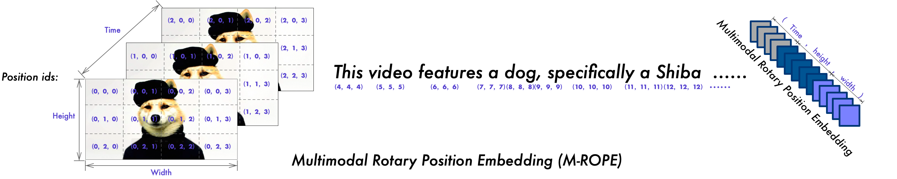

### 8.3.1 设计动机

**What**：M-RoPE（Multimodal Rotary Position Embedding）将标准 1D-RoPE 扩展到三维（时间 $t$、高度 $h$、宽度 $w$），使模型能够同时编码文本的序列位置、图像的空间位置和视频的时空位置。

**Why**：多模态序列中混合了三种截然不同的结构：
- **文本**：1D 序列，位置是线性递增的
- **图像**：2D 平面，位置有行和列两个维度
- **视频**：3D 时空体，位置有时间、行、列三个维度

如果将所有 token 简单展平为 1D 序列并使用标准 RoPE，模型无法区分"同一行相邻的两个 patch"和"不同行但展平后相邻的两个 patch"。

**How**：M-RoPE 将注意力头的维度 $d$ 三等分，分别对三个维度独立旋转：

$$\mathbf{q}_{\text{MRoPE}}(t, h, w) = \text{Concat}\Big[\text{Rot}(t, d/3) \cdot \mathbf{q}_t,\; \text{Rot}(h, d/3) \cdot \mathbf{q}_h,\; \text{Rot}(w, d/3) \cdot \mathbf{q}_w\Big]$$

其中 $\text{Rot}(p, d')$ 对 $d'$ 维子空间施加位置 $p$ 的旋转变换：

$$\text{Rot}(p, d') = \begin{pmatrix} \cos(p\omega_0) & -\sin(p\omega_0) & & \\ \sin(p\omega_0) & \cos(p\omega_0) & & \\ & & \ddots & \\ & & & \cos(p\omega_{d'/2-1}) & -\sin(p\omega_{d'/2-1}) \\ & & & \sin(p\omega_{d'/2-1}) & \cos(p\omega_{d'/2-1}) \end{pmatrix}$$

频率 $\omega_k = \theta^{-2k/d'}$，其中 $\theta = 10000$。

### 8.3.2 各模态的位置 ID 分配

| Token 类型 | $t$ (时间) | $h$ (高度) | $w$ (宽度) |
|-----------|-----------|-----------|-----------|
| 文本 token（第 pos 个） | pos | pos | pos |
| 图像 token（第 r 行, c 列） | 固定常量 $T_{\text{img}}$ | 行索引 r | 列索引 c |
| 视频帧 f 的 token（第 r 行, c 列） | **帧序号 f** | 行索引 r | 列索引 c |

**关键设计：文本 token 与 1D-RoPE 的兼容性**

当文本 token 的三个维度设为相同值 $t = h = w = \text{pos}$ 时，M-RoPE 退化为标准 1D-RoPE（每个子空间的角频率为原来的 $1/3$），保证语言建模能力不退化。

```python
import torch

def assign_mrope_ids(sequence):
    """为多模态序列分配 M-RoPE 位置 ID"""
    t_ids, h_ids, w_ids = [], [], []
    text_pos = 0
    
    for segment in sequence:
        if segment.type == "text":
            for _ in segment.tokens:
                t_ids.append(text_pos)
                h_ids.append(text_pos)
                w_ids.append(text_pos)
                text_pos += 1
                
        elif segment.type == "image":
            img_t = text_pos  # 固定时间常量
            for r in range(segment.h_patches):
                for c in range(segment.w_patches):
                    t_ids.append(img_t)
                    h_ids.append(r)    # 行索引
                    w_ids.append(c)    # 列索引
            text_pos += 1  # 整张图占一个"时间步"
            
        elif segment.type == "video_frame":
            frame_t = segment.frame_index  # 帧序号
            for r in range(segment.h_patches):
                for c in range(segment.w_patches):
                    t_ids.append(frame_t)
                    h_ids.append(r)
                    w_ids.append(c)
    
    return torch.tensor(t_ids), torch.tensor(h_ids), torch.tensor(w_ids)
```

> **类比**：M-RoPE 就像 GPS 坐标系——用经度、纬度、海拔三个维度唯一确定地球上任何一点。文本是沿一条直线前进的旅行者（三个坐标同步递增），图像是一张平铺的地图（经纬度变化、海拔固定），视频是随时间变化的地图序列（三维都在变化）。

### 8.3.3 Qwen2-VL M-RoPE 的局限

Qwen2-VL 的 M-RoPE 在实际使用中暴露了两个问题，推动了后续版本的改进：

1. **帧序号 vs 绝对时间**：temporal ID 使用帧序号（0, 1, 2, ...），不同帧率视频的相邻帧位置差相同，模型无法感知真实时间间隔
   - → Qwen2.5-VL 改为**绝对时间戳**（秒数）

2. **局部坐标系**：每张图片的空间坐标从 (0, 0) 开始，多图场景下坐标"撞车"
   - → Qwen3-VL 改为**全局坐标系**（Interleaved-MRoPE）

## 8.4 Naive Dynamic Resolution：朴素动态分辨率


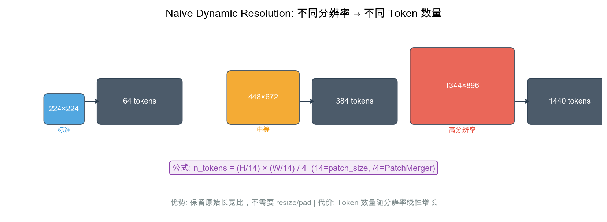

> *自绘图。说明：展示不同分辨率图像（224²/448×672/1344×896）映射到不同数量 token 的过程，标注 token 计算公式。帮助理解"不 resize、不 pad、保持原始长宽比"的动态分辨率策略及其 token 数量随分辨率线性增长的代价。Qwen2-VL 论文 Figure 2 有分辨率鲁棒性展示，此图侧重 token 数量计算。*

### 8.4.1 设计原理

**What**：Naive Dynamic Resolution 允许任意尺寸的输入图像，无需固定 resize 到 224×224 或 448×448。

**Why**：固定分辨率有两个问题：① 高分辨率图像被缩小后丢失细节（小字、远处物体）；② 低分辨率图像被放大后引入噪声。动态分辨率让模型"看到"图像的原始细节。

**How**：

```
处理流程:
1. 输入图像 H × W（任意尺寸）
2. 将 H, W 调整为 14 的倍数（patch_size = 14）
   H' = round(H / 14) × 14
   W' = round(W / 14) × 14
3. 分割为 14×14 的 patch
   patch 数 = (H'/14) × (W'/14)
4. 每个 patch → ViT → 1280 维特征
5. PatchMerger 2×2 → 4:1 压缩
   LLM token 数 = (H'/28) × (W'/28)

示例:
├── 224×224  → 256 patches  → 64 LLM tokens
├── 448×672  → 1536 patches → 384 LLM tokens
├── 1344×896 → 5760 patches → 1440 LLM tokens
└── 2240×1680 → 19200 patches → 4800 LLM tokens
```

### 8.4.2 与 Qwen2.5-VL 的对比

# Qwen2-VL 与 Qwen2.5-VL 特性对比
| 特性 | Qwen2-VL | Qwen2.5-VL |
| :--- | :--- | :--- |
| 分辨率适配 | M-RoPE 原生支持任意分辨率/长宽比 | Advanced Dynamic Resolution：自适应 Patch 粒度 + 更精细的分辨率路由策略 |
| 视频理解 | 动态帧率采样 + 基础时序建模 | 强化时序对齐、支持更长视频、动态 FPS 范围更广、关键帧感知更强 |
| 长上下文 | 支持 32K/128K（依版本） | 支持 256K，视频/图文混合序列的 KV 优化与显存管理显著升级 |
| 视觉编码器 | 大规模预训练 ViT + M-RoPE | 预训练数据/规模/结构全面升级，保留 M-RoPE 并增强高分辨率特征表达 |

## 8.5 3D Tube：视频时空压缩

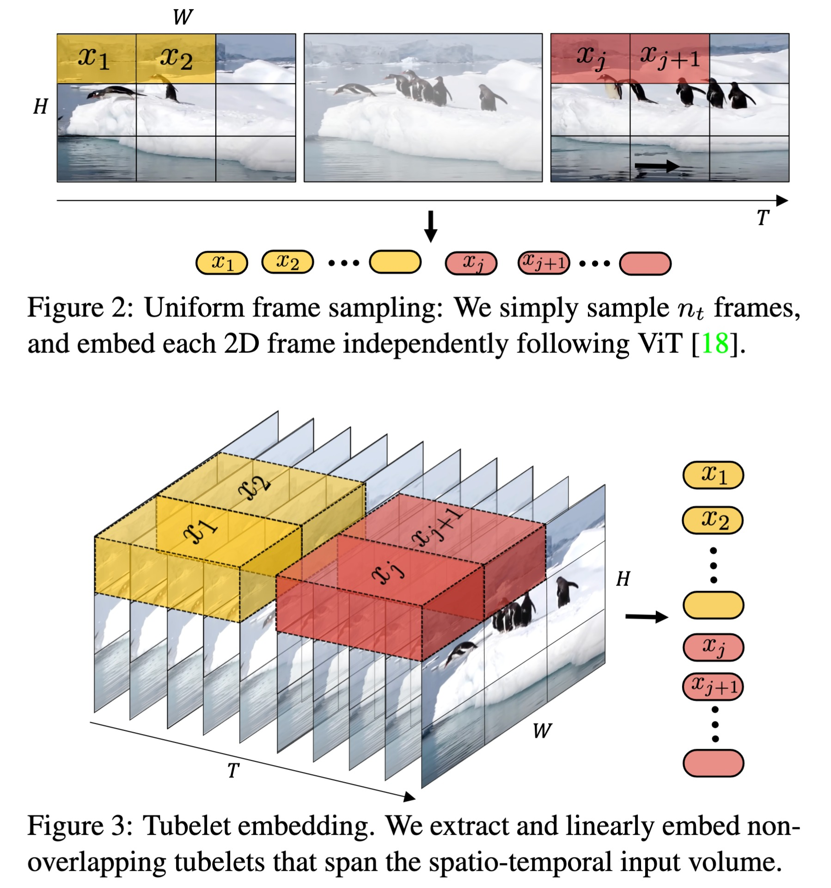

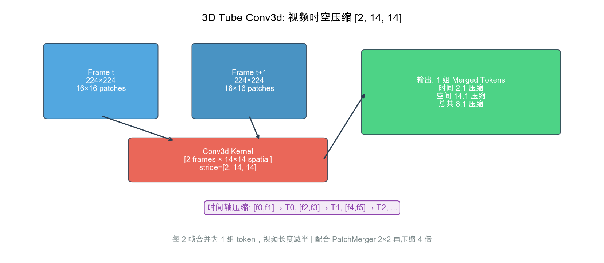

> *自绘图。说明：展示 Conv3d[2,14,14] 如何将两帧视频合并为一组 token，实现时间维度 2:1 压缩。配合 PatchMerger 的 4:1 空间压缩，总共实现 8:1 token 压缩。此图为本报告原创，基于 Qwen2-VL 论文中的 3D 卷积描述绘制。*

### 8.5.1 核心设计

**What**：3D Tube 使用 Conv3d 卷积将相邻两帧的同一空间位置压缩为单个 token，实现 2× 时序压缩。

**Why**：视频的时间冗余极高——相邻两帧 99% 的内容相同。直接逐帧送入 ViT 会导致 token 数量线性增长，LLM 上下文快速溢出。

**How**：

```
3D Tube Conv3d 卷积核: [2, 14, 14]
                       ↑   ↑    ↑
                    时间  高度  宽度

操作过程:
帧 f:   [H × W 像素] → 14×14 patch 网格
帧 f+1: [H × W 像素] → 14×14 patch 网格

Conv3d 同时处理两帧的同一位置:
  [2, 14, 14] 区域 → 1 个 ViT token (1280维)

效果:
  原始: N 帧视频 → N × (H/14 × W/14) 个 token
  压缩: N 帧视频 → N/2 × (H/14 × W/14) 个 token  (时间 2× 压缩)

静态图像兼容: 单张图像复制为 2 帧，统一走 3D Tube 路径
```

> **类比**：3D Tube 就像视频压缩中的"关键帧差分"——不是分别描述每一帧的完整画面，而是描述"两帧之间的共同内容 + 变化"，一个 token 编码了两帧的时空信息。

## 8.6 PatchMerger：视觉 Token 压缩


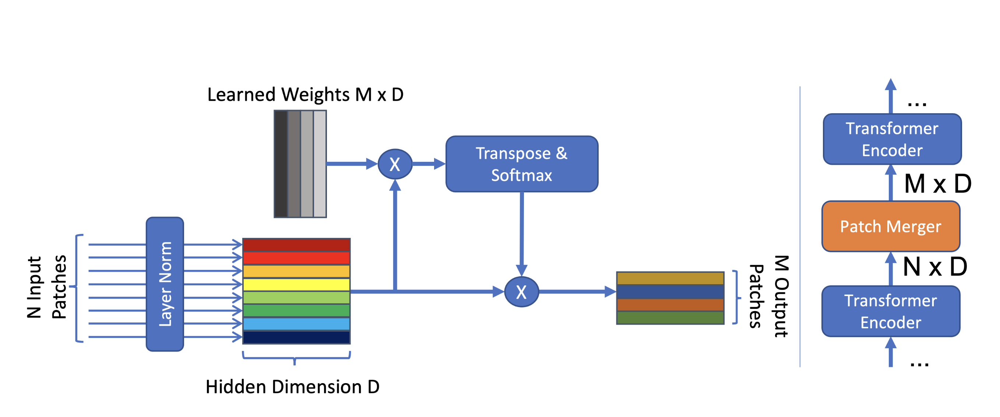
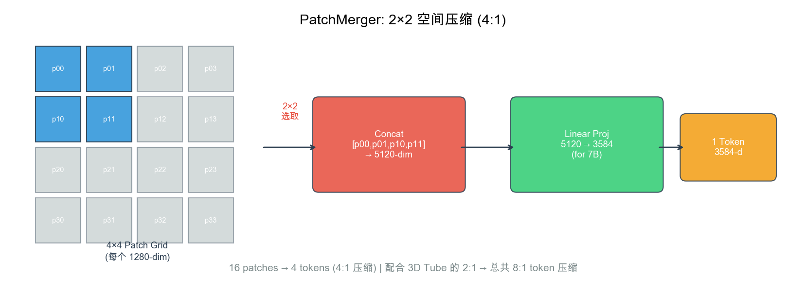

> *自绘图。说明：展示 2×2 相邻 patch 如何通过 concat → 线性投影 压缩为 1 个 token（1280×4=5120 → 3584），实现 4:1 的空间压缩比。此图为本报告原创。*

**What**：PatchMerger 将空间上相邻的 2×2 = 4 个 ViT patch 特征拼接并投影，实现 4:1 token 压缩。

**How**：

```python
class PatchMerger(nn.Module):
    """Qwen2-VL 的 2×2 Patch 合并模块"""
    def __init__(self, vit_hidden=1280, llm_hidden=3584):
        super().__init__()
        self.proj = nn.Linear(vit_hidden * 4, llm_hidden)
    
    def forward(self, patches):
        # patches: [B, H_p, W_p, 1280]
        B, Hp, Wp, C = patches.shape
        # 2×2 邻域 reshape + concat
        x = patches.reshape(B, Hp//2, 2, Wp//2, 2, C)
        x = x.permute(0, 1, 3, 2, 4, 5).reshape(B, Hp//2, Wp//2, 4*C)
        # 投影到 LLM 维度
        return self.proj(x)  # [B, Hp//2, Wp//2, llm_hidden]
```

**对比 Qwen2.5-VL 的 MLP Merger**：

| 维度 | Qwen2-VL PatchMerger | Qwen2.5-VL MLP Merger |
|------|----------------------|----------------------|
| 结构 | 2 层 MLP + GELU 激活 | **2 层 MLP + SiLU** |
| 核心作用| ViT 特征 → LLM 词表空间对齐 | 同左，配合升级的视觉编码器优化梯度流|
|空间建模|由 ViT + M-RoPE 负责（投影器不参与）|同左，依赖 Advanced Dynamic Resolution 策略|
|OCR/数学支持|原生支持（训练数据含高质量文档/公式）|数据质量↑、对齐策略↑、高分辨率路由↑ → 精度/泛化显著提升|

## 8.7 训练管道

```
Qwen2-VL 训练管道:

阶段 1: 视觉-语言预对齐
├── 数据: 大规模图文对
├── 训练范围: ViT + PatchMerger
├── 冻结: LLM backbone
├── 目标: 视觉特征进入 LLM 嵌入空间
└── 数据量: ~0.5T tokens

阶段 2: 多模态联合预训练
├── 数据: 图文 + 视频字幕 + VQA
├── 训练范围: ViT + PatchMerger + LLM (全参数)
├── 序列长度: 8192
└── 数据量: ~0.7T tokens

总训练: ~1.2T tokens（对比 Qwen2.5-VL 的 4.1T，仅 29%）

Post-training:
├── SFT: 指令微调（冻结 ViT）
└── DPO: 偏好对齐
```

## 8.8 性能基准

### 8.8.1 核心基准（72B）

| 类别 | 基准 | Qwen2-VL-72B | GPT-4o (同期) | 说明 |
|------|------|-------------|--------------|------|
| 多学科推理 | MMMU | 64.5 | ~69 | 接近 GPT-4o |
| 视觉数学 | MathVista | 70.5 | 63.8 | **超越** GPT-4o |
| 文档理解 | DocVQA | 94.5 | — | 文档能力强 |
| OCR | OCRBench | 866 | 736 | **大幅领先** GPT-4o |
| 图表 | ChartQA | 88.3 | — | — |
| GUI Agent | ScreenSpot Pro | 1.6 | ~18 | **几乎不可用** |
| 视频理解 | MLVU M-Avg | 68.7 | — | — |

### 8.8.2 关键观察

- **OCR 强项**：OCRBench 866 大幅领先 GPT-4o（736），得益于 DFN ViT 的细粒度视觉特征
- **MathVista 超越 GPT-4o**：视觉数学推理是 Qwen 系列的传统强项
- **GUI 几乎不可用**：ScreenSpot Pro 仅 1.6 分，说明高分辨率 GUI Grounding 能力严重不足
  - → Qwen2.5-VL 通过专项训练数据将此项提升至 43.6（**27× 提升**）

### 8.8.3 与后续版本对比

| 基准 | Qwen2-VL-72B | Qwen2.5-VL-72B | 提升 |
|------|-------------|----------------|------|
| MMMU | 64.5 | **70.2** | +5.7 |
| MathVista | 70.5 | **74.8** | +4.3 |
| DocVQA | 94.5 | **96.4** | +1.9 |
| OCRBench | 866 | **885** | +19 |
| ScreenSpot Pro | 1.6 | **43.6** | **+42.0** |
| MLVU | 68.7 | **74.6** | +5.9 |

## 8.9 面试高频考点

**Q1：为什么 1D 位置编码不适合处理视觉信息？M-RoPE 的三维分解思路解决了什么根本问题？**

答：图像具有天然的 2D 空间结构——一个 patch 的"邻居"在上下左右四个方向上，而非只在"前后"。1D 位置编码将图像 patch 展平为一条线，强制把 2D 邻近关系映射为 1D 序列关系——第一行最后一个 patch 和第二行第一个 patch 在空间上紧邻，但在 1D 序列中可能相隔数十个位置。M-RoPE 将 head 维度三等分，分别用 RoPE 编码时间（t）、高度（h）、宽度（w），使注意力能直接感知"这两个 patch 在空间上相邻"。对于纯文本 token，三维设为相同值，数学上退化为标准 1D-RoPE——这种**优雅的退化设计**使得一套位置编码同时服务文本、图像、视频三种模态。

**Q2：动态分辨率的设计哲学是什么？它与人类视觉系统有什么类比？**

答：固定分辨率（如 224×224）相当于用同一个放大镜看所有东西——看文档时分辨率不够（字太小），看风景时又浪费计算。动态分辨率模拟了人类视觉的**选择性注意力**：需要细看的内容（文档、小字）分配更多视觉 token（更高分辨率），不需要细看的内容（整体场景）分配较少 token。这意味着模型的计算量与信息量成正比，而非与像素数固定。Qwen2-VL 的"朴素动态分辨率"是这一思想的首次实现——任意分辨率输入按 14×14 patch 切分，产生不等数量的视觉 token。

**Q3：位置编码从 M-RoPE → TMRoPE → Interleaved-MRoPE 的演进中，每一步解决了什么核心痛点？**

答：四代位置编码演进反映了多模态理解能力的递进需求：

| 版本 | 编码 | 解决的痛点 |
|------|------|-----------|
| Qwen2-VL | M-RoPE（帧序号） | 1D → 3D，首次实现空间位置感知 |
| Qwen2.5-VL | M-RoPE + 绝对时间戳 | 帧序号无时间语义 → 引入秒级时间，支持视频事件定位 |
| Qwen2.5-Omni | TMRoPE（物理时间轴） | 音视频时间不对齐 → 统一物理时间坐标系 |
| Qwen3-VL | Interleaved-MRoPE（全局坐标） | 多图坐标冲突 → 全局唯一坐标，256K 下 100+ 图不混淆 |

核心设计原则是**每一步只解决上一代暴露出的最紧迫问题**，而非一步到位设计"完美"方案——这是工程演进的典型模式。

**Q4：为什么 Qwen2-VL 能用统一架构同时处理图像和视频？这反映了什么设计哲学？**

答：Qwen2-VL 将图像视为"单帧视频"——图像的 temporal 维度为常数，视频的 temporal 维度随帧变化，两者在同一个 M-RoPE 框架下自然统一。无需为图像和视频维护两套编码器或两套位置编码。这反映了**"统一性优于特化"**的设计哲学：一个足够通用的框架比两个特化框架更易维护、更易扩展。当需要增加新模态（如 3D 点云）时，只需要定义新的坐标分配方式，而非重新设计架构。


---

# 第九章 Qwen2.5-VL — 从零训练 ViT 与原生动态分辨率（2025.02）

> **承接关系**：本章紧接 Qwen2-VL，讲述其直接后继版本的三项核心架构升级：从零训练 ViT + Window Attention、MLP Merger 精妙设计、以及 M-RoPE 的绝对时间对齐改进。

## 9.1 发布定位与设计目标

**发布时间**：2025 年 2 月（arXiv:2502.13923）
**参数规格**：3B / 7B / 72B 三档

Qwen2.5-VL 的核心设计目标体现在三个维度：

| 目标维度 | 具体追求 | 对应创新 |
|---------|---------|---------|
| **视觉理解广度** | 从图标到卫星图，从手写到数学公式 | ViT 从零训练 + 4.1T 多样化数据 |
| **时空感知精度** | 精确到秒级的视频事件定位 | MRoPE 绝对时间对齐 + 动态 FPS |
| **智能体行动能力** | 操控电脑/手机的 GUI 代理 | ScreenSpot Pro 专项训练 |


## 9.2 视觉编码器详解

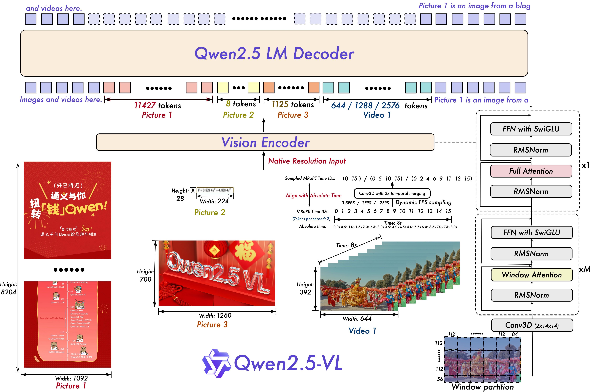


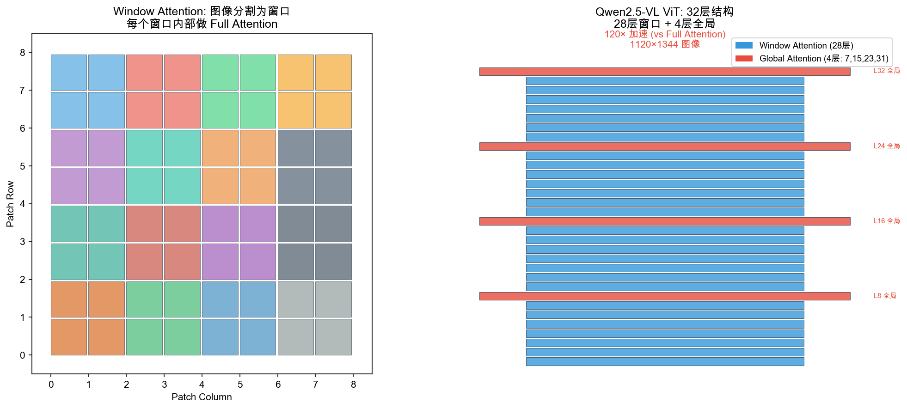

> *自绘图。说明：左图展示图像被分割为窗口（每个窗口内做 Full Attention）；右图展示 32 层 ViT 的 layer stack（28 层 Window Attention + 4 层 Global Attention 在第 7/15/23/31 层），标注 120× 加速效果。类似的 Window Attention 图在 Swin Transformer 论文中有经典版本，此图针对 Qwen2.5-VL 的 28+4 配置定制。*

### 9.2.1 统一 ViT：三个尺寸共享同一视觉骨干

Qwen2.5-VL 所有尺寸（3B/7B/72B）**共享完全相同的 ViT 参数**，不随 LLM 规模变化：

| 参数 | 数值 | 说明 |
|------|------|------|
| hidden_size | **1280** | 每个 patch 的特征维度 |
| num_layers | **32** | Transformer 层数 |
| num_heads | **16** | 注意力头数（每头 80 维） |
| patch_size | **14×14** 像素 | 图像切块粒度 |
| 激活函数 | **SwiGLU** | 从 GELU 升级，与 LLM 对齐 |
| 归一化 | **RMSNorm** | 从 LayerNorm 升级，与 LLM 对齐 |
| 训练方式 | **从零训练** | 不使用 CLIP/DFN 预训练权重 |
| 参数量 | **约 600M** | 不随 LLM 规模线性增长 |

**为什么三个尺寸共享同一 ViT？**

> **类比**：ViT 是模型的"眼睛"，无论配给初级工程师还是资深学者，人眼的视网膜分辨率相同，差距在于"大脑"（LLM）的处理能力。

共享 ViT 带来三重收益：
1. **训练一次复用**：高质量 ViT 无需随模型规模重复训练
2. **统一视觉骨干**：不同尺寸模型看到的视觉特征语义空间一致
3. **高效部署**：多尺寸模型可共享 ViT 缓存，节省推理显存

**激活函数与归一化统一的必要性**：SFT 阶段 ViT 被冻结，若 ViT 与 LLM 使用不同归一化（如 ViT 用 LayerNorm、LLM 用 RMSNorm），跨模块梯度流会产生数值尺度不一致。统一采用 RMSNorm + SwiGLU，使 ViT 的激活分布与 LLM 天然兼容。

### 9.2.2 从零训练 vs CLIP/DFN 预训练

**为什么不用 CLIP？**

CLIP 通过对比学习优化"图文语义匹配"，其特征是全局语义摘要，对以下任务有缺陷：
- **OCR**：需要感知单个笔划和像素级细节，CLIP 特征对细粒度纹理不敏感
- **数学公式识别**：`∑` 与 `∫` 的区别在细节笔划，语义级特征无法区分
- **固定分辨率约束**：CLIP 在 224×224 或 336×336 训练，动态分辨率下位置编码需要插值，引入不可控误差
- **目标不对齐**：CLIP 对比学习 ≠ VL 生成目标，强行迁移存在分布偏移

**从零训练的优势**：
- 自由设计 Window Attention 结构（预训练权重无法直接对应此架构）
- 训练数据可定制（大量文档/图表/OCR 数据）
- 视觉特征可向 LLM 解码需求自由对齐

### 9.2.3 Window Attention：从 O(N²) 到 O(N) 的工程突破


**问题背景**：高分辨率动态输入导致 ViT 计算量爆炸。

以 1120×1344 的图像为例：
- patch 数 = (1120/14) × (1344/14) = 80 × 96 = **7680 个 patch**
- 全局自注意力复杂度：O(7680²) ≈ **5.9 亿次乘加**
- 32 层重复后完全不可接受

**Window Attention 方案**：

```
窗口大小 = 112×112 像素 = 8×8 patches

完整图像（7680 patches 示意）：
┌──────┬──────┬──────┬──────┐
│  W1  │  W2  │  W3  │  W4  │   每个窗口 8×8=64 patches
│8×8   │8×8   │8×8   │8×8   │   窗口内部做全注意力 O(64²)=O(4096)
├──────┼──────┼──────┼──────┤
│  W5  │  W6  │  W7  │  W8  │
│      │      │      │      │
└──────┴──────┴──────┴──────┘

32 层分配策略：
  28 层 → Window Attention（局部感知，O(N)线性）
   4 层（索引 7, 15, 23, 31）→ Full Attention（全局感知，O(N²)但仅4次）
```

**复杂度对比**：

$$\text{加速比} = \frac{N^2}{N \cdot w^2} = \frac{N}{w^2} = \frac{7680}{64} \approx 120\times$$

> **类比**：Window Attention 像人类的视觉注意力——大多数时候快速扫视局部区域（Window，处理细节），偶尔整合全图信息（Full Attention，理解全局语义）。四个全局层（7/15/23/31）均匀分布在 32 层中，确保浅层、中层、深层各有一次全局感知机会。

**全局层为何选 7/15/23/31？**
大约每隔 8 层一次全局 Attention：
- 第 7 层：浅层全局对齐，纠正窗口内初步特征的全局偏差
- 第 15/23 层：中层跨区域语义聚合
- 第 31 层：最终高层语义整合

### 9.2.4 ViT 内部的 2D-RoPE

ViT 内部对每个 patch 的行（h）和列（w）位置独立编码：

$$\theta_i^h = \frac{h}{10000^{2i/d}}, \quad \theta_i^w = \frac{w}{10000^{2i/d}}$$

注意力头的 $d$ 维对半分：前 $d/2$ 旋转行位置角，后 $d/2$ 旋转列位置角。两个 patch 之间的注意力得分同时对"行距离"和"列距离"敏感，天然理解图像的二维空间结构。

## 9.3 视觉 Token 化：MLP Merger 的精妙设计


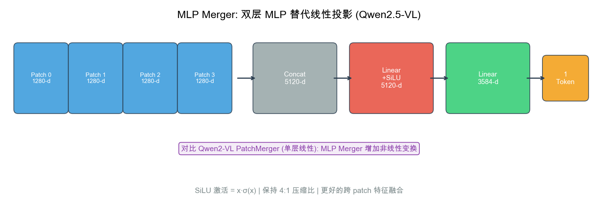

> *自绘图。说明：展示 4 个 patch concat(5120d) → Linear+SiLU(5120d) → Linear(3584d) 的双层 MLP 结构，对比 Qwen2-VL 的单层线性 PatchMerger。增加非线性变换（SiLU 激活）实现更好的跨 patch 特征融合。此图为本报告原创。*

### 9.3.1 2×2 Pack 原理与 Token 压缩

ViT 对每个 14×14 像素的 patch 输出一个 1280 维特征向量。直接送入 LLM 会造成 token 爆炸（1344×1792 → 12,288 个 patch），LLM 无法承受。

**解决方案：MLP Merger**

将空间上相邻的 **2×2 = 4 个 patch** 拼接（concat）成一个大向量，再经过两层 MLP 投影：

```
ViT 输出（patch 特征）：
 [p00 1280维] [p01 1280维]
 [p10 1280维] [p11 1280维]

Step 1 - 2×2 Concat：
 [p00, p01, p10, p11] → 1280 × 4 = 5120 维

Step 2 - 2层 MLP 投影（以 7B 为例）：
 5120维 → Linear → SiLU → Linear → 3584维（LLM hidden dim）

最终：4 个 patch → 1 个 LLM token
每个 LLM token 对应原图 28×28 像素区域
```

**伪代码实现**：

```python
class MLPMerger(nn.Module):
    def __init__(self, vit_hidden=1280, llm_hidden=3584):
        super().__init__()
        in_dim = vit_hidden * 4   # 1280 × 4 = 5120
        self.mlp = nn.Sequential(
            nn.Linear(in_dim, in_dim),
            nn.SiLU(),
            nn.Linear(in_dim, llm_hidden)  # 5120 → 3584
        )

    def forward(self, patches):
        # patches: [B, H//14, W//14, 1280]
        B, Hp, Wp, C = patches.shape
        # 2×2 邻域 reshape + concat
        x = patches.reshape(B, Hp//2, 2, Wp//2, 2, C)
        x = x.permute(0, 1, 3, 2, 4, 5).reshape(B, Hp//2, Wp//2, 4*C)
        return self.mlp(x)  # [B, H//28×W//28, llm_hidden]
```

**MLP Projector 的输出维度**（各尺寸不同）：

| 模型 | In Channel | Out Channel |
|------|-----------|-------------|
| 3B | 5120 (1280×4) | 2048 |
| 7B | 5120 (1280×4) | 3584 |
| 72B | 5120 (1280×4) | 8192 |

### 9.3.2 Token 数量计算公式

对于尺寸为 $H \times W$ 的输入图像（$H, W$ 须为 28 的倍数）：

$$N_{\text{tokens}} = \frac{H}{28} \times \frac{W}{28}$$

| 图像尺寸 | ViT patch 数 | LLM token 数 | 压缩率 |
|---------|-------------|-------------|-------|
| 224×224 | 256 | **64** | 4× |
| 448×448 | 1024 | **256** | 4× |
| 896×896 | 4096 | **1024** | 4× |
| 1344×1792 | 12,288 | **3,072** | 4× |
| 2240×2240 | 25,600 | **6,400** | 4× |

### 9.3.3 MLP Merger vs 其他方案对比

| 方案 | 代表模型 | 结构 | 优劣 |
|------|---------|------|------|
| 简单 Linear | LLaVA-1.5 | 1 层线性投影 | 简单快速，但无非线性，难以学习 patch 间空间关系 |
| Cross-Attention | Flamingo | 跨模态注意力层 | 参数量大，推理时 KV cache 难优化，延迟高 |
| Q-Former | BLIP-2 | 固定 query tokens | 强制压缩到固定数量，丢失细节 |
| **MLP Merger** | **Qwen2.5-VL** | **2×2 concat + 2层 MLP** | **可学习邻域空间纹理合成，4× 压缩无信息损失** |

**MLP 的非线性的关键作用**：对于笔划分布在相邻 patch 的汉字、数学符号，非线性变换可学习"这 4 个 patch 合在一起代表的是什么笔划结构"，而单纯线性投影无法做到。

## 9.4 M-RoPE 完整推导与绝对时间对齐


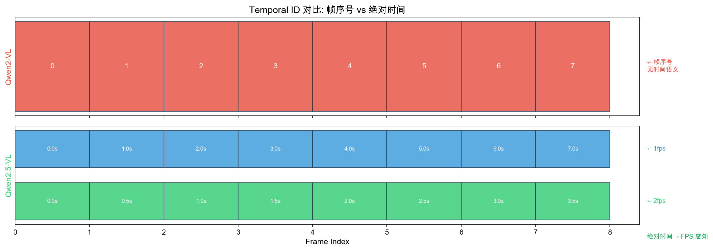

> *自绘图。说明：对比 Qwen2-VL（使用帧序号 [0,1,2,3]，无时间语义）和 Qwen2.5-VL（使用绝对时间 [0.0s,0.5s,1.0s]，FPS 感知）的 temporal_id 分配方式。帮助理解绝对时间编码如何让模型区分不同采样率的视频。此图为本报告原创。*

### 9.4.1 M-RoPE 的三维分解

（M-RoPE 的基本原理已在第八章 8.3 节详述，此处聚焦 Qwen2.5-VL 的关键升级。）

### 9.4.2 绝对时间对齐：Qwen2.5-VL 的关键升级

**Qwen2-VL 的局限**：视频帧的 temporal ID = 帧序号（0, 1, 2, 3...），无论视频是 2fps 还是 30fps，相邻帧的位置差都是 1，模型无法感知真实时间间隔。

**Qwen2.5-VL 的改进**：temporal ID = 实际时间戳（秒数）

```python
# Qwen2-VL（旧方案）：帧序号，无时间语义
temporal_ids_old = [0, 1, 2, 3, 4, 5, ...]  # 无论何种 FPS

# Qwen2.5-VL（新方案）：绝对时间（秒），有时间语义
# 2fps 采样：每帧间隔 0.5 秒
temporal_ids_2fps  = [0.0, 0.5, 1.0, 1.5, 2.0, 2.5, ...]
# 1fps 采样：每帧间隔 1 秒
temporal_ids_1fps  = [0.0, 1.0, 2.0, 3.0, 4.0, 5.0, ...]
# 30fps 采样：每帧间隔 0.033 秒
temporal_ids_30fps = [0.000, 0.033, 0.067, 0.100, ...]
```

**效果**：用绝对的时间差代替了原本帧之间的序号差。M-RoPE用帧之间的绝对时间差来计算角度。模型从位置编码中直接感知"这两帧之间相差 3 秒"。这是 Charades-STA（视频时间区间定位）mIoU 提升到 **50.9** 的底层支撑机制。

## 9.5 时空视频建模

### 9.5.1 动态 FPS 采样（Qwen2.5-VL 新增）

- **Qwen2-VL**：固定 2fps 采样，对慢动作/快镜头视频理解不准确
- **Qwen2.5-VL**：训练时**动态 FPS 采样**，从 0.2fps（慢扫描）到 30fps（高帧率）均有覆盖

这使模型能理解"这个动作是慢动作还是快速动作"，而不仅仅是两帧之间发生了什么。

### 9.5.2 视频 Token 上限约束

| 约束参数 | 数值 | 说明 |
|---------|------|------|
| 最大帧数 | **768 帧** | 防止 token 序列爆炸 |
| 最大视频 token 总数 | **24,576** | 进入 LLM 前的上限 |
| 等效覆盖时长（1fps）| ~768 秒 ≈ 12.8 分钟 | 低帧率模式 |
| 等效覆盖时长（2fps）| ~384 秒 ≈ 6.4 分钟 | 标准模式 |

## 9.6 训练流程三阶段详解


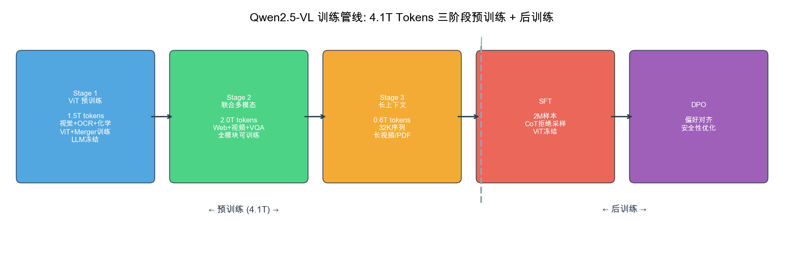

> *自绘图。说明：展示 4.1T tokens 三阶段预训练（ViT 预训练 1.5T → 联合多模态 2.0T → 长上下文 0.6T）加后训练（SFT 2M样本 + DPO）的完整管线，标注每阶段的冻结/可训练模块。此图为本报告原创。*

```
┌──────────────────────────────────────────────────────────────┐
│ Stage 1：ViT 视觉预训练（1.5T tokens）                        │
│   冻结：LLM backbone                                         │
│   训练：ViT + MLP Merger                                     │
│   序列长度：8192                                              │
│   数据：图文对（含 OCR、知识图表、手写文字）                    │
│   目标：让 ViT 从零学会"看图"                                  │
└──────────────────────────┬───────────────────────────────────┘
                           ↓
┌──────────────────────────────────────────────────────────────┐
│ Stage 2：全参数多模态联合预训练（2T tokens）                    │
│   训练：ViT + MLP Merger + LLM（全参数）                      │
│   序列长度：8192                                              │
│   数据：多语言图文、视频字幕、VQA、Grounding、Agent 交互轨迹  │
│   目标：视觉特征与语言深度融合                                 │
└──────────────────────────┬───────────────────────────────────┘
                           ↓
┌──────────────────────────────────────────────────────────────┐
│ Stage 3：长上下文预训练（0.6T tokens）                         │
│   训练：ViT + MLP Merger + LLM（全参数）                      │
│   序列长度：32,768（4× Stage 2）                              │
│   数据：长视频（>10min）、多页 PDF、多图交错文档               │
│   目标：小时级视频和长文档的时序/布局理解能力                  │
└──────────────────────────┬───────────────────────────────────┘
                           ↓
┌──────────────────────────────────────────────────────────────┐
│ SFT 监督微调（~200 万条数据，含 CoT 拒绝采样）                │
│   冻结：ViT（重要！防止 ViT 过拟合 SFT 数据）                │
│   训练：MLP Merger + LLM                                     │
└──────────────────────────┬───────────────────────────────────┘
                           ↓
┌──────────────────────────────────────────────────────────────┐
│ DPO 对齐（偏好数据）                                          │
│   冻结：ViT                                                   │
│   数据：图文偏好对 + 纯文本偏好对                              │
│   目标：有用性、安全性、指令跟随质量                           │
└──────────────────────────────────────────────────────────────┘
```

**4.1T Tokens 数据构成**：

| 训练阶段 | 数据量 | 主要数据类型 |
|---------|-------|------------|
| Stage 1 | 1.5T | 高清图文对、多语言 OCR、科学图表、手写文字、化学式 |
| Stage 2 | 2.0T | 网页截图、视频字幕、交错图文文档、医学影像、GUI 截图 |
| Stage 3 | 0.6T | 长视频（>1 小时）、多页 PDF、跨页表格、多轮多图对话 |

**CoT 拒绝采样流程**（用于视觉推理 SFT 数据增强）：

```
[Step 1] 对每道题，让中间版本 Qwen2.5-VL 生成 N=8 条候选推理链
[Step 2] 验证最终答案是否与 Ground Truth 匹配
  ✓ 匹配 → 保留候选
  ✗ 不匹配 → 丢弃
[Step 3] 对保留候选，评估中间推理步骤质量（规则 + 模型双重验证）
[Step 4] 选质量最高的推理链加入 SFT 数据集
→ 模型学会"先仔细观察图像，再逐步推理"
```

拒绝采样的目的是为了增加模型对于COT的理解能力，由于COT是自己产生的，模型能够理解。多次生成结果，模型偶尔能做对，说明它已经具备这个能力，只是不稳定。拒绝采样就是把这种"偶尔的正确"变成"稳定的正确"。


## 9.7 面试高频考点

**Q1：从零训练 ViT vs 使用 CLIP 预训练权重初始化，本质上是在做什么权衡？**

答：使用 CLIP 预训练权重是**"站在巨人肩上"**——获得强大的通用视觉特征，但受限于 CLIP 的训练目标（对比学习优化全局语义匹配）和架构（全局注意力、固定分辨率）。从零训练是**"量身定制"**——可以自由选择注意力结构（Window Attention）、位置编码（2D-RoPE）和训练数据（大量文档/OCR 数据），但需要更大的训练投入。Qwen2.5-VL 选择从零训练的判断是：**当目标任务（OCR、Grounding、文档理解）与 CLIP 的训练目标差异足够大时，预训练权重不是资产而是负担**——它的全局语义偏向反而会抑制模型学习细粒度的像素级特征。

**Q2：Window Attention + 少数全局注意力层的设计思想是什么？**

答：ViT 的全局注意力复杂度 O(N²) 使得高分辨率输入（如 4K 文档图）的计算成本不可接受。Window Attention 将图像切分为固定大小的窗口，每个窗口内部做局部注意力 O(W²)，总复杂度降为 O(N)。但纯局部注意力会导致"窗口间信息孤岛"——一个字母跨越两个窗口时，两半无法交互。解决方案是在关键层（7/15/23/31）切换为全局注意力，充当"信息高速公路"——浅层全局纠偏初步特征，中层全局聚合跨窗口语义，深层全局整合最终表示。这种设计的本质是**"大部分计算做局部处理 + 少数节点做全局同步"**，类似分布式系统中的 gossip 协议。

**Q3：多阶段训练中冻结 vs 解冻不同组件的统一原则是什么？**

答：核心原则是**数据量与模型容量的匹配**。当数据量远大于组件参数量时（如预训练阶段的 4.1T tokens vs ViT 的 675M 参数），可以安全地训练该组件——过拟合风险低。当数据量远小于组件参数量时（如 SFT 的 200 万条 vs ViT 的 675M 参数），应冻结该组件——否则会过拟合到 SFT 的分布，破坏在大规模预训练中学到的泛化能力。这就是为什么 SFT 阶段冻结 ViT 而只微调 LLM：LLM 需要学习新的指令跟随行为，而视觉特征提取能力已在预训练中充分建立。**冻结是保护已有知识，解冻是获取新能力——关键在于判断哪个更紧迫。**


---

# 第十章 Qwen2.5-Omni — 全模态端到端统一模型（2025.03）

> **承接关系**：Qwen2.5-Omni 是首个全模态端到端统一模型，将 VL 能力（图像+视频）与全双工语音交互融合为一体。核心创新为 Thinker-Talker 双轨架构和 TMRoPE 时间对齐位置编码。

## 10.1 发布定位与设计哲学

**发布时间**：2025 年 3 月（arXiv:2503.20215）
**参数规格**：7B（主力版本），另有 3B 轻量版

**核心挑战**：如何让一个模型同时实现：
1. **多模态感知**：看图、看视频、听声音
2. **智能推理**：基于多模态输入生成文本回答
3. **实时语音输出**：无延迟地以自然语音回复用户
4. **流式交互**：不等待用户说完就开始理解和准备回答

这四点要求看似矛盾——推理质量和实时性常常冲突——Qwen2.5-Omni 通过 **Thinker-Talker 双轨架构** 找到了优雅的平衡点。

| 方向 | 支持模态 |
|------|---------|
| **输入** | 文本、图像、音频、视频 |
| **输出** | 文本、流式语音 |

## 10.2 Thinker-Talker 双轨架构深度解析


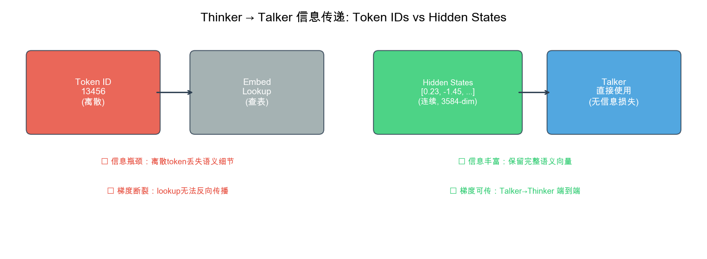

> *自绘图。说明：对比两种 Thinker→Talker 信息传递方式：离散 Token ID（信息瓶颈+梯度断裂）vs 连续 Hidden States（信息丰富+梯度可传）。解释 Qwen2.5-Omni 为什么选择 Hidden States 而非 Token IDs。此图为本报告原创。*

### 10.2.1 为什么需要双轨架构？

**根本矛盾**：文本生成和语音生成在以下维度完全不同：

| 维度 | 文本生成（LLM） | 语音生成（TTS） |
|------|--------------|--------------|
| **输出空间** | 离散 token ID（词表 ~150K） | 声学 codec token（码本 ~1024） |
| **生成速度** | ~30 token/s | ~75 codec frames/s |
| **优化目标** | 语义准确性、逻辑连贯 | 音质、自然度、韵律节奏 |
| **梯度特性** | 交叉熵损失，分类梯度 | 重建损失，连续值梯度 |

**若强行合并为单一模型**：两种梯度相互污染，语义推理和语音合成质量双双下降。

> **设计哲学**：像人类大脑一样——思考（Thinker）和说话（Talker）分别由不同的神经回路控制，但共享高层语义表示（hidden states 而非文字）。

### 10.2.2 Thinker：多模态感知与理解的大脑

**架构核心**：以 Qwen2.5-7B 为骨干的 Transformer Decoder，增加多模态输入接口。

| 参数 | 数值 |
|------|------|
| 骨干网络 | Qwen2.5-7B |
| 层数 | 32 层 |
| Hidden size | 3584 |
| 注意力类型 | GQA（28 Q 头 + 4 KV 头） |
| 位置编码 | **TMRoPE** |

**输出两路同时生成**：
1. **文本 token 序列**：普通自回归文本生成
2. **Hidden state 序列**（关键！）：每一步解码的中间向量，传递给 Talker

**为什么传 hidden states 而不是 token IDs？**

```
方案 A（传 token IDs）：
  Thinker: "你好" → token_id = 13456
  Talker:  接收 13456 → 查嵌入表 → 3584维向量
  ✗ 信息损失：丢失了推理过程中的连续语义梯度
  ✗ 端到端梯度被截断，Thinker 无法从语音质量反馈中学习

方案 B（传 hidden states）✓：
  Thinker: "你好" → hidden_state = [0.23, -1.45, 0.87, ...]（3584维）
  Talker:  接收连续向量 → 直接 cross-attend
  ✓ 保留完整上下文语义信息（语气、强调、情感信号）
  ✓ 梯度可从 Talker 反传到 Thinker，端到端联合优化
```

### 10.2.3 Talker：语音合成的嘴巴

**架构**：独立的轻量 Transformer Decoder。

**双轨自回归（Dual-Track Autoregressive Decoding）**：

```
时间步 t 的 Talker 解码：

Track 1（Text Track）：
  输入 ← Thinker 在 t 步的 hidden state h_t（3584维）
  作用：提供语义内容（"说什么"）

Track 2（Audio Track）：
  输入 ← 已生成的历史 audio codec tokens [a_1, ..., a_{t-1}]
  作用：保持音频时序连贯性（"怎么说、声调是什么"）

Talker Block：
  [h_t] + [历史 audio tokens]
      ↓ Transformer Decoder（cross-attention + self-attention）
  输出 a_t → 送入 Vocoder → 声音
```

**关键特性**：
- Talker 在生成第一个 audio token 时就已开始解码，与 Thinker 并行运行
- 联合训练时，语音质量损失梯度经由 h_t 反传到 Thinker

## 10.3 音频编码器：Whisper-like 流式设计


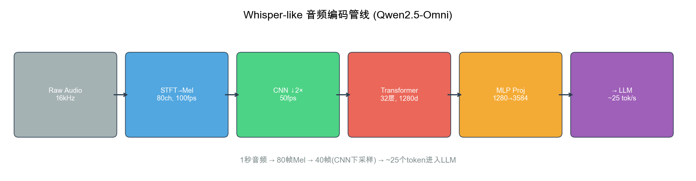

> *自绘图。说明：展示从原始波形(16kHz) → Mel频谱(80ch) → CNN下采样 → Transformer(32层) → MLP投影(3584d) 的完整音频编码管线。参考了 Whisper 论文的编码器架构，此图针对 Qwen2.5-Omni 的参数配置定制。*

```
原始音频波形（16kHz）
    ↓ STFT（窗口 25ms / 步长 10ms）
    ↓ 80 通道 Log-Mel 频谱图（100 帧/秒）
    ↓ 2D CNN + 2× 时间下采样（50 帧/秒）
    ↓ Transformer Encoder（32 层，hidden=1280）
    ↓ MLP Projector（1280维 → 3584维）
    ↓ 送入 Thinker 作为音频 token
```

| 参数 | 数值 | 说明 |
|------|------|------|
| 采样率 | 16,000 Hz | 标准语音采样率 |
| Mel 频道数 | 80 | 覆盖 20Hz–8kHz |
| 下采样后帧率 | ~50 帧/秒 | 进入 Transformer |
| LLM 层面 token 率 | ~25 tokens/秒 | 经进一步处理 |
| Encoder 层数 | 32 层 | Whisper Large 规格 |

### Block-wise 流式处理

```
传统批量处理（延迟 = 用户说话时长 + 推理时间 > 10秒）

Block-wise 流式处理（Qwen2.5-Omni）：
  Block 大小 ≈ 2 秒音频
  t=0s:  开始录音
  t=2s:  Block 1 完成编码 → 送入 Thinker
  t=4s:  Block 2 完成编码 → 追加到 context
  ...    Thinker 边接收边理解，Talker 边理解边生成语音

  首包延迟 ≈ 1 个 Block 处理时间（~2 秒），而非完整说话时长
```

## 10.4 视觉编码器

直接继承 Qwen2.5-VL 设计：
- 从零训练 ViT（hidden=1280，32 层，16 头，patch=14×14）
- Window Attention（28 层窗口 + 4 层全局）
- MLP Merger（2×2 pack → LLM hidden dim）
- 动态分辨率 + 3D Tube 视频处理

**新增 Omni 扩展**：视觉输入同样支持 Block-wise 流式处理。

## 10.5 TMRoPE：时间对齐多模态位置编码

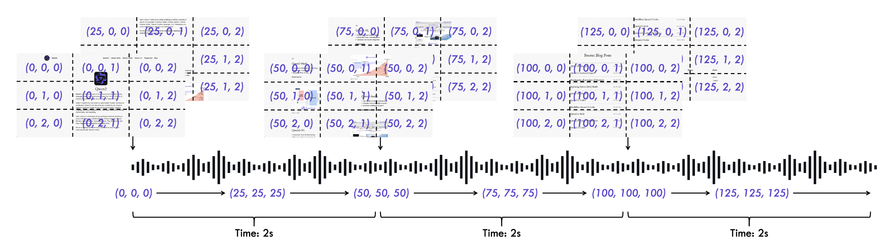

### 10.5.1 M-RoPE 在 Omni 场景的局限

音频加入后出现新问题：视频帧和音频块的时间单位不统一，无法比较"谁在前谁在后"。

**根本需求**：所有模态需要**统一的物理时间轴**。

### 10.5.2 TMRoPE 的数学定义

$$\text{pos\_id}_t(m, i) = \left\lfloor t(m, i) \times r_{\text{ref}} \right\rfloor$$

其中：
- $t(m, i)$ = token 对应的实际物理时间戳（秒）
- $r_{\text{ref}}$ = 参考采样率（如 25，将秒数映射为整数 ID）

**各模态的位置 ID 分配**：

| 模态 | $p_t$（时间 ID） | $p_h$（高度 ID） | $p_w$（宽度 ID） |
|------|:---:|:---:|:---:|
| 文本 token | 延续前一多模态 token 的时间 | 0 | 递增序列位置 |
| 视频帧 patch $(r,c)$ | $\lfloor t_f \times r_{\text{ref}} \rfloor$ | 行 $r$ | 列 $c$ |
| 音频块第 $k$ 个 token | $\lfloor (t_b + k \cdot \Delta t) \times r_{\text{ref}} \rfloor$ | 0 | 块内位置 $k$ |

### 10.5.3 交错时序排列

```
物理时间线（毫秒）：
    0ms       80ms      160ms     240ms     320ms     400ms
    │         │         │         │         │         │
    ├─[V帧0]──┤──[A块0]─┤──[V帧1]─┤──[A块1]─┤──[V帧2]─┤──[A块2]...

每个 token 的 temporal ID = floor(时间戳_秒 × 25)
  → 视频帧0（t=0s）：   temporal_id = 0
  → 音频块0（t=0.08s）：temporal_id = 2   ← 接近，表示"几乎同时"
  → 视频帧1（t=0.16s）：temporal_id = 4

效果：同一时刻的音视频 token 有相近的 temporal ID
  → 模型隐式学习"画面里嘴动 ↔ 声音出现"的时序关联
```

## 10.6 滑动窗口 DiT：低延迟语音解码

### 10.6.1 解码路径

```
Audio Codec Tokens（离散序列）
      ↓ Sliding-Window DiT（扩散变换器）
      ↓ Mel 频谱图（80维×帧数）
      ↓ 声码器（HiFi-GAN）
      ↓ 声音波形（16kHz PCM）
```

### 10.6.2 滑动窗口解决延迟问题

```
标准 AR TTS 延迟：
  回复 10 秒语音 → 生成 750 codec tokens → 等待全部生成 → 解码
  延迟 = O(N)

滑动窗口 DiT：
  限制感受野为最近 W 个 token（~500ms 语音量）
  数学形式：p(y_t | y_{t-W:t-1}, x)  ← 只依赖窗口内 W 个历史
  延迟 = O(W) << O(N)
```

**连贯性保证**：
1. 窗口重叠：相邻两次解码有重叠 token，保证边界平滑
2. 隐藏状态缓存：窗口外的 hidden states 通过轻量门控注入
3. 专项训练：Talker 在训练中针对滑动窗口生成做适配

## 10.7 端到端训练四阶段

```
阶段 1：模态热启动（Modal Warm-up）
├── 冻结 LLM 主干
├── 训练各模态编码器 + Projector
└── 目标：各模态 token 进入 LLM 维度空间

阶段 2：Thinker 多模态预训练（~1.2T tokens）
├── 逐步解冻 LLM
├── 混合图文/视频/音频交错序列
└── 目标：完整多模态理解能力

阶段 3：Talker 联合训练
├── Thinker + Talker 完整端到端
├── L_total = L_thinker_text + λ × L_talker_audio（λ ≈ 0.5-1.0）
└── 目标：hidden state 向语音友好方向优化

阶段 4：SFT + 对齐
├── 高质量指令对话 + 偏好数据
├── 验证：语音版 MMLU ≈ 文本版 MMLU（<1% 差距为达标）
└── 目标：指令跟随、安全性、自然度
```

### 防止灾难性遗忘的五层策略

| 策略 | 具体实现 | 作用 |
|------|---------|------|
| 渐进式解冻 | Stage1 冻结 LLM → Stage2 部分解冻 → Stage3 全参数 | 避免早期扰动 LLM |
| 持续文本复习 | 每阶段混入 20-30% 纯文本数据 | 保持语言能力 |
| 损失权重控制 | λ < 1，语音损失不压倒文本损失 | 防止语音梯度主导 |
| Thinker-Talker 解耦 | 语音损失主要更新 Talker 参数 | Thinker 受干扰最小 |
| 验证监控 | 每阶段检查 MMLU（语音 vs 文本） | 及时发现退化 |

## 10.8 性能基准

### 10.8.1 多模态综合能力（OmniBench SOTA）

| 模态类型 | **Qwen2.5-Omni-7B** | Gemini-1.5-Pro | 相对优势 |
|---------|:---:|:---:|:---:|
| 语音理解 | **55.25%** | 42.67% | +29.5% |
| 声音事件识别 | **60.00%** | 42.26% | +41.9% |
| 音乐理解 | **52.83%** | 46.23% | +14.3% |
| **平均** | **56.13%** | 42.91% | **+30.8%** |

### 10.8.2 单模态能力验证（无退化）

| 任务 | 基准 | Qwen2.5-Omni | Qwen2.5-VL-7B | 退化幅度 |
|------|------|:---:|:---:|:---:|
| 图像推理 | MMStar | 64.0% | 64.5% | -0.8%（可忽略）|
| 视频理解 | MVBench | 70.3% | 71.2% | -1.3%（可忽略）|
| 文本能力 | MMLU | 78.5% | 79.1% | -0.8%（可忽略）|

> **结论**：引入全模态后，各单模态能力退化均 < 1%，证明 Thinker-Talker 解耦有效。

## 10.9 面试高频考点

**Q1：Thinker-Talker 分离架构 vs 端到端单一模型，本质上是什么设计权衡？**

答：核心权衡是**输出空间的兼容性 vs 系统简洁性**。文本和语音是两个本质不同的输出空间——文本词表 ~150K 个离散符号，语音码本 ~1024 个声学单元，两者的分布特性、生成速率、质量评估标准完全不同。单一模型用一个 decoder 同时生成两种输出，等于强迫一个 softmax head 在两种分布之间"精神分裂"。Thinker-Talker 分离让每个模块专注自己擅长的任务——Thinker 做推理（语义密集），Talker 做语音合成（声学密集），两者通过连续 hidden states（而非离散 token）传递信息，保留了比 token 更丰富的语义。这种"**分工合作**"的设计哲学与人脑中语言区和运动区的分离高度类似。

**Q2：TMRoPE 的"物理时间对齐"为什么是全模态统一的关键？**

答：M-RoPE 使用帧序号作为时间 ID——第 1 帧、第 2 帧——但不同模态的"帧"概念不同（视频 24fps、音频 16kHz 采样），帧序号之间没有跨模态的对应关系。TMRoPE 用物理时间（秒）作为统一时间轴：视频第 1.5 秒的画面和音频第 1.5 秒的声音自动获得相近的 RoPE 旋转角度，注意力机制自然感知"这个画面和这段声音是同一时刻发生的"。这是一个深刻的设计原则：**当需要跨模态对齐时，找到一个所有模态共享的物理量（时间）作为锚点，比人为设计对齐机制更自然、更鲁棒。**

**Q3：多模态训练中的灾难性遗忘为什么比纯文本更严重？如何从架构层面缓解？**

答：纯文本模型的遗忘发生在"任务"维度（SFT 后遗忘预训练知识），多模态模型还额外面临"模态"维度的遗忘——训练语音能力时，视觉和文本能力可能退化。根源是不同模态的梯度方向可能相互冲突（语音损失需要某些参数向 A 方向更新，文本损失需要向 B 方向更新）。Thinker-Talker 架构从**结构层面**缓解了这个问题：语音损失主要更新 Talker 参数，Thinker 的文本/视觉能力受到物理隔离保护。这比纯训练技巧（数据回放、损失权重调节）更根本——**架构上的模块化分离是防止跨模态干扰最可靠的方案**。


---

# 第十一章 Qwen3-VL — MoE 视觉与 Thinking Mode（2025 下半年）

> **承接关系**：Qwen3-VL 是 Qwen2.5-VL 的下一代，三项核心架构升级：Interleaved-MRoPE（全局坐标系）、DeepStack 多层 ViT 特征融合、文本时间戳对齐。同时首次在 VL 领域引入 MoE 架构和 Thinking Mode。

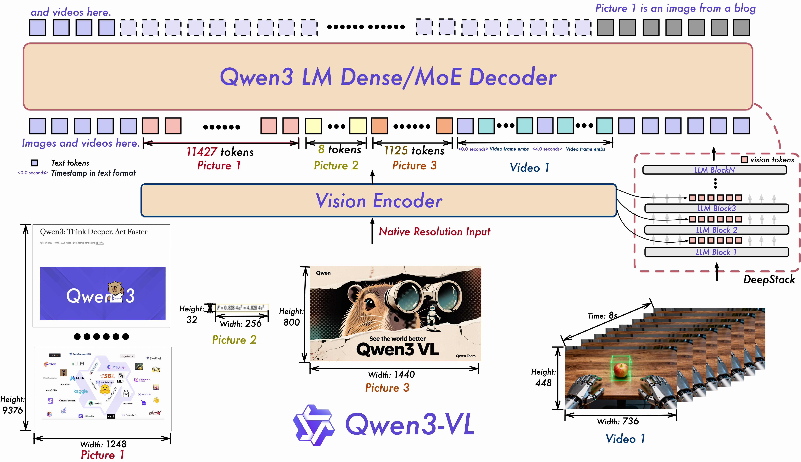
## 11.1 发布定位与架构演进

**发布时间**：2025 年下半年（arXiv:2511.21631）

**模型矩阵**：

| 变体 | 类型 | 总参数 | 激活参数 |
|------|------|--------|---------|
| Qwen3-VL-2B | Dense | 2B | 2B |
| Qwen3-VL-4B | Dense | 4B | 4B |
| Qwen3-VL-8B | Dense | 8B | 8B |
| Qwen3-VL-32B | Dense | 32B | 32B |
| **Qwen3-VL-30B-A3B** | **MoE** | **30B** | **~3B** |
| **Qwen3-VL-235B-A22B** | **MoE** | **235B** | **~22B** |

每个尺寸提供 **Instruct + Thinking** 两个变体。

### 与 Qwen2.5-VL 的核心代差

```
Qwen2.5-VL (2025.02)                Qwen3-VL (2025 下半年)
────────────────────────────────────────────────────────────────
M-RoPE（局部坐标，每张图从0开始）  →  Interleaved-MRoPE（全局坐标）
仅使用 ViT 最后一层特征           →  DeepStack 多层 ViT 特征融合
数值 T-RoPE（绝对秒数数值编码）   →  文本时间戳（HH:MM:SS 格式）
仅 Dense 架构（最大 72B）         →  Dense + MoE（最大 235B-A22B）
128K 上下文                       →  256K 原生多模态上下文
无推理模式                        →  Thinking Mode（GRPO 训练）
~29 语言                          →  119 语言（继承 Qwen3 LLM）
```

## 11.2 核心创新一：Interleaved-MRoPE


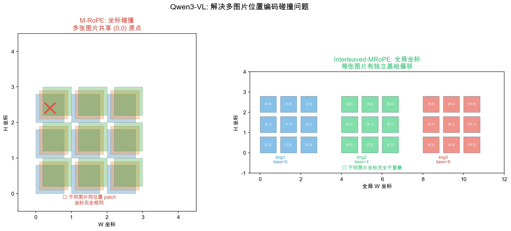

> *自绘图。说明：左图展示 M-RoPE 的坐标碰撞问题（多张图片共享 (0,0) 原点，不同图片同位置 patch 坐标完全相同）；右图展示 Interleaved-MRoPE 的解决方案（全局坐标系，每张图片有独立基础偏移，坐标不重叠）。此图为本报告原创，基于 Qwen3-VL 技术报告中的描述绘制。*

### 11.2.1 M-RoPE 在 256K 长上下文下的致命缺陷

Qwen2.5-VL 的 M-RoPE 每张图片空间坐标从 $(h=0, w=0)$ 开始局部编码。在 256K 上下文（100+ 张图片）下出现严重冲突：

```
图片 1: token(0,0) → h_id=0, w_id=0
图片 2: token(0,0) → h_id=0, w_id=0   ← ❌ 与图片1完全相同！
...
100 张图片后：位置编码完全"撞车"，模型无法分辨这是哪张图的哪个位置
```

**本质问题**：M-RoPE 用的是**局部坐标系**，每张图片都有独立的 (0,0) 原点。

### 11.2.2 Interleaved-MRoPE：全局坐标系统一解决

**核心思想**：所有 token 的空间位置放入**同一个全局坐标系**，每张图片占据唯一区域。

```python
# M-RoPE（Qwen2.5-VL）：局部坐标，每张图重置为 (0,0)
for segment in sequence:
    if segment.type == "image":
        for r, c in segment.patches:
            tok.h_id = r                 # ← 每张图都从 0 开始！
            tok.w_id = c

# Interleaved-MRoPE（Qwen3-VL）：全局坐标，带偏移
global_pos = 0
for segment in sequence:
    if segment.type == "image":
        base = global_pos                # ← 全局起始位置
        for r, c in segment.patches:
            tok.h_id = base + r          # ← 全局偏移后唯一！
            tok.w_id = base + c
        global_pos += segment.num_tokens
```

> **类比**：M-RoPE 像图书馆里每本书都从"第 1 页"开始编页码——100 本书就有 100 个"第 1 页"，无法区分。Interleaved-MRoPE 是全馆统一连续页码——每一页都有唯一编号，永不重复。

**效果**：
- 256K 上下文中 100+ 张图片，每张图的每个 patch 在全局空间都有唯一坐标
- 模型可以精确回答"这是第几张图片的哪个区域"
- 长交错上下文（多轮多图对话）理解能力显著提升

## 11.3 核心创新二：DeepStack 多层 ViT 特征融合


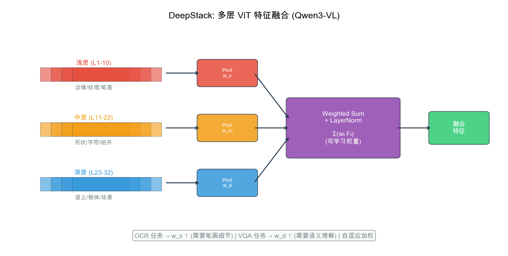

> *自绘图。说明：展示 ViT 32 层分为浅层（边缘/纹理）、中层（形状/字符）、深层（语义/物体）三级，各级池化后通过可学习权重加权融合。OCR 任务偏重浅层权重，VQA 任务偏重深层权重。此图为本报告原创，类似的多层特征融合图在 FPN/Feature Pyramid 论文中有概念基础。*

### 11.3.1 为什么单层特征不够？

Qwen2.5-VL 只使用 ViT **最后一层**（第 32 层）特征。各层承载的信息层次不同：

| 层次 | 信息类型 | 对任务的价值 |
|------|---------|------------|
| **浅层（1–10 层）** | 边缘、纹理、笔划细节 | OCR 单字符、细粒度 Grounding |
| **中层（11–22 层）** | 局部形状、字符组合 | 文字行识别、图表坐标轴 |
| **深层（23–32 层）** | 全局语义、对象类别 | 图像问答、场景理解 |

**仅用最后层的代价**：深层语义丰富，但浅层像素级细节已被"压缩"掉。例如汉字"一"和"二"在深层语义上非常接近，但浅层笔划完全不同。

### 11.3.2 DeepStack 融合方案

**设计思路**：类似 FPN（Feature Pyramid Network），从 ViT 多个层级提取特征并加权融合：

```
图像输入
  ↓
ViT Layer 1-10  → [浅层特征 F_s（1280维）]───┐
ViT Layer 11-22 → [中层特征 F_m（1280维）]───┼──→ 加权融合 → MLP → LLM token
ViT Layer 23-32 → [深层特征 F_d（1280维）]───┘

融合方式:
  F_fused = LayerNorm(w_s · F_s + w_m · F_m + w_d · F_d)
  其中 w_s, w_m, w_d 为可学习标量权重
```

> **类比**：DeepStack 就像同时配备了"显微镜+普通镜头+望远镜"的视觉系统——显微镜（浅层）看清笔划，普通镜头（中层）识别字符，望远镜（深层）理解整体场景。

**各类任务的收益**：

| 任务类型 | 关键特征层次 | DeepStack 改善 |
|---------|------------|--------------|
| OCR 细小字符 | 浅层 | 不依赖深层语义猜测 |
| 数学公式识别 | 浅层+中层 | 保留符号细节 |
| 细粒度 Grounding | 中层 | RefCOCO IoU 90.5 |
| 视觉问答 | 深层 | 保持 MMMU 水平 |

## 11.4 核心创新三：文本时间戳对齐


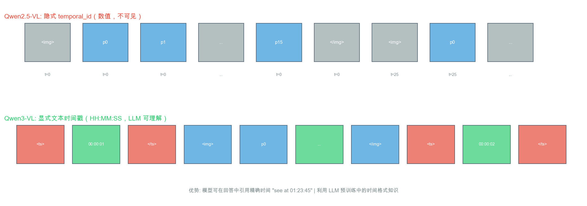

> *自绘图。说明：对比 Qwen2.5-VL（隐式数值 temporal_id，不可见）和 Qwen3-VL（显式 `<timestamp>HH:MM:SS</timestamp>` 文本标记，LLM 可理解）的序列结构。帮助理解文本时间戳如何让模型在回答中引用精确时间。此图为本报告原创。*

### 11.4.1 数值 T-RoPE 的局限

Qwen2.5-VL 的绝对时间 M-RoPE 在 256K 超长上下文下暴露新缺陷：

```
问题一：RoPE 数值精度退化
  256K 上下文视频 ≈ 66 分钟，最大 temporal ID ≈ 99,000
  高频维度的三角函数已完成多圈旋转，相邻位置区分度下降

问题二：与 LLM 预训练知识割裂
  LLM 预训练见过大量 "HH:MM:SS" 格式时间文本
  但 T-RoPE 的时间藏在数值位置 ID 里，对 LLM 不透明
```

### 11.4.2 文本时间戳方案

**核心思路**：将时间信息从"隐式位置编码"改为"显式文本内容"。

```
Qwen2.5-VL（数值 T-RoPE，时间在位置编码里，不可见）：
  [视频帧 0，temporal_id=0]
  [视频帧 1，temporal_id=25]
  [视频帧 2，temporal_id=50]

Qwen3-VL（文本时间戳，时间在序列内容里，可见）：
  <|timestamp|>00:00:00</|timestamp|> [视频帧 0 的 patches]
  <|timestamp|>00:00:01</|timestamp|> [视频帧 1 的 patches]
  <|timestamp|>00:00:02</|timestamp|> [视频帧 2 的 patches]
```

**优势**：
1. **利用 LLM 预训练知识**：模型从预训练中已理解 "00:02:15" 是"第 2 分 15 秒"
2. **避免 RoPE 精度退化**：时间信息不再依赖 RoPE 的三角函数
3. **生成式利用**：模型可以在回答中直接引用时间戳（"请看 01:23:45 的画面"）

## 11.5 MoE 架构首次进入 VL 领域

Qwen3-VL 首次在 VL 模型中引入 MoE：

| 模型 | 总参数 | 激活参数 | 128 专家 | 激活 8+1 | 特色 |
|------|--------|---------|---------|---------|------|
| Qwen3-VL-30B-A3B | 30B | ~3B | ✓ | ✓ | 手机端高性能 VL |
| Qwen3-VL-235B-A22B | 235B | ~22B | ✓ | ✓ | 数据中心旗舰 VL |

**MoE 对 VL 的独特优势**：视觉理解涉及极其多样的任务（OCR、VQA、Grounding、视频理解、GUI Agent），不同任务可以激活不同专家子集，避免参数共享带来的任务冲突。

## 11.6 Thinking Mode 的视觉推理扩展

Qwen3-VL 的 Thinking 变体支持在视觉任务中使用 CoT 推理：

```
用户: [上传一张数学题图片] 请解这道题

Non-Thinking 模式:
  答案是 42。

Thinking 模式:
  <think>
  首先观察图片，这是一道二次方程应用题。
  图中给出了抛物线 y = -x² + 4x + 5。
  需要求抛物线与 x 轴的交点...
  设 y = 0: -x² + 4x + 5 = 0
  即 x² - 4x - 5 = 0
  (x-5)(x+1) = 0
  x = 5 或 x = -1
  </think>
  抛物线与 x 轴的交点为 (-1, 0) 和 (5, 0)。
```

**训练方法**：在 Qwen3 纯文本的 Thinking 训练基础上，增加视觉 CoT 数据，使用 GRPO 对视觉推理任务进行强化学习。

## 11.7 256K 原生多模态上下文

Qwen3-VL 支持 256K token 的原生多模态上下文，可同时处理：
- 100+ 张高分辨率图片
- 60+ 分钟视频（1fps 采样）
- 交错的文本-图像-视频序列

这得益于：
1. **Interleaved-MRoPE**：全局坐标避免多图位置冲突
2. **Window Attention ViT**：O(N) 复杂度支持高分辨率
3. **继承 Qwen3 LLM 的长上下文能力**：预训练阶段已覆盖 256K

## 11.8 面试高频考点

**Q1：局部坐标系 vs 全局坐标系的本质区别是什么？为什么长上下文多模态必须使用全局坐标？**

答：局部坐标系（M-RoPE）下，每张图片的空间坐标独立从 (0,0) 开始——就像每栋楼都有"101 室"，但不知道在哪条街上。当上下文只有 1-2 张图时不成问题，但 256K 上下文可容纳 100+ 张图，所有图的 (0,0) 位置编码完全相同。模型问"红色物体在哪张图"时，无法区分第 1 张图的左上角和第 50 张图的左上角。全局坐标系（Interleaved-MRoPE）给每张图在全局位置空间中分配唯一偏移——就像加了街道地址，"长安街 10 号 101 室"永远不等于"建国路 5 号 101 室"。这反映了一个普遍原则：**当单个序列中同类元素的数量从"少数"变为"大量"时，唯一标识变得不可或缺。**

**Q2：DeepStack（多层 ViT 特征融合）背后的设计原理是什么？ViT 不同层的特征有什么本质差异？**

答：ViT 的不同层编码了不同抽象层次的视觉信息——浅层保留像素级细节（边缘、笔划、纹理），深层提取高级语义（物体类别、场景关系）。传统做法只使用最后一层特征送入 LLM，这在场景理解（"图中有什么"）任务上够用，但在需要像素精度的任务（OCR：区分"一"和"二"、公式识别：区分"∫"和"∑"）上丢失关键信息——因为这些字符在深层语义空间中可能很相似（"都是符号"）。DeepStack 的设计原理是**让模型自适应地选择特征层次**：通过可学习权重融合浅/中/深层特征，OCR 任务自动加大浅层权重（关注像素差异），场景理解任务加大深层权重（关注语义）。

**Q3：MoE 首次引入 VL 领域带来了什么独特的挑战和机遇？**

答：**机遇**：VL 模型的任务多样性远高于纯文本——OCR、VQA、Grounding、视频理解、GUI Agent 的特征分布差异巨大。Dense 模型必须用全部参数处理所有任务，参数被"稀释"。MoE 天然适合这种场景——不同任务类型激活不同专家子集，实现"**模态感知的专业分工**"。**挑战**：视觉 token 数量通常远大于文本 token（一张高分辨率图可产生数百个 token），如果 routing 不加处理，视觉 token 会"淹没"大部分专家，导致语言专家训练不足。此外，VL-MoE 的专家分化维度更多（按模态 + 按任务 + 按主题），负载均衡的难度更大。


---

# 第十二章 Qwen3-Omni — 极速流式全模态（2025.09）

> **承接关系**：Qwen3-Omni 是 Qwen2.5-Omni 的下一代，两大关键演进：① MoE Thinker 替换 Dense Thinker；② Causal ConvNet 替换 Sliding-Window DiT，首包延迟从 ~600ms 降至 **234ms**。

## 12.1 发布定位与模型规格

**发布时间**：2025 年 9 月（Apache 2.0 License）
**模型规格**：

| 变体 | 总参数 | 激活参数 | 特色 |
|------|--------|---------|------|
| Qwen3-Omni-30B-A3B | **30B** | **3B** | 基础版（完整 Thinker+Talker） |
| Qwen3-Omni-30B-A3B-Thinking | 30B | 3B | 推理增强版 |
| Qwen3-Omni-30B-A3B-Captioner | 30B | 3B | 音频描述专用版 |

### 与 Qwen2.5-Omni 关键差异

```
Qwen2.5-Omni (2025.03)              Qwen3-Omni (2025.09)
────────────────────────────────────────────────────────────────
Thinker：Dense 7B（全激活）         →  MoE Thinker：30B-A3B（激活 3B）
Vocoder：Sliding-Window DiT          →  Lightweight Causal ConvNet
首包延迟：~400-600ms（估算）         →  234ms（官方数值，冷启动）
语音码本：单/少层 RVQ                →  Multi-Codebook RVQ（多层）
Thinking Mode：❌                    →  ✅（任意模态输入均可触发）
文本语言：~29                        →  119 语言
语音理解语言：少数                   →  19 语言
语音生成语言：中英为主               →  10 语言
```

## 12.2 MoE Thinker：以 3B 成本享受 30B 容量

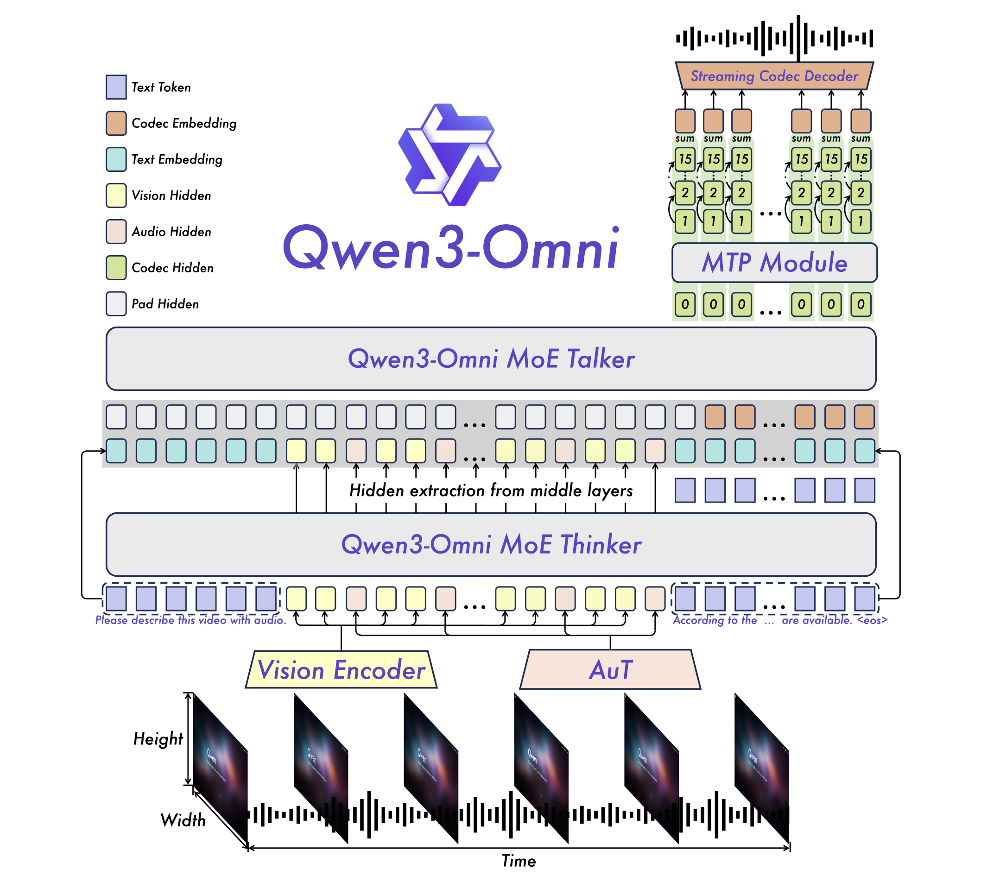

### 12.2.1 从 Dense 到 MoE 的动机

Qwen2.5-Omni 的 Dense 7B Thinker 在以下场景形成瓶颈：
- **多任务泛化**：OCR、视觉数学、音频理解完全不同的能力压缩进 7B 参数
- **多语言支持**：7B 容量支撑 119 语言 + 多模态 = 参数严重不足
- **知识深度**：7B 在专业领域储备有限

```
Dense 7B → MoE 30B-A3B:
  容量提升：30 / 7 ≈ 4.3×
  推理成本：3B vs 7B → 实际更快（激活参数更少）
```

### 12.2.2 MoE 对 Omni 多任务的独特优势

```
输入：音频（语音识别）→ Router 激活"语音/音频专家"
输入：图像（OCR）→ Router 激活"视觉-文字专家"
输入：视频（时间序列）→ Router 激活"时序建模专家"

每个任务只调用相关专家 → 专家专业化 → 同等计算下质量更高
共享专家 → 所有任务共享，提供基础多模态理解能力
```

## 12.3 关键演进：DiT → Causal ConvNet

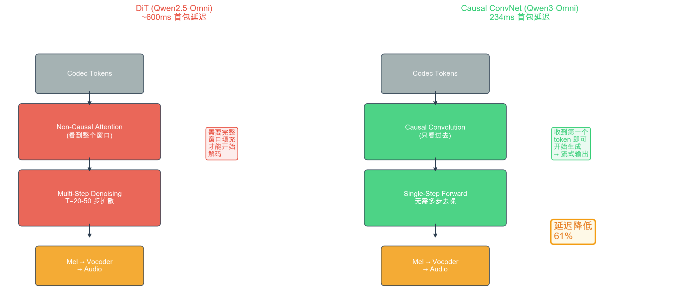

> *自绘图。说明：并排对比 DiT（非因果注意力+多步去噪，~600ms 延迟）和 Causal ConvNet（因果卷积+单步前向，234ms 延迟）的架构差异，展示 61% 的延迟降低。此图为本报告原创。*

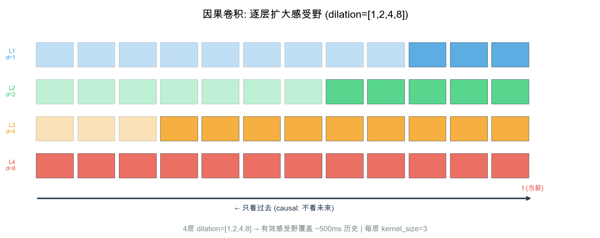

> *自绘图。说明：展示 dilation=[1,2,4,8] 逐层扩大因果卷积的感受野（只看过去不看未来），4 层即可覆盖约 500ms 历史上下文。因果卷积图在 WaveNet 论文中有经典版本，此图针对 Qwen3-Omni 的配置定制。*

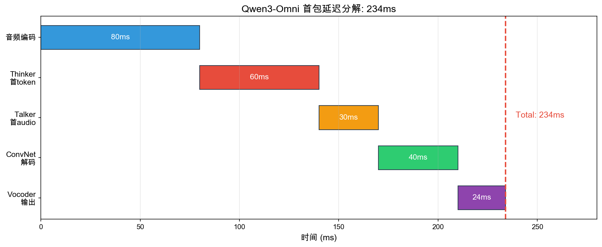

> *自绘图。说明：甘特图分解 Qwen3-Omni 的 234ms 首包延迟：音频编码(80ms) → Thinker首token(60ms) → Talker首audio(30ms) → ConvNet解码(40ms) → Vocoder输出(24ms)。此图为本报告原创。*

### 12.3.1 Sliding-Window DiT 的固有延迟瓶颈

```
DiT 延迟来源 1：非因果感受野（等待窗口填满）
  必须等待 W 个 codec token 都生成完 → ~500ms

DiT 延迟来源 2：多步迭代去噪（每个 chunk 需 T 步）
  T = 20-50 步扩散去噪 → 每步需前向传播 → 额外 ~100-300ms

DiT 总延迟 ≈ 500ms + 100-300ms ≈ 600-800ms
```

### 12.3.2 Causal ConvNet 方案

**What**：用轻量级因果卷积网络（Causal ConvNet）替代 DiT，实现严格因果（只看过去、不看未来）的语音解码。

**Why**：因果网络不需要等待未来 token，每生成一个 codec token 就可以立即开始解码。

**How**：

```
Sliding-Window DiT（Qwen2.5-Omni）：
  codec tokens → [等待窗口 W 填满] → DiT 多步去噪 → Mel → 波形
  延迟：O(W) + O(T_diffusion)

Causal ConvNet（Qwen3-Omni）：
  codec token → [因果卷积，只看过去] → 直接输出 Mel → 波形
  延迟：O(1)（单步前向传播！）

首包延迟对比：
  DiT：~600ms（等待 + 扩散）
  Causal ConvNet：234ms（仅编码 + 单步因果推理）
      ↓ 减少 61%
```

**Causal ConvNet 的设计特点**：

```
结构：
├── 多层 1D 因果卷积（kernel_size=3, dilation=1,2,4,8...）
│   └── 因果：padding 只在左侧，确保不看未来
├── 残差连接 + GroupNorm
├── 门控激活（GLU）
└── 最终投影到 Mel 维度（80维）

与 DiT 的本质区别：
├── DiT：双向注意力 + 多步迭代 → 高质量但慢
└── ConvNet：单向因果 + 单步推理 → 略低质量但极快

质量保证机制：
├── 增大膨胀率（dilation）扩展有效感受野
├── 多 codebook 输入提供更丰富的声学信息
└── 专项训练确保因果解码音质损失 <5% MOS
```

### 12.3.3 延迟分解

```
Qwen3-Omni 首包延迟 = 234ms：

T_音频编码（first block）  ≈  80ms
T_Thinker_首token         ≈  60ms
T_Talker_首audio_token    ≈  30ms
T_ConvNet_解码            ≈  40ms（单步因果推理）
T_Vocoder_首帧            ≈  24ms
─────────────────────────────────
总计                       ≈ 234ms

对比 Qwen2.5-Omni：~600ms → 降低 61%

人类感知阈值：~300ms 以下感觉"即时回复"
Qwen3-Omni 的 234ms 已低于此阈值 → 用户体验质变
```

## 12.4 Multi-Codebook RVQ：音质提升


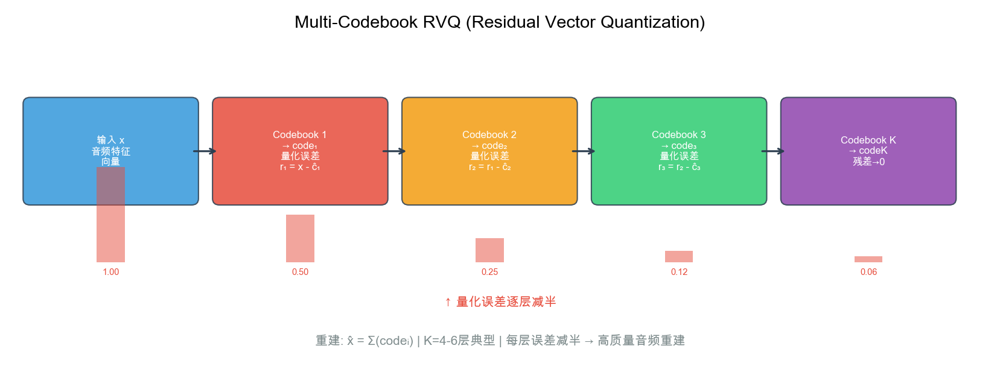

> *自绘图。说明：展示 RVQ（Residual Vector Quantization）逐层量化过程——每层找最近码字后计算残差，传递给下一层。量化误差逐层减半，K=4-6 层即可实现高质量音频重建。RVQ 图在 SoundStream/Encodec 论文中有类似版本，此图针对 Qwen3-Omni 的 Multi-Codebook 配置定制。*

### 12.4.1 RVQ 原理

**What**：RVQ（Residual Vector Quantization）使用多层码本（codebook）对音频进行分层量化，每层编码上一层的残差。

**Why**：单层码本（~1024 个 code）的量化精度有限，复杂语音的细微韵律和音色难以准确还原。多层 RVQ 逐层细化，每增加一层就减少一半量化误差。

**How**：

```
Multi-Codebook RVQ 量化过程：

原始音频特征 x（连续向量）
    ↓
Layer 1: 在码本 C_1 中找最近邻 → code_1, 残差 r_1 = x - C_1[code_1]
    ↓
Layer 2: 在码本 C_2 中找 r_1 的最近邻 → code_2, 残差 r_2 = r_1 - C_2[code_2]
    ↓
Layer 3: 在码本 C_3 中找 r_2 的最近邻 → code_3, ...
    ↓
...
Layer K: code_K

最终表示: [code_1, code_2, ..., code_K]

重建: x_hat = C_1[code_1] + C_2[code_2] + ... + C_K[code_K]

每增加一层，量化误差减半 → K 层后误差 ≈ 原始的 2^(-K)
```

### 12.4.2 对 Causal ConvNet 的意义

Multi-Codebook 为 Causal ConvNet 提供更丰富的输入信息：

```
单层 RVQ：每帧 1 个 code → ConvNet 输入信息有限 → 音质受限
多层 RVQ：每帧 K 个 codes → ConvNet 输入信息丰富 → 音质大幅提升

补偿效果：ConvNet 架构比 DiT 简单（单步 vs 多步），但多 codebook
         提供了足够的声学细节，使最终音质差距缩小到 <5% MOS
```

## 12.5 Thinking Mode 全模态集成

Qwen3-Omni 首次在 Omni 模型中引入 Thinking Mode：

```
任意模态输入 → Thinking 模式触发

语音输入: "用勾股定理解释为什么..."
  <think>
  用户提到了勾股定理，需要数学推理...
  a² + b² = c²
  ...
  </think>
  勾股定理是说... [语音输出]

图像+语音输入: [上传电路图] "这个电路有什么问题？"
  <think>
  观察电路图：检测到串联电阻和并联电容...
  计算阻抗: Z = R + 1/(jωC) ...
  发现: 反馈回路缺少稳定电阻
  </think>
  这个电路的问题在于... [语音输出]
```

## 12.6 性能基准

### 12.6.1 音频/音视频基准（36 个基准 SOTA）

**32/36** 个音频和音视频基准达到**开源 SOTA**
**22/36** 达到**总体 SOTA**（超越 Gemini-2.5-Pro、GPT-4o-Transcribe）

### 12.6.2 跨模态对比

| 维度 | Qwen3-Omni 表现 | 说明 |
|------|----------------|------|
| 音频理解 | 开源 SOTA | 超越 Gemini-2.5-Pro |
| 视觉任务 | ≈ 同规模单模态 VL 模型 | 无退化 |
| 文本任务 | ≈ 同规模纯文本 LLM | 无退化 |
| 语音生成 | 超越大多数流式+非流式方案 | 234ms 首包延迟 |

### 12.6.3 延迟对比

| 系统 | 首包延迟 | 架构 |
|------|---------|------|
| **Qwen3-Omni** | **234ms** | Causal ConvNet |
| Qwen2.5-Omni | ~600ms | Sliding-Window DiT |
| GPT-4o-Audio | ~500ms | 未公开 |
| 人类感知阈值 | ~300ms | — |

## 12.7 面试高频考点

**Q1：Causal ConvNet 替换 DiT（Diffusion Transformer）做语音合成，背后的设计权衡是什么？**

答：DiT 是一种基于 Transformer 的扩散模型，语音质量高但需要多步迭代去噪——每步都是一次完整的 Transformer 推理，延迟与步数成正比。Causal ConvNet 是单步前向传播，延迟极低但感受野受限于卷积核大小。这是**质量 vs 延迟**的经典权衡。Qwen3-Omni 选择 ConvNet 的判断是：在实时语音交互场景下，**300ms 以下的延迟是硬约束**（超过则用户感知到明显卡顿），而 MOS 下降 5% 内用户几乎无感。用膨胀因果卷积（dilation=1,2,4,8...）扩展感受野 + Multi-Codebook RVQ 补充声学信息，可以在延迟约束内最大化音质。

**Q2：从 VL 模型扩展到 Omni 模型，核心挑战在哪里？**

答：VL 模型只需处理视觉 → 文本的单向转换（看图说话），输入和输出模态各自独立。Omni 模型面临三个新挑战：① **输出模态冲突**——文本和语音的生成速率、词表大小、质量评估标准完全不同，一个 decoder 难以兼顾；② **实时性约束**——语音交互要求端到端延迟 <300ms，而推理（thinking）和语音合成（speaking）天然串行；③ **模态间时间对齐**——音频和视频必须在物理时间上精确同步，错位几百毫秒就会被感知。Thinker-Talker 架构同时解决了前两个挑战（分工 + 并行），TMRoPE 解决了第三个。

**Q3：实时多模态交互系统的端到端延迟由哪些环节组成？瓶颈在哪里？**

答：Qwen3-Omni 的 234ms 首包延迟可分解为：音频编码（~80ms，受 STFT 窗口大小限制）→ Thinker 首 token 推理（~60ms，受 prefill 计算量限制）→ Talker + ConvNet 语音解码（~30ms，单步前向传播）→ 其他开销。**瓶颈不在模型侧，而在物理约束侧**——音频编码的物理下限约 25ms（需要足够长的时间窗口才能提取频率特征），网络传输在实际部署中再加 50-100ms。这意味着进一步优化模型推理速度的边际收益递减——系统延迟的瓶颈已转向硬件和物理层面。


---

# Part IV: 深度对比分析

# 第十三章 纯文本 vs VL vs Omni 设计差异深度对比

## 13.1 位置编码的演进脉络


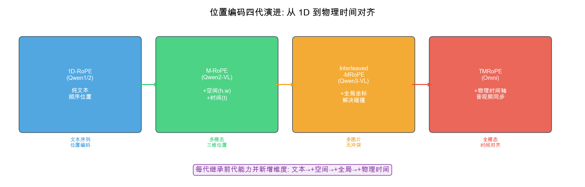

> *自绘图。说明：展示 1D-RoPE → M-RoPE → Interleaved-MRoPE → TMRoPE 四代演进，每代标注新增能力（文本→+空间→+全局→+物理时间）。帮助读者理解位置编码是如何从单维度扩展到支持全模态时间对齐的。此图为本报告原创综合分析。*

四代位置编码体现了从"序列感知"→"空间感知"→"时空感知"→"物理时间统一"的进化：

```
纯文本 LLM（Qwen1/2/2.5/3）：
  1D-RoPE：pos_id = [0, 1, 2, 3, ..., N]
  每个 token 只有一个序列位置
  注意力只感知"前后距离"，不感知"空间上下左右"

VL 模型（Qwen2.5-VL）：
  M-RoPE：三维 (t, h, w)，head 维度三等分
  图像 patch：(t=固定, h=行, w=列) → 感知 2D 空间结构
  视频帧：(t=绝对秒数, h=行, w=列) → 感知 3D 时空结构
  文本：(t=pos, h=pos, w=pos) → 退化为 1D-RoPE（完全兼容）

VL 模型升级（Qwen3-VL）：
  Interleaved-MRoPE：全局坐标系下的三维编码
  解决 256K 长上下文多图场景下坐标重叠问题

Omni 模型（Qwen2.5-Omni）：
  TMRoPE：物理时间轴统一所有模态
  pos_id_t = floor(实际秒数 × r_ref)
  音频块、视频帧、文本 token 同一时钟 → 时序对齐无额外监督
```

## 13.2 输入处理的全模态对比


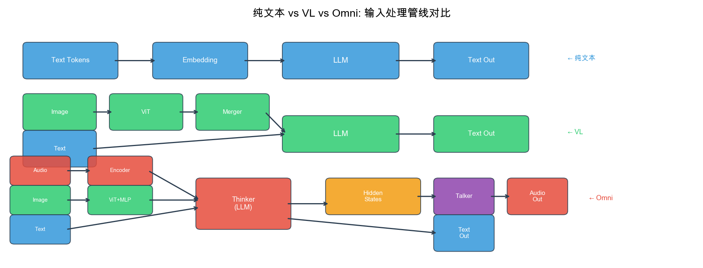

> *自绘图。说明：三条并行管线展示从简单（Text→Embed→LLM）到中等（+ViT+Merger→LLM）到复杂（+AudioEncoder+Thinker→Talker→AudioOut）的输入处理路径渐进复杂化。此图为本报告原创。*

| 维度 | 纯文本 LLM | VL 模型 | Omni 模型 |
|------|----------|---------|---------|
| **输入模态** | 文本 token | 文本 + 图像/视频 | 文本 + 图像/视频 + **音频** |
| **图像处理** | ❌ | ViT → MLP Merger → visual token | 继承 VL |
| **视频处理** | ❌ | 3D Tube + 动态 FPS → MRoPE 时间编码 | 继承 VL + **Block-wise 流式** |
| **音频处理** | ❌ | ❌ | Whisper 编码器 → 2× 下采样 → ~25 tok/s |
| **位置编码** | 1D-RoPE | M-RoPE / Interleaved-MRoPE | TMRoPE（物理时间轴） |
| **输入方式** | 批量 | 通常批量 | **Block-wise 实时流式** |
| **上下文长度** | 256K（Qwen3） | 128K/256K | 受流式输入限制 |

## 13.3 生成/推理机制的差异

| 维度 | 纯文本 LLM | VL 模型 | Omni 模型 |
|------|----------|---------|---------|
| **输出模态** | 文本 token | 文本（含坐标/结构化输出） | 文本 + **语音 codec token** |
| **生成架构** | 单路自回归 | 单路自回归 | **Thinker + Talker 双轨并行** |
| **Thinking Mode** | ✅（Qwen3） | ✅（Qwen3-VL） | ✅（Qwen3-Omni） |
| **实时输出** | token 流 | token 流 | **token 流 + 语音流（并行）** |
| **语音合成** | ❌（需外接 TTS） | ❌（需外接 TTS） | **端到端内置** |

## 13.4 训练策略的模态差异

```
纯文本 LLM（Qwen3）：
  [1] Base 预训练（36T tokens）
  [2] Long-CoT 冷启动
  [3] Reasoning RL / GRPO
  [4] General RL
  [5] 强到弱蒸馏

VL 模型（Qwen2.5-VL）：
  [1] ViT 视觉预训练（冻结 LLM，1.5T）← 多出此步
  [2] 全参数多模态预训练（2T）
  [3] 长上下文预训练（0.6T，序列 32K）
  [4] SFT（冻结 ViT，200万条，含 CoT 拒绝采样）
  [5] DPO 对齐（冻结 ViT）

Omni 模型（Qwen2.5-Omni）：
  [1] 模态热启动（冻结 LLM）← 最多的前置阶段
  [2] Thinker 多模态预训练（~1.2T，逐步解冻 LLM）
  [3] Talker 联合训练（端到端，L = L_text + λL_audio）← 多出 Talker
  [4] SFT + 对齐（含语音指令跟随专项）
  关键挑战：防止各模态梯度互相干扰
```

## 13.5 KV Cache 与上下文管理

| 场景 | 纯文本 | VL | Omni |
|------|-------|----|----|
| **KV cache 主要来源** | 文本 token | 文本 + 大量视觉 token | 文本 + 视觉 + 持续追加的音频 |
| **单张图占用** | — | 64~3072 visual tokens | 同左 |
| **1 分钟音频** | — | — | ~1500 audio tokens |
| **上下文增长模式** | 批量（固定） | 批量（含视觉 token） | **实时递增** |
| **KV cache 压力** | 中 | 高 | **极高** |
| **缓解策略** | GQA（8× 节省） | GQA + Window Attention | GQA + Block-wise 丢弃旧 Block |

---

# 第十四章 代际演进分析与技术趋势总结

## 14.1 VL 模型四代演进对比表

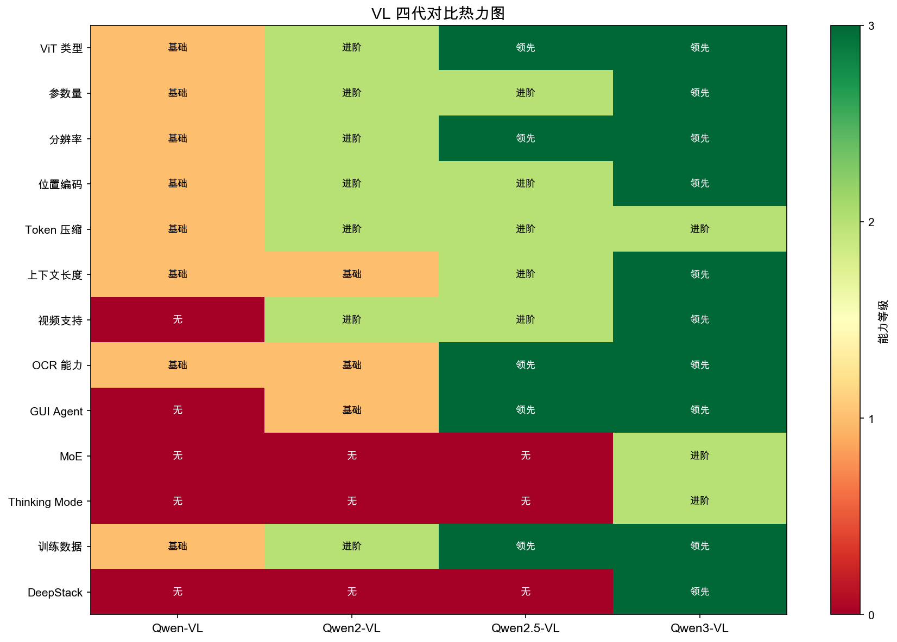

> *自绘图。说明：13 个关键特性（ViT 类型、分辨率、MoE、Thinking Mode 等）在 Qwen-VL/2-VL/2.5-VL/3-VL 四代模型上的能力等级热力图。颜色从红(无)到绿(领先)，帮助快速识别每代模型的优势和短板。此图为本报告原创综合分析。*

| 维度 | Qwen-VL (2023) | Qwen2-VL (2024.10) | Qwen2.5-VL (2025.02) | Qwen3-VL (2025 下半年) |
|------|:---:|:---:|:---:|:---:|
| **视觉编码器** | CLIP ViT（固定） | DFN ViT（675M） | **从零训练 ViT** + Window Attn | 从零训练 ViT + **DeepStack** |
| **分辨率** | 固定 224/448 | 动态分辨率 | 动态 + Window Attn | 动态 + DeepStack |
| **位置编码** | 绝对位置嵌入 | **M-RoPE**（2D 空间） | M-RoPE（绝对时间戳） | **Interleaved-MRoPE** |
| **时间感知** | ❌ | 帧序号 | **绝对秒数** | **文本时间戳** |
| **视频支持** | 有限 | 固定 2fps | **动态 FPS**，24K token | 动态 FPS，256K 上下文 |
| **MoE** | ❌ | ❌ | ❌ | **✅（235B-A22B）** |
| **Thinking** | ❌ | ❌ | ❌ | **✅（GRPO）** |
| **上下文** | 2K-8K | 32K-128K | **128K** | **256K** |
| **训练数据** | 数亿级 | 1.2T tokens | **4.1T tokens** | 更大规模 |
| **GUI Agent** | 有限 | ScreenSpot = 1.6 | **43.6** | **RefCOCO IoU 90.5** |

## 14.2 Omni 模型两代演进对比

| 维度 | Qwen2.5-Omni (2025.03) | Qwen3-Omni (2025.09) |
|------|:---:|:---:|
| **Thinker** | Dense 7B | **MoE 30B-A3B** |
| **激活参数** | 7B | **3B**（更低！） |
| **Vocoder** | Sliding-Window DiT | **Causal ConvNet** |
| **首包延迟** | ~600ms | **234ms** |
| **语音质量** | 单层 RVQ | **Multi-Codebook RVQ** |
| **Thinking Mode** | ❌ | **✅** |
| **文本语言** | ~29 | **119** |
| **语音理解** | 少数语言 | **19 语言** |
| **语音生成** | 中英为主 | **10 语言** |
| **开源协议** | 未明确 | **Apache 2.0** |

## 14.3 纯文本 LLM 关键技术对比

### 14.3.1 注意力机制演进

| 版本 | 注意力类型 | Q 头数 | KV 头数 | KV cache (4K, FP16) | 优势 |
|------|-----------|--------|---------|---------------------|------|
| Qwen-1 | MHA | 32 | 32 | 128MB | 标准实现 |
| Qwen2 | GQA | 28 | 4 | 16MB | **8× 内存节省** |
| Qwen2.5 | GQA + QK-Norm | 28 | 4 | 16MB | **长序列稳定** |
| Qwen3 | GQA + MoE | 动态 | 动态 | 动态 | **参数效率** |

### 14.3.2 位置编码演进

| 版本 | 位置编码 | 扩展技术 | 最大上下文 |
|------|---------|---------|-----------|
| Qwen-1 | RoPE | — | 16K |
| Qwen2 | RoPE | NTK-aware 插值 | 128K |
| Qwen2.5 | RoPE | NTK + **YaRN** | **1M** |
| Qwen3 | RoPE + QK-Norm | 渐进训练 | 256K |
| VL 系列 | M-RoPE → Interleaved-MRoPE | 绝对时间 → 文本时间戳 | 256K |
| Omni | TMRoPE | 物理时间轴 | 流式 |

### 14.3.3 数据规模与性能

| 版本 | 数据量 | 增长 | MMLU | 边际 MMLU 提升 |
|------|--------|------|------|--------------|
| Qwen-1 | ~3T | — | ~58 | — |
| Qwen2 | 7T | +133% | 84.2 | +26.2 |
| Qwen2.5 | 18T | +157% | ~87 | +2.8 |
| Qwen3 | 36T | +100% | ~89 | +2 |

### 14.3.4 后训练策略演进

| 版本 | SFT 样本 | RL 策略 | 特点 |
|------|---------|--------|------|
| Qwen-1 | ~100K | PPO | 基础 RLHF |
| Qwen2 | ~500K | PPO + DPO | 混合优化 |
| Qwen2.5 | 1M+ | 多阶段 RL + GRPO | **推理专用 RL** |
| Qwen3 | 蒸馏 | GRPO + 融合 | **强到弱蒸馏** |

### 14.3.5 综合性能横向对比

| 模型 | MMLU | HumanEval | GSM8K | MATH | 参数量 |
|------|------|-----------|-------|------|--------|
| Qwen-1-14B | 65.3 | 42.1 | 62.1 | — | 14B |
| Qwen2-72B | 84.2 | 64.6 | 89.5 | 78.3 | 72B |
| Qwen2.5-72B | ~87 | ~75 | ~92 | ~85 | 72B |
| Qwen3-32B | ~86 | ~75 | ~90 | ~80 | 32B |
| Qwen3-235B-A22B | ~89 | ~80 | ~93 | ~85 | 235B/22B |
| LLaMA3-405B | 85.2 | 70.1 | 88.2 | 79.1 | 405B |
| GPT-4o | ~87 | ~88 | ~95 | ~88 | ~200B? |

**关键观察**：
1. **参数效率**：Qwen3-32B 性能接近 Qwen2.5-72B（2.3× 参数效率提升）
2. **MoE 优势**：Qwen3-235B-A22B 超越 LLaMA3-405B（5× 参数，激活仅 22B）
3. **数学能力**：Qwen 系列在 GSM8K/MATH 上持续领先

## 14.4 六大技术演进趋势

### 趋势一：固定分辨率 → 动态分辨率 → 原生分辨率

早期 VL 模型将图像强制 resize 到 224×224，导致细节丢失。技术路线：
- **动态分辨率（Qwen2-VL）**：保留宽高比，M-RoPE 处理可变位置编码
- **原生分辨率（Qwen2.5-VL）**：不做 padding/resize，ViT 从零训练适配

**必然性**：从"描述图片"升级为"理解文档/操作界面"，动态分辨率是必要前提。

### 趋势二：静态图像 → 时空视频 → 实时流式

时间感知能力从"无"→"相对帧序号"→"绝对秒数"→"文本时间戳"→"实时流式"。这是 AI 从"看图工具"演变为"实时智能助手"的基础能力跃迁。

### 趋势三：跨模态桥接 → 端到端统一 → 思考-说话分离

架构演进不是"统一 vs 分离"的简单线性，而是在不同层面寻找最优粒度——特征空间统一（concat），输出空间分离（Thinker/Talker），训练目标解耦（独立损失权重）。

### 趋势四：Dense → MoE 在多模态中的首次应用

VL 领域的 MoE 比纯文本晚 1-2 年，主要挑战：视觉 token 路由稳定性、多模态训练不稳定性、工程复杂度。Qwen3-VL 通过辅助负载均衡损失、渐进式 MoE 引入、共享专家解决这些问题。

### 趋势五：无推理 → Thinking Mode 集成

VL 模型从"视觉感知工具"演变为"具有视觉感知的推理引擎"。视觉 CoT 比纯文本 CoT 更复杂——推理链需要引用图像区域，奖励函数需同时验证答案和视觉引用。

### 趋势六：生产延迟 → 实时流式

| 方案 | 首包延迟 |
|------|---------|
| 非流式 TTS | 数十秒 |
| 传统 AR TTS | 3-5 秒 |
| Sliding-Window DiT | ~600ms |
| **Causal ConvNet** | **234ms** |

**工程驱动**：234ms 与 600ms 对准确率几乎无影响，纯粹为用户体验优化。随着 AI 从研究走向产品，工程指标（延迟、吞吐量）的权重越来越高。

## 14.5 技术演进的核心动机

**商业动机**：
- OCR/文档解析 → 企业数字化转型
- GUI Agent → 企业自动化 RPA
- 实时语音 → 智能客服、语音助手
- 119 语言 → 全球化市场

**技术动机**：
- 动态分辨率 → OCR/Grounding 必要前提
- MoE → 突破 Dense 参数墙
- Thinking Mode → 解锁 STEM 推理潜力
- 文本时间戳 → 与 LLM 预训练知识对齐

**竞争动机**：
- 对标 GPT-4o → Qwen2.5-Omni/Qwen3-Omni
- 对标 Claude 3.5 → DocVQA 96.4、OCRBench 885
- 开源策略（Apache 2.0）→ 通过生态建设形成护城河

---

# 第十五章 关键技术横向对比

## 15.1 激活函数对比

| 激活函数 | 公式 | 采用版本 | 优势 |
|---------|------|---------|------|
| ReLU | $\max(0, x)$ | — | 计算快 |
| GLU | $(xW) \otimes \sigma(xV)$ | — | 门控机制 |
| **SwiGLU** | $(x W_1 \cdot \text{Swish}(x W_1)) \otimes (x V)$ | **全部 Qwen** | **平滑 + 门控** |

SwiGLU 的三重优势：
1. **平滑性**：Swish 连续可微，避免"死亡神经元"
2. **门控机制**：逐元素乘法实现信息流控制
3. **表达能力**：两个投影矩阵提供更大表达空间

## 15.2 归一化方案对比

| 归一化 | 计算方式 | 采用版本 | 优势 |
|-------|---------|---------|------|
| LayerNorm | $(x - \mu) / \sigma$ | LLaMA2 之前 | 标准实现 |
| **RMSNorm** | $x / \text{RMS}(x)$ | **全部 Qwen** | **省去均值计算，训练更快** |
| QK-Norm | $Q / \|Q\|,\; K / \|K\|$ | Qwen2+ | **长序列数值稳定** |

## 15.3 视觉编码器演进


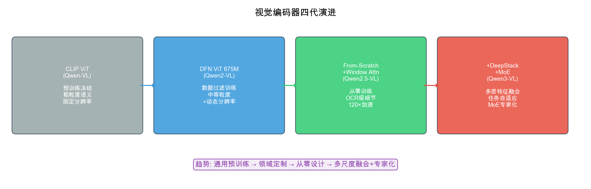

> *自绘图。说明：展示 CLIP ViT → DFN ViT → From-Scratch ViT+WindowAttn → +DeepStack+MoE 四代视觉编码器的演进，每代标注关键改进。趋势从"通用预训练"到"领域定制"到"从零设计"再到"多尺度融合+专家化"。此图为本报告原创。*

| 版本 | 编码器 | 参数量 | 初始化 | 注意力 | 位置编码 |
|------|--------|--------|--------|--------|---------|
| Qwen-VL | CLIP ViT | ~304M | CLIP 预训练 | 全局 | 绝对位置 |
| Qwen2-VL | DFN ViT | ~675M | DFN 预训练 | 全局 | ViT 位置插值 |
| Qwen2.5-VL | Custom ViT | ~600M | **从零训练** | **Window** | **2D-RoPE** |
| Qwen3-VL | Custom ViT | ~600M | 从零训练 | Window | 2D-RoPE + **DeepStack** |

## 15.4 融合机制演进

| 版本 | 方案 | 压缩比 | 非线性 | 特色 |
|------|------|--------|--------|------|
| Qwen-VL | Cross-Attention | 1:1 | 有 | 参数量大 |
| Qwen2-VL | PatchMerger (Linear) | **4:1** | 无 | 简单高效 |
| Qwen2.5-VL | **MLP Merger** | **4:1** | **SiLU** | 可学习空间纹理 |
| Qwen3-VL | MLP Merger + DeepStack | 4:1 | SiLU | 多层特征融合 |

## 15.5 语音生成方案演进

| 版本 | 方案 | 首包延迟 | 因果性 | 音质 |
|------|------|---------|--------|------|
| Qwen2.5-Omni | Sliding-Window DiT | ~600ms | 非因果 | 高（多步去噪） |
| Qwen3-Omni | **Causal ConvNet** | **234ms** | **严格因果** | 略低（<5% MOS 差距） |

## 15.6 长上下文技术演进

| 技术 | 版本 | 原理 | 效果 |
|------|------|------|------|
| 标准 RoPE | Qwen-1 | 基础旋转位置编码 | 16K |
| NTK-aware RoPE | Qwen2 | 分频处理，高频不变 | 128K（零样本外推） |
| **YaRN** | Qwen2.5 | 分频 + 注意力缩放 | **1M** |
| 渐进训练 | Qwen3 | 4K→32K→128K→256K | 256K（原生） |
| M-RoPE | VL 系列 | 三维旋转位置编码 | 多模态位置感知 |
| TMRoPE | Omni | 物理时间轴统一 | 音视频时序对齐 |


---

# Part V: 实践指南

# 第十六章 复现关键路径

## 16.1 Qwen2.5-VL 复现路径

### A. 环境准备

| 组件 | 最低版本 | 推荐版本 | 备注 |
|------|---------|---------|------|
| Python | 3.10 | 3.11 | |
| PyTorch | 2.2.0 | 2.3.0+ | CUDA 12.1+ |
| Transformers | 4.45.0 | 4.49.0+ | 含 Qwen2.5-VL Processor |
| flash-attn | 2.5.8 | 2.6.3+ | 编译约 20min，需 Ninja |
| decord | 0.6.0 | — | 高效视频读取 |
| qwen-vl-utils | 最新 | — | 官方工具库 |

**GPU 显存参考**（BF16 推理，448×448 输入）：

| 模型 | 最低显存 | 推荐配置 |
|------|---------|---------|
| Qwen2.5-VL-3B | 8 GB | RTX 3080 |
| Qwen2.5-VL-7B | 18 GB | RTX 4090 / A100-40G |
| Qwen2.5-VL-72B | ≥160 GB | 4× A100-80G |

### B. 关键代码路径

```
transformers/models/qwen2_5_vl/
├── modeling_qwen2_5_vl.py       # 主模型：ViT、MLP Merger、LLM、M-RoPE
│   ├── Qwen2_5_VLVisionEncoder  # ViT（含 Window Attention）
│   ├── Qwen2_5_VLVisionBlock    # Window Attn 和 Full Attn 的切换逻辑
│   ├── Qwen2_5_VLPatchMerger    # 2×2 MLP Merger
│   └── Qwen2_5_VLRotaryEmbedding # M-RoPE（三维位置编码）
└── processing_qwen2_5_vl.py     # Processor：resize、token 数计算、position_ids

qwen_vl_utils/vision_process.py
├── smart_resize()               # 将图像 resize 到 28 的倍数
├── process_vision_info()        # 统一处理图像/视频输入
└── fetch_video()               # 视频帧采样（含动态 FPS 计算）
```

### C. 推理复现关键点

**图像推理三要素**：

```python
from qwen_vl_utils import process_vision_info

# 1. 分辨率必须是 28 的倍数（14 × 2）
image = smart_resize(image, min_pixels=4*28*28, max_pixels=1280*28*28)

# 2. Token 数计算
n_tokens = (image.height // 28) * (image.width // 28)

# 3. Position IDs（M-RoPE 三维 ID）
# 图像 patch(row=r, col=c)：t_id=CONSTANT, h_id=r, w_id=c
```

**视频推理关键**：temporal_id 用**绝对秒数**而非帧序号

```python
# 正确：绝对时间戳
timestamps = [frame_idx / video_fps for frame_idx in sampled_frame_indices]
# 错误：帧序号
timestamps = [0, 1, 2, 3, ...]  # ❌ 模型无法感知真实时间间隔
```

**Grounding 输出解析**：

```python
# 模型输出是像素坐标，不需要乘以图像尺寸
response = "<|box_start|>(856, 634), (1024, 698)<|box_end|>"
# 直接解析为 x1=856, y1=634, x2=1024, y2=698
# 注意：不是 [0,1] 归一化坐标！
```

### D. 训练复现关键点

**多阶段冻结策略**：

```python
# Stage 1：仅训练 ViT + MLP Merger
for name, param in model.named_parameters():
    if "language_model" in name:
        param.requires_grad = False
    else:
        param.requires_grad = True

# Stage 2：全参数
for param in model.parameters():
    param.requires_grad = True

# SFT 阶段：冻结 ViT
for name, param in model.named_parameters():
    if "visual" in name:
        param.requires_grad = False
```

**动态 Resolution Packing（无 Padding 批处理）**：

```python
from flash_attn import flash_attn_varlen_func

attn_output = flash_attn_varlen_func(
    q, k, v,
    cu_seqlens_q=cu_seqlens,   # 累计序列长度
    cu_seqlens_k=cu_seqlens,
    max_seqlen_q=max_seqlen,
    max_seqlen_k=max_seqlen,
)
```

### E. 常见 Pitfall

| # | 错误现象 | 正确做法 |
|---|---------|---------|
| P1 | 推理乱码 / CUDA 错误 | 输入图像尺寸**必须是 28 的倍数**，调用 `smart_resize()` |
| P2 | 视频时间定位不准 | temporal_id 必须用**实际秒数** |
| P3 | 高分辨率时 OOM | 设置 `max_pixels` 限制最大 token 数 |
| P4 | Grounding 坐标偏移 | 模型输出是**像素坐标**，非归一化坐标 |
| P5 | SFT 后视觉能力退化 | SFT 阶段**冻结 ViT** |
| P6 | Window Attention 层错误 | 全局注意力层索引为 `{7, 15, 23, 31}` |

## 16.2 Qwen2.5-Omni 复现路径

### A. 架构模块定位

```
Qwen2.5-Omni 代码结构：
├── thinker/
│   ├── audio_encoder.py         # Whisper-like（32层，1280维，20头）
│   ├── vision_encoder.py        # 继承 Qwen2.5-VL 的 ViT
│   ├── audio_projector.py       # 1280→3584
│   ├── vision_projector.py      # 5120→3584
│   └── llm_backbone.py          # Qwen2.5-7B
├── talker/
│   ├── dual_track_decoder.py    # 双轨自回归 Decoder
│   └── audio_codec_head.py      # codec token 预测头
└── vocoder/
    └── sliding_window_dit.py    # Sliding-Window DiT
```

### B. TMRoPE Position IDs 构建

```python
def build_tmrope_position_ids(sequence_elements, r_ref=25):
    t_ids, h_ids, w_ids = [], [], []
    global_pos = 0

    for elem in sequence_elements:
        if elem.type == "text":
            for _ in elem.tokens:
                t_ids.append(global_pos)
                h_ids.append(0)
                w_ids.append(global_pos)
                global_pos += 1
        elif elem.type == "video_frame":
            ts_id = int(elem.timestamp_sec * r_ref)
            for r in range(elem.h_patches):
                for c in range(elem.w_patches):
                    t_ids.append(ts_id)
                    h_ids.append(r)
                    w_ids.append(c)
        elif elem.type == "audio_chunk":
            for k in range(elem.num_tokens):
                ts_id = int((elem.start_sec + k * elem.token_duration) * r_ref)
                t_ids.append(ts_id)
                h_ids.append(0)
                w_ids.append(k)

    return torch.tensor([t_ids, h_ids, w_ids])
```

### C. 常见 Pitfall

| # | 问题 | 正确做法 |
|---|------|---------|
| P1 | Talker 输入错误 | 接收 Thinker 的 **hidden states**，非 token IDs |
| P2 | 音视频时序错位 | 所有模态按**实际时间戳**排列 |
| P3 | 音频 Block 边界噪声 | 相邻 Block 需有**重叠区域** |
| P4 | 首包延迟过高 | 检查 DiT window_size；优先使用 Qwen3-Omni ConvNet |
| P5 | 语音质量差 | 确认使用 Thinker **最后一层** hidden states |

## 16.3 Qwen3-VL 复现要点

| 新增技术点 | 复现关键 |
|----------|---------|
| **Interleaved-MRoPE** | h_id = `base + local_row`，w_id = `base + local_col`；`base` = 图片全局起始位置 |
| **DeepStack** | 注册多个 ViT 中间层 output hook（如第 8/16/24/32 层），加权求和后送入 Merger |
| **文本时间戳** | 每帧前插入 `<timestamp>HH:MM:SS</timestamp>` 文本 token |
| **MoE 调试** | `output_router_logits=True` 打印路由分布，检查专家负载均衡 |
| **Thinking Mode** | 用户消息前加 `/think` 或系统提示启用 |

## 16.4 Qwen3-Omni 复现要点

| 新增技术点 | 复现关键 |
|----------|---------|
| **Causal ConvNet** | 使用 `CausalConv1d`（左侧 padding，右侧不 padding）|
| **Multi-Codebook** | Talker 有 N 个独立 Linear head，并行解码 N 个 codec ID |
| **MoE 路由监控** | 检查视觉/文本 token 路由分布；>70% 集中到同一专家说明辅助 loss 不够 |
| **首包延迟验证** | 目标 < 300ms；用 `time.perf_counter()` 分段打点 |

---

# Part VI: 多模态大模型高频面试考点汇总

> 本部分汇总跨章节的通用多模态面试考点，聚焦**架构设计理念、方法论理解、tradeoff 分析**，而非具体参数或数据集细节。

## 一、多模态融合架构

**Q1：多模态融合的三种主流范式（Cross-Attention / Projection / Early Fusion）各自的设计哲学是什么？**

答：
- **Cross-Attention**（Flamingo, Qwen-VL, BLIP-2 Q-Former）：视觉特征作为 K/V 注入 LLM 层，实现深层跨模态交互。哲学是"主动查询"——语言模型带着问题去"看"图像。优点是交互深度大，缺点是修改 LLM 结构、训练复杂。
- **Projection-based**（LLaVA, Qwen2-VL）：视觉特征经 MLP/Linear 投影后与文本 token 拼接送入 LLM。哲学是"让 LLM 自己学对齐"——只做空间变换，依赖 LLM 的 self-attention 来实现跨模态理解。优点是简单、可扩展，缺点是交互深度依赖 LLM 能力。
- **Early Fusion**（Fuyu, Chameleon）：直接将图像 patch 线性投影为 token，去掉独立视觉编码器。哲学是"统一一切"——所有模态都是 token 序列。优点是极简，缺点是要求 LLM 自己学视觉表征。

**核心洞察**：业界趋势从复杂走向简洁——当 LLM 足够强大且数据足够多时，简单方案（Projection）不输复杂方案（Cross-Attention）。这说明**融合机制的复杂度不是性能瓶颈，数据质量和视觉编码器才是**。

**Q2：为什么 LLaVA 用最简单的线性投影就能取得令人惊讶的效果？这说明了什么？**

答：LLaVA 证明了一个反直觉的结论：CLIP ViT 的特征空间与 LLM 的 embedding 空间之间的对齐，**不需要复杂的跨模态注意力机制**——一个简单的线性变换足以建立有效的映射，剩下的工作由 LLM 的 self-attention 在后续层中完成。这说明：① 预训练的 CLIP ViT 和 LLM 已各自形成了足够好的表示空间，只需要"搭桥"而非"重建"；② 高质量的指令微调数据（GPT-4 生成的 150K 对话）对最终效果的贡献远大于融合机制的复杂度。核心启示：**在组件已足够强大的前提下，胶水层越简单越好。**

## 二、视觉编码器设计

**Q3：CLIP 作为视觉编码器的优势和局限分别是什么？为什么有些模型选择放弃 CLIP？**

答：
- **优势**：CLIP 通过图文对比学习天然对齐了视觉和语言空间，提供了零样本迁移能力，且社区生态丰富（多种尺寸、多种训练变体）。
- **局限**：① 对比学习优化全局语义匹配（"这是一只猫"），缺乏细粒度空间感知（"猫在图的哪个位置"）；② 固定分辨率训练（224/336），动态分辨率下需要位置插值，精度受损；③ 全局注意力架构在高分辨率输入时 O(N²) 不可承受。

Qwen2.5-VL 放弃 CLIP 从零训练，是因为其任务需求（OCR、文档理解、GUI Agent）与 CLIP 的训练目标差异太大——**当任务和预训练目标严重 mismatch 时，预训练权重不是加速收敛的资产，而是限制方向的负担**。

**Q4：视觉编码器的 Scaling Law 与 LLM 的 Scaling Law 有什么本质不同？**

答：InternVL 将视觉编码器扩大到 6B（InternViT-6B），证明视觉侧也存在 scaling 收益。但关键差异在于：① 视觉编码器的 scaling 收益递减比 LLM 更早——视觉特征空间的"有效维度"有限，超过一定规模后边际收益快速下降；② 视觉侧对**数据多样性**比数据量更敏感——100 万张多样化图片可能比 1000 万张相似图片更有价值；③ 最终性能的瓶颈更多在 LLM 侧——视觉编码器只负责"看到什么"，而"如何理解和推理"取决于 LLM。因此在资源有限时，**优先 scale LLM 通常比 scale 视觉编码器更划算**。

## 三、多模态对齐策略

**Q5：对比学习对齐（CLIP-style）和生成式对齐（LLaVA-style instruction tuning）解决的是同一个问题吗？**

答：不是。对比学习解决的是**"全局语义匹配"**——学习"这张图和这段文字说的是同一件事"，是一种粗粒度的对齐，适合检索和零样本分类。生成式对齐解决的是**"细粒度条件生成"**——学习"看到这张图后，应该如何回答这个问题"，需要理解图像细节并生成相关文本。两者是互补而非替代关系：CLIP 提供基础的视觉-语言对应关系，instruction tuning 在此基础上建立细粒度的指令跟随能力。这就是为什么大多数 MLLM 同时依赖两者——用 CLIP 初始化视觉编码器（获得基础对齐），再通过 instruction tuning 精调（获得任务能力）。

**Q6：多模态 RLHF 为什么比纯文本 RLHF 更难？**

答：核心难点有三层：① **Reward Model 的困难**——评估"文本回答是否忠实于图像内容"比评估"文本回答是否通顺"困难得多，reward model 必须具备视觉理解能力；② **人类标注成本**——标注者需要仔细对比图像内容与模型输出，判断是否存在幻觉，比纯文本标注的认知负荷高得多；③ **视觉主观性**——图像理解存在合理的主观差异（"这个表情是开心还是尴尬？"），难以建立统一的偏好标准。RLHF-V 等工作尝试用自动化幻觉检测来降低标注成本，但仍然是多模态对齐的前沿难题。

## 四、多模态幻觉（Hallucination）

**Q7：多模态幻觉与纯文本幻觉的根源有什么本质不同？**

答：纯文本幻觉主要源于 LLM 对训练数据中统计模式的过度拟合——生成"看起来合理但实际不正确"的内容。多模态幻觉有一个额外的、更根本的原因：**视觉信息在传递链路中的损失**。从图像到最终回答，信息经过多次压缩：图像 → patch → ViT 特征 → 投影/压缩 → LLM embedding。每一步都可能丢失细节。当 LLM 在生成回答时缺乏足够的视觉证据时，会依赖语言先验"脑补"——例如看到"厨房"就自动添加"冰箱"，即使图中没有。这就是为什么提高视觉分辨率（保留更多细节）和动态 token 数（避免固定压缩）是缓解幻觉的有效手段。

**Q8：缓解多模态幻觉有哪些主流方案？它们分别针对幻觉链路中的哪个环节？**

答：
- **提高视觉分辨率 / 动态 token**（Qwen2-VL）：针对**信息输入**环节——减少视觉信息的损失量
- **Grounding 增强**（让模型指出回答依据的图像区域）：针对**推理过程**——强制模型基于证据而非猜测
- **对比解码（Contrastive Decoding）**：针对**输出生成**——对比"有图"和"无图"条件下的输出分布，抑制不依赖图像的语言先验
- **RLHF-V（幻觉标注做偏好学习）**：针对**训练目标**——直接惩罚幻觉输出
- **训练数据清洗**（去除含幻觉描述的 caption）：针对**数据源头**——避免模型从数据中学到幻觉模式

最有效的方案通常是**多环节联合优化**——没有单一银弹。

## 五、视频理解

**Q9：视频理解与图像理解的核心挑战差异在哪里？**

答：图像理解是空间感知（"什么在哪里"），视频理解还需要**时序推理**（"先发生了什么，后发生了什么，因果关系是什么"）。核心挑战有三层：
1. **Token 数量爆炸**——1 分钟视频 @1fps × 256 token/帧 = 15360 个视觉 token，远超多数 LLM 的 context 上限
2. **关键信息的时间稀疏性**——一段 10 分钟的视频中，与问题相关的信息可能只出现在某几秒，其余帧都是冗余
3. **时序关系的抽象性**——"因为 A 所以 B"比"A 在 B 左边"更难建模，需要跨帧推理

主流解决方案包括：均匀采样（简单但丢失关键帧）、动态 FPS（按信息密度调整采样率）、时空 pooling（压缩冗余帧的 token）、以及 Qwen3-VL 的文本时间戳方案（利用 LLM 预训练中的时间知识）。

## 六、主流多模态模型对比

**Q10：LLaVA、Qwen-VL 系列、InternVL 三条技术路线的核心差异是什么？**

答：

| 维度 | LLaVA | Qwen-VL 系列 | InternVL |
|------|-------|-------------|----------|
| **融合方式** | 线性/MLP 投影 | Cross-Attention → MLP 投影（演进） | 类 LLaVA 投影 |
| **视觉编码器** | CLIP ViT (frozen) | CLIP → DFN → 从零训练（演进） | InternViT-6B（自研超大 ViT） |
| **核心哲学** | 极简架构 + 好数据 | 系统性架构创新（位置编码、动态分辨率） | 视觉编码器 Scaling |
| **创新重心** | 数据工程 + 训练范式 | 多模态位置编码 + 全模态统一 | 视觉基础模型 |
| **代表贡献** | 证明简单方案有效 | M-RoPE、动态分辨率、Thinker-Talker | 证明视觉侧 Scaling 有效 |

三条路线代表了三种不同的信念：LLaVA 相信**数据和 LLM 能力是关键**；Qwen-VL 相信**架构创新（尤其是位置编码）是关键**；InternVL 相信**视觉编码器的规模是关键**。事实上三者都有道理——最终最强的模型可能需要三者兼具。

**Q11：开源多模态模型与闭源模型（GPT-4V、Gemini）的核心差距在哪里？**

答：差距**不主要在架构**——开源模型的架构创新（如 M-RoPE、动态分辨率）并不逊于闭源。核心差距在三个方面：① **训练数据的规模和多样性**——闭源模型有数十亿级别的私有高质量图文数据；② **RLHF 对齐的精细程度**——闭源模型有更成熟的人类偏好标注体系和迭代对齐流程；③ **Safety 和拒绝机制**——闭源模型在安全性上的投入远超开源。这个认知很重要：如果你想缩小差距，**投入应该优先放在数据和对齐上，而非架构创新**。

---

# 参考文献

0. **Qwen-VL: A Versatile Vision-Language Model for Understanding, Localization, Text Reading, and Beyond**
   Bai, J., Bai, S., et al. (Qwen Team, Alibaba Group, 2023)
   arXiv: https://arxiv.org/abs/2308.12966

1. **Qwen Technical Report**
   Bai, J., Bai, S., et al. (Qwen Team, Alibaba Group, 2023)
   arXiv: https://arxiv.org/abs/2309.16609

2. **Qwen2 Technical Report**
   Yang, A., Yang, B., et al. (Qwen Team, Alibaba Group, 2024)
   arXiv: https://arxiv.org/abs/2407.10671

3. **Qwen2.5 Technical Report**
   Qwen Team, Alibaba Group (2024)
   arXiv: https://arxiv.org/abs/2412.15115

4. **Qwen3 Technical Report**
   Yang, A., Li, A., Yang, B., et al. (Qwen Team, Alibaba Group, 2025)
   arXiv: https://arxiv.org/abs/2505.09388

5. **Qwen2-VL Technical Report**
   Wang, P., et al. (Qwen Team, Alibaba Group, 2024)
   arXiv: https://arxiv.org/abs/2409.12191

6. **Qwen2.5-VL Technical Report**
   Bai, S., Chen, K., et al. (Qwen Team, Alibaba Group, 2025)
   arXiv: https://arxiv.org/abs/2502.13923

7. **Qwen3-VL Technical Report**
   Bai, S., et al. (Qwen Team, Alibaba Group, 2025)
   arXiv: https://arxiv.org/abs/2511.21631

8. **Qwen2.5-Omni Technical Report**
   Xu, J., Guo, Z., et al. (Qwen Team, Alibaba Group, 2025)
   arXiv: https://arxiv.org/abs/2503.20215

9. **Qwen3-Omni Technical Report**
   Xu, J., Guo, Z., Hu, H., Chu, Y., et al. (Qwen Team, Alibaba Group, 2025)

10. **RoFormer: Enhanced Transformer with Rotary Position Embedding**
    Su, J., Lu, Y., et al. (2021)
    arXiv: https://arxiv.org/abs/2104.09864

11. **YaRN: Efficient Context Window Extension of Large Language Models**
    Peng, B., et al. (2023)
    arXiv: https://arxiv.org/abs/2309.00071

12. **Mixture-of-Experts Meets Instruction Tuning (ST-MoE)**
    Zoph, B., et al. (Google, 2022)
    arXiv: https://arxiv.org/abs/2305.14705

13. **DeepSeekMoE: Towards Ultimate Expert Specialization**
    Dai, D., et al. (DeepSeek, 2024)
    arXiv: https://arxiv.org/abs/2401.06066

14. **GRPO: Group Relative Policy Optimization**
    Shao, Z., et al. (2024)
    arXiv: https://arxiv.org/abs/2402.03300

15. **官方资源**
    - GitHub: https://github.com/QwenLM/
    - HuggingFace: https://huggingface.co/Qwen
    - 官方博客: https://qwenlm.github.io/

---

**报告完成日期**：2026 年 4 月 12 日
**覆盖范围**：Qwen 全系列 10 个模型（Qwen-1 → Qwen2 → Qwen2-VL → Qwen2.5 → Qwen2.5-VL → Qwen2.5-Omni → Qwen3 → Qwen3-VL → Qwen3-Omni + Qwen3-Next 预览）
**总结构**：6 大 Part、16 章、每章含面试考点 + Part VI 多模态高频面试考点汇总

